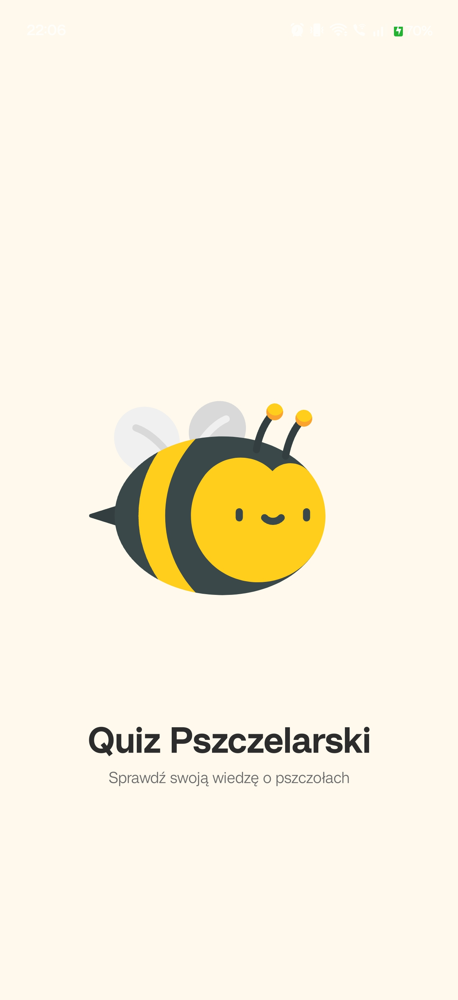
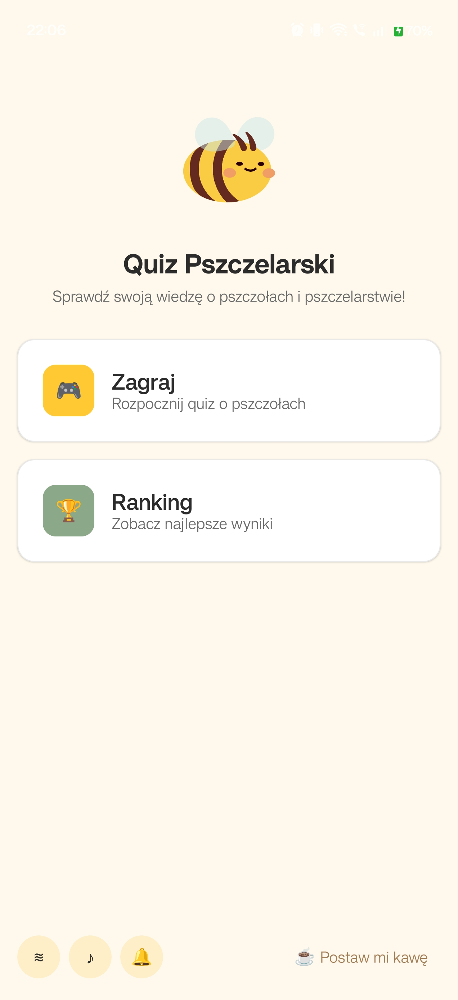
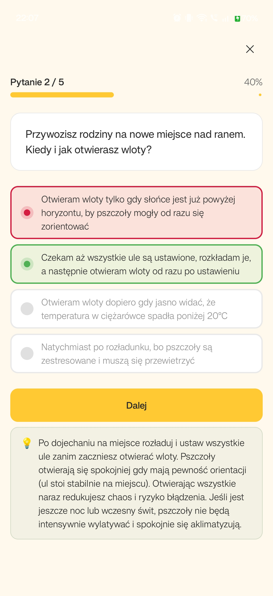
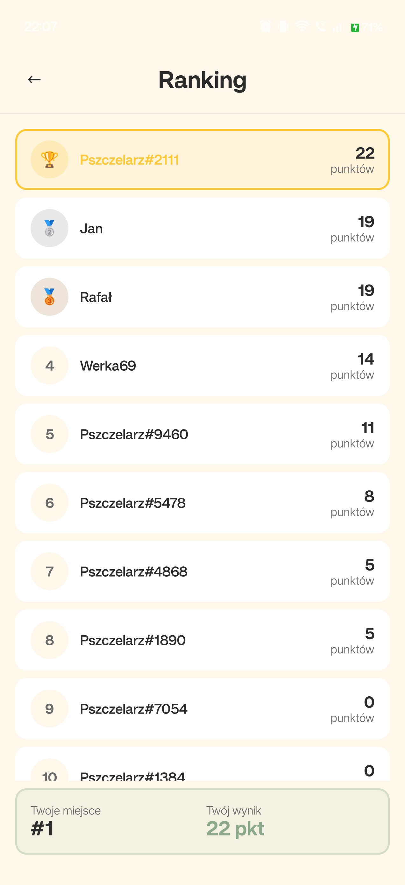

# 🐝 Quiz Pszczelarski

> Mobilna aplikacja quizowa dla pszczelarzy — Android & iOS z jednej bazy kodu.

[](https://kotlinlang.org)
[](https://www.jetbrains.com/lf/compose-multiplatform/)
[](https://firebase.google.com)
[](https://kotlinlang.org/docs/multiplatform.html)
[](LICENSE)

---

## Spis treści

- [Zapotrzebowanie biznesowe](#zapotrzebowanie-biznesowe)
- [Screenshoty](#screenshoty)
- [Architektura](#architektura)
- [Struktura projektu](#struktura-projektu)
- [Stos technologiczny](#stos-technologiczny)
- [Funkcjonalności](#funkcjonalności)
- [Uruchomienie](#uruchomienie)
- [Konfiguracja Firebase](#konfiguracja-firebase)
- [Testy](#testy)
- [Publikacja w App Store](#publikacja-w-app-store)

---

## Zapotrzebowanie biznesowe

### Problem

Środowisko pszczelarskie w Polsce nie dysponuje interaktywnym narzędziem do samodzielnego sprawdzenia i utrwalenia wiedzy z zakresu pszczelarstwa — na poziomach od amatora po technika. Publikacje branżowe i egzaminy są dostępne tylko w formie papierowej lub na komercyjnych platformach edukacyjnych nieprzystosowanych do specyfiki tej dziedziny.

### Rozwiązanie

**Quiz Pszczelarski** to darmowa aplikacja mobilna (Android + iOS) umożliwiająca:

| Cel | Realizacja |
|-----|-----------|
| Nauka przez zabawę | Quiz wielokrotnego wyboru z natychmiastowym feedbackiem |
| Motywacja | Streak bonusowy, wynik, globalny ranking w czasie rzeczywistym |
| Dostępność offline | Pytania dostępne bez internetu dzięki lokalnemu cache (SQLite) |
| Brak barier wejścia | Anonimowe logowanie — zero rejestracji, zero haseł |
| Personalizacja | Wybór poziomu (Normalny / Pro / Technik Pszczelarz) i liczby pytań |
| Ciągłość używania | Powiadomienia przypominające o codziennej nauce |

### Grupy docelowe

- **Uczniowie** techników rolniczych i pszczelarskich
- **Amatorzy** przygotowujący się do egzaminów związkowych
- **Zaawansowani pszczelarze** chcący usystematyzować wiedzę

---

## Screenshoty

<p align="center">
  
  
  
  
</p>

---

## Architektura

### Diagram warstw

```
┌─────────────────────────────────────────────────────────┐
│                     composeApp (UI)                     │
│         Compose Multiplatform — commonMain              │
│                                                         │
│  SplashScreen  HomeScreen  QuizScreen  ResultScreen     │
│  LeaderboardScreen  ForceUpdateScreen                   │
│                                                         │
│  ┌─────────────┐    ┌──────────────────────────────┐   │
│  │  ViewModels │    │      AppNavigation (MVI)      │   │
│  │  (MVI)      │◄───│      AnimatedContent          │   │
│  └──────┬──────┘    └──────────────────────────────┘   │
└─────────┼───────────────────────────────────────────────┘
          │ depends on
┌─────────▼───────────────────────────────────────────────┐
│                   shared (Domain)                       │
│                                                         │
│  UseCases: GetRandomQuestions, CalculateScore,          │
│            EnsureUser, SubmitScore, FlushPending,       │
│            ObserveSettings                             │
│                                                         │
│  Repositories (interfaces): QuestionRepository,        │
│            UserRepository, LeaderboardRepository,       │
│            AppConfigRepository, SettingsRepository      │
│                                                         │
│  Models: Question, QuizResult, UserProfile,             │
│          LeaderboardEntry, AppConfig, AppError          │
└─────────┬───────────────────────────────────────────────┘
          │ implements
┌─────────▼───────────────────────────────────────────────┐
│                   shared (Data)                         │
│                                                         │
│  Firebase: FirebaseQuestionsRepository                  │
│            FirebaseUserRepository                       │
│            FirebaseLeaderboardRepository                │
│            FirebaseAppConfigRepository                  │
│            FirebaseAnalyticsService                     │
│                                                         │
│  Local:    CachingQuestionsRepository (cache-first)     │
│            SqlDelightQuestionsDataSource                │
│            SqlDelightPendingScoreDataSource             │
│            SettingsRepositoryImpl (MultiplatformSettings│
└─────────────────────────────────────────────────────────┘
```

### Przepływ danych — quiz

```
User tap
  │
  ▼
QuizScreen (Compose)
  │  Intent (CheckAnswer / NextQuestion / AbandonQuiz)
  ▼
QuizViewModel (MVI)
  │  GetRandomQuestionsUseCase  ←── CachingQuestionsRepository
  │  CalculateScoreUseCase                │
  │  AnalyticsService.quizCompleted()     ├── SQLDelight (offline)
  │                                       └── Firebase Firestore (online)
  ▼
QuizState (StateFlow)
  │
  ▼
QuizScreen re-compose → AnswerFeedback → BonusOverlay
  │
  ▼
ResultViewModel.SubmitScoreUseCase
  ├── online  → FirebaseLeaderboardRepository
  └── offline → PendingScore (SQLDelight) → FlushPendingScores
```

### Strategia offline (cache-first)

```
App start
  │
  ├─► SQLDelight cache hit?
  │       YES → render pytania natychmiast
  │       NO  → loading state
  │
  ├─► QuestionSyncService.sync() (w tle)
  │       online  → Firestore snapshot → zapis do SQLDelight
  │       offline → brak sync, używaj cache
  │
  └─► PendingScore queue
          online  → FlushPendingScoresUseCase → Firestore
          offline → kolejka zostaje w SQLDelight
```

---

## Struktura projektu

```
quiz-pszczelarski-kmp/
│
├── composeApp/                          # Moduł UI (Compose Multiplatform)
│   └── src/
│       ├── commonMain/kotlin/
│       │   ├── navigation/
│       │   │   ├── AppNavigation.kt     # Główny router (AnimatedContent)
│       │   │   └── Route.kt             # Sealed class tras
│       │   ├── presentation/
│       │   │   ├── base/MviViewModel.kt # Baza MVI (StateFlow + Channel)
│       │   │   ├── home/                # HomeViewModel, State, Intent, Effect
│       │   │   ├── quiz/                # QuizViewModel + AnswerFeedback
│       │   │   ├── result/              # ResultViewModel
│       │   │   └── leaderboard/         # LeaderboardViewModel
│       │   ├── ui/
│       │   │   ├── components/          # AppButton, AnswerOption, BonusOverlay…
│       │   │   ├── screens/             # SplashScreen, HomeScreen, QuizScreen…
│       │   │   └── theme/               # AppColors, AppTypography, AppSpacing…
│       │   └── platform/               # expect: Haptics, SplashSoundPlayer,
│       │                               #         NotificationScheduler, AppVersion
│       ├── androidMain/                 # actual: Android implementacje platform
│       └── iosMain/                     # actual: iOS implementacje platform
│
├── shared/                              # Moduł logiki biznesowej
│   └── src/
│       ├── commonMain/kotlin/
│       │   ├── domain/
│       │   │   ├── model/               # Question, UserProfile, QuizResult…
│       │   │   ├── repository/          # Interfejsy repozytoriów
│       │   │   ├── usecase/             # Przypadki użycia (pure Kotlin)
│       │   │   └── service/             # AnalyticsService (interfejs)
│       │   └── data/
│       │       ├── analytics/           # FirebaseAnalyticsService, HashUtils
│       │       ├── config/              # FirebaseAppConfigRepository
│       │       ├── dto/                 # QuestionDto, UserDto
│       │       ├── leaderboard/         # FirebaseLeaderboardRepository
│       │       ├── local/               # SQLDelight data sources
│       │       ├── mapper/              # QuestionMapper, UserMapper
│       │       ├── questions/           # CachingQuestionsRepository
│       │       ├── remote/              # RemoteQuestionsDataSource
│       │       ├── settings/            # SettingsRepositoryImpl
│       │       └── user/                # FirebaseUserRepository
│       ├── commonMain/sqldelight/       # Schemat bazy danych (.sq)
│       ├── androidMain/                 # DatabaseDriverFactory (Android)
│       ├── iosMain/                     # DatabaseDriverFactory (iOS/Native)
│       └── commonTest/                  # Testy jednostkowe
│
├── iosApp/                              # iOS entrypoint (Swift)
│   ├── iOSApp.swift
│   └── iosApp.xcodeproj/
│
├── docs/
│   ├── adr/                             # Architecture Decision Records (ADR-0001…0011)
│   └── definition-of-ready.md
│
└── plans/                               # Plany developmentu (fazy 0–8)
```

---

## Stos technologiczny

### Core

| Technologia | Wersja | Rola |
|-------------|--------|------|
| Kotlin Multiplatform | 2.2.21 | Wspólna logika Android + iOS |
| Compose Multiplatform | 1.10.1 | Wspólne UI Android + iOS |
| Kotlin Coroutines | 1.10.2 | Asynchroniczność, StateFlow |
| Kotlin Serialization | 1.8.1 | Deserializacja DTO z Firestore |

### Firebase (GitLive SDK)

| Moduł | Wersja | Zastosowanie |
|-------|--------|--------------|
| firebase-auth | 2.1.0 | Anonimowe logowanie |
| firebase-firestore | 2.1.0 | Pytania, użytkownicy, ranking (real-time) |
| firebase-config | 2.1.0 | Remote Config (wymuszenie aktualizacji) |
| firebase-analytics | 2.1.0 | Zdarzenia: quiz_started/completed/abandoned |
| firebase-crashlytics | 2.1.0 | Raporty błędów + custom keys |

### Persystencja i ustawienia

| Biblioteka | Wersja | Zastosowanie |
|------------|--------|--------------|
| SQLDelight | 2.0.2 | Lokalna baza SQLite (cache pytań, kolejka offline) |
| Multiplatform Settings | 1.3.0 | Preferencje użytkownika (nick, ustawienia) |

### UI i animacje

| Biblioteka | Wersja | Zastosowanie |
|------------|--------|--------------|
| Compottie | 2.0.0-rc01 | Animacje Lottie (pszczoła, niedźwiedź, bonus) |
| Material3 | Compose BOM | Design system, kolory, typografia |

### Build

| Narzędzie | Wersja |
|-----------|--------|
| Gradle | 8.11.1 |
| AGP | 8.7.3 |
| minSdk | 26 (Android 8.0) |
| targetSdk / compileSdk | 35 |
| iOS Deployment Target | 16.0 |

---

## Funkcjonalności

### Zrealizowane

- [x] **Anonimowe logowanie** — brak rejestracji, automatyczny nick `Pszczelarz#XXXX`
- [x] **Quiz wielopoziomowy** — Normalny / Pro / Technik Pszczelarz (5/10/15/20 pytań)
- [x] **Natychmiastowy feedback** — zielone/czerwone podświetlenie + infotip z wyjaśnieniem
- [x] **Bonus overlay** — animacja pszczoły po serii poprawnych odpowiedzi
- [x] **Ranking globalny** — live updates z Firestore
- [x] **Offline cache** — pytania dostępne bez internetu (SQLDelight, cache-first)
- [x] **Kolejka offline** — wyniki zapisywane lokalnie, wysyłane po powrocie online
- [x] **Powiadomienia** — codzienne przypomnienia (Android AlarmManager / iOS UNUserNotificationCenter)
- [x] **Remote Config** — wymuszenie aktualizacji bez wydawania nowej wersji
- [x] **Crashlytics** — raporty błędów + custom keys (tryb, poziom, hash pytania)
- [x] **Analytics** — zdarzenia quizowe z czasem trwania i indeksem sesji
- [x] **Animacje Lottie** — splash, pszczoła latająca w rankingu, easter egg niedźwiedź
- [x] **Haptics** — wibracje na poprawną/złą odpowiedź
- [x] **Zmiana nicku** — z poziomu rankingu (tap na własny wiersz)
- [x] **Ikona aplikacji** — dedykowana ikona pszczoły (Android adaptive + iOS)

---

## Uruchomienie

### Wymagania

- **JDK 17+**
- **Android Studio Ladybug** (lub nowsze) z pluginem KMP
- **Xcode 15+** (dla iOS)
- Konto Firebase (do konfiguracji)

### Android

```bash
# Klonowanie
git clone https://github.com/jordanrafalm/quiz-pszczelarski-kmp.git
cd quiz-pszczelarski-kmp

# Dodaj google-services.json (patrz: Konfiguracja Firebase)
# Umieść plik w: composeApp/google-services.json

# Build
./gradlew :composeApp:assembleDebug

# Lub otwórz w Android Studio i kliknij Run
```

### iOS

```bash
# Dodaj GoogleService-Info.plist (patrz: Konfiguracja Firebase)
# Umieść plik w: iosApp/iosApp/GoogleService-Info.plist

# Build frameworku Kotlin
./gradlew :composeApp:embedAndSignAppleFrameworkForXcode

# Otwórz projekt w Xcode
open iosApp/iosApp.xcodeproj
# Uruchom na symulatorze lub urządzeniu
```

---

## Konfiguracja Firebase

1. Utwórz projekt w [Firebase Console](https://console.firebase.google.com)
2. Dodaj aplikację Android (`pl.quizpszczelarski.app`) → pobierz `google-services.json` → umieść w `composeApp/`
3. Dodaj aplikację iOS (`pl.quizpszczelarski.app`) → pobierz `GoogleService-Info.plist` → umieść w `iosApp/iosApp/`
4. Włącz w Firebase Console:
   - Authentication → Anonymous
   - Firestore Database
   - Remote Config
   - Crashlytics
   - Analytics

### Struktura Firestore

```
questions/
  {id}:
    text: string
    answers: string[]
    correctIndex: int
    level: "normal" | "pro" | "hard"
    infotip: string?

users/
  {uid}:
    nickname: string
    totalScore: int
    gamesPlayed: int

leaderboard/
  {uid}:
    nickname: string
    totalScore: int
```

---

## Testy

```bash
# Wszystkie testy jednostkowe (shared module)
./gradlew :shared:test

# Raport HTML
open shared/build/reports/tests/testDebugUnitTest/index.html
```

### Pokrycie testami

| Klasa | Testy |
|-------|-------|
| `CalculateScoreUseCase` | Scenariusze punktacji (idealna, zero, częściowa) |
| `CachingQuestionsRepository` | Cache-hit, cache-miss, sync, wersjonowanie |
| `QuestionMapper` | Mapowanie DTO → model domenowy |
| `SettingsRepositoryImpl` | Zapis/odczyt preferencji, obserwacja Flow |

---

## Architecture Decision Records

Kluczowe decyzje architektoniczne są udokumentowane w [`docs/adr/`](docs/adr/):

| ADR | Temat |
|-----|-------|
| [ADR-0001](docs/adr/ADR-0001-platform-specific-ui.md) | Shared UI w Compose Multiplatform |
| [ADR-0002](docs/adr/ADR-0002-design-system-theme.md) | System designu i temat |
| [ADR-0003](docs/adr/ADR-0003-mvi-state-management.md) | Zarządzanie stanem MVI |
| [ADR-0004](docs/adr/ADR-0004-firebase-kmp-integration.md) | Integracja Firebase (GitLive SDK) |
| [ADR-0005](docs/adr/ADR-0005-offline-cache-strategy.md) | Strategia cache offline |
| [ADR-0010](docs/adr/ADR-0010-crashlytics-analytics.md) | Crashlytics i Analytics |
| [ADR-0011](docs/adr/ADR-0011-answer-feedback-bonus-streak.md) | Feedback i bonus streak |

---

## Publikacja w App Store

Dokumentacja procesu publikacji w Apple App Store:

| Dokument | Opis |
|----------|------|
| [📋 Quick Action Guide](docs/app-store-quick-action-guide.md) | Szybki przewodnik — 9 kroków do publikacji |
| [📝 Submission Checklist](docs/app-store-submission-checklist.md) | Szczegółowa lista wymagań App Store Connect |
| [🌐 Hosting Privacy Policy](docs/hosting-privacy-policy.md) | Jak hostować politykę prywatności |
| [📱 Generating iPad Screenshots](docs/generating-ipad-screenshots.md) | Tworzenie screenshotów dla iPad Pro 13" |
| [🔒 Export Compliance](docs/export-compliance-ios.md) | Konfiguracja export compliance (szyfrowanie) |

**Szybki start**:
```bash
# 1. Hostuj politykę prywatności (GitHub Pages)
# Przejdź do: Settings → Pages → Enable

# 2. Generuj screenshoty iPad
open -a Simulator
./gradlew :composeApp:embedAndSignAppleFrameworkForXcode
open iosApp/iosApp.xcodeproj

# 3. Wypełnij App Store Connect (kategoria, wiek, cena)
# 4. Wyślij do review
```

---

## Licencja

Projekt na licencji MIT.

---

<p align="center">
  Zrobiony z ❤️ i miodem 🍯 dla polskich pszczelarzy
</p>