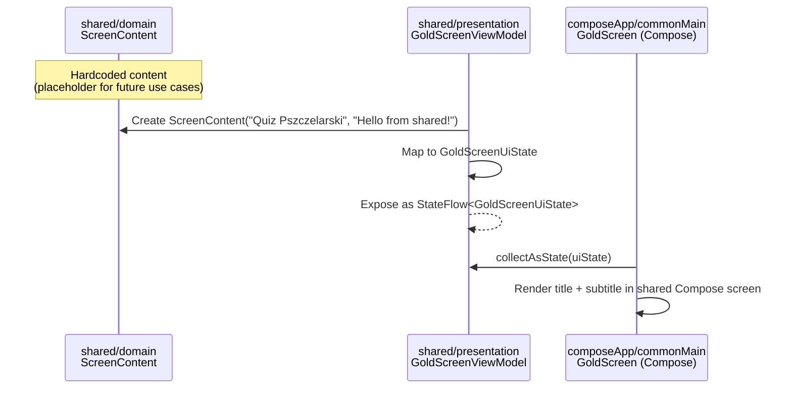
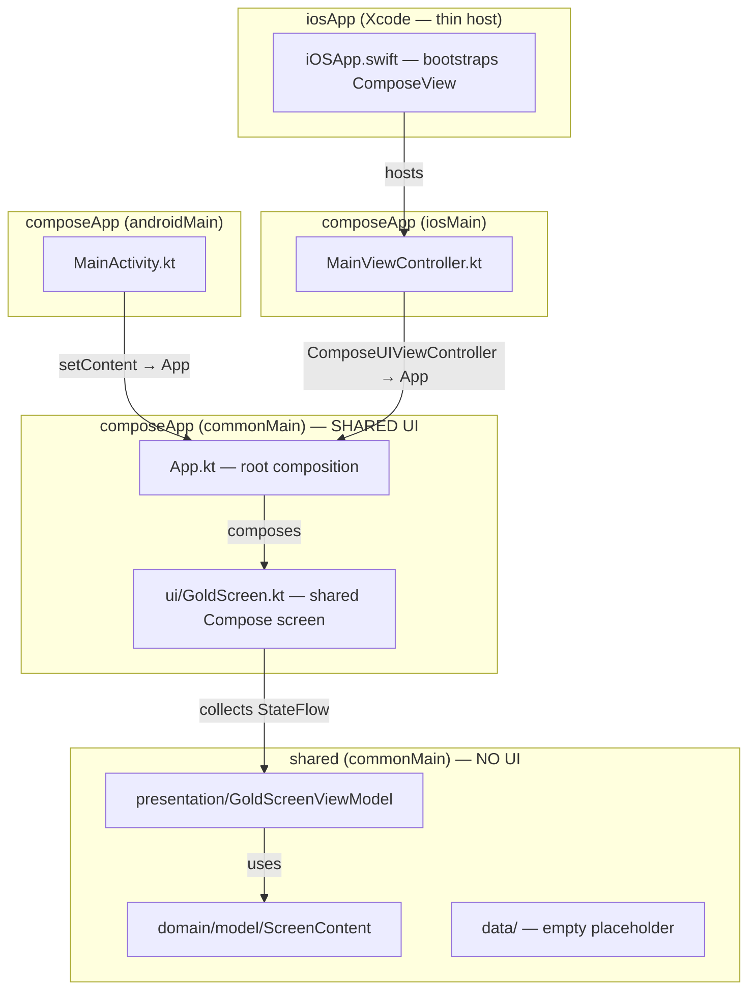

# Phase 0: Gold Screen Scaffold — Implementation Plan

> **Date:** 2026-02-16  
> **Goal:** Minimal KMP project that builds and runs on Android and iOS,  
> displaying a shared "Gold Screen" with text from shared code.  
> **UI:** Compose Multiplatform — shared screens in `composeApp/src/commonMain`.  
> **Architecture:** Clean Architecture layers in `:shared` (domain/data/presentation).  
> **ADR:** ADR-0001 (Compose Multiplatform shared UI)

---

## A) Repository & Module Structure

```
quiz-pszczelarski-kmp/
├── build.gradle.kts                          # root: plugin declarations only
├── settings.gradle.kts                       # includes :shared, :composeApp
├── gradle.properties                         # KMP + Android properties
├── gradle/
│   ├── wrapper/
│   │   ├── gradle-wrapper.jar
│   │   └── gradle-wrapper.properties
│   └── libs.versions.toml                    # version catalog
├── gradlew
├── gradlew.bat
│
├── shared/                                   # KMP library — business logic only
│   ├── build.gradle.kts
│   └── src/
│       ├── commonMain/kotlin/pl/quizpszczelarski/shared/
│       │   ├── domain/
│       │   │   └── model/
│       │   │       └── ScreenContent.kt      # domain model
│       │   ├── data/                         # empty placeholder
│       │   │   └── .gitkeep
│       │   └── presentation/
│       │       ├── GoldScreenUiState.kt      # UI state data class
│       │       └── GoldScreenViewModel.kt    # shared ViewModel
│       ├── commonTest/                       # placeholder for tests
│       ├── androidMain/                      # (empty for now)
│       └── iosMain/                          # (empty for now)
│
├── composeApp/                               # Compose Multiplatform — shared UI
│   ├── build.gradle.kts
│   └── src/
│       ├── commonMain/kotlin/pl/quizpszczelarski/app/
│       │   ├── App.kt                        # root @Composable (AppRoot)
│       │   └── ui/
│       │       └── GoldScreen.kt             # shared Compose screen
│       ├── androidMain/kotlin/pl/quizpszczelarski/app/
│       │   └── MainActivity.kt              # Android Activity entrypoint
│       ├── androidMain/res/
│       │   └── values/strings.xml
│       ├── androidMain/AndroidManifest.xml
│       └── iosMain/kotlin/pl/quizpszczelarski/app/
│           └── MainViewController.kt         # iOS entry (UIKit bridge)
│
├── iosApp/                                   # Xcode project (thin host)
│   ├── iosApp.xcodeproj/
│   ├── iosApp/
│   │   ├── iOSApp.swift                      # @main — hosts ComposeViewController
│   │   ├── ContentView.swift                 # wraps ComposeView in SwiftUI
│   │   ├── Info.plist
│   │   └── Assets.xcassets/
│   └── iosApp.xcworkspace/
│
├── docs/
│   ├── definition-of-ready.md
│   └── adr/
│       └── ADR-0001-platform-specific-ui.md
├── plans/
│   └── phase-0-scaffold.md                   # this file
└── tools/                                    # existing tooling
```

### Module Summary

| Module | Type | Purpose |
|---|---|---|
| `:shared` | KMP library (Android + iOS) | Domain models, use cases, ViewModels (NO UI) |
| `:composeApp` | KMP + Compose Multiplatform | Shared Compose screens (commonMain) + platform entrypoints |
| `iosApp/` | Xcode project (thin host) | Bootstraps ComposeViewController, no SwiftUI screens |

---

## B) Technology Decisions

### B1. State Management: MVVM (not MVI)

**Choice:** MVVM with `StateFlow<UiState>` + `onEvent(UiEvent)`.

**Why not MVI?** For MVP with simple screens, MVI's reducer/store pattern adds ceremony.
MVVM is sufficient and can be evolved to MVI later if needed (no breaking change).

**Pattern per screen:**
- `UiState` — immutable `data class` (what the UI renders)
- `UiEvent` — sealed interface (what the user does)  
- `ViewModel` — holds `StateFlow<UiState>`, exposes `fun onEvent(event: UiEvent)`

### B2. UI: Compose Multiplatform (shared)

Per ADR-0001, all screens live in `composeApp/src/commonMain`.
iOS host project (`iosApp/`) is a thin shell that bootstraps `ComposeViewController`.
No SKIE, no SwiftUI screens, no iOS bridging for state.

### B3. Dependency Injection: None for Phase 0

For one screen with no real dependencies, DI is premature.
Koin will be introduced when the first real use case requires injection (Phase 1+).

### B4. Navigation: None for Phase 0

Single screen — no navigation framework needed yet.

---

## C) Data Flow: shared → Compose UI (both platforms)

### Sequence Diagram



### Layer Diagram



### Flow Summary

1. `ScreenContent` (domain model) holds `title` and `subtitle` — pure data, lives in `:shared`.
2. `GoldScreenViewModel` creates a `ScreenContent`, maps to `GoldScreenUiState`, exposes via `StateFlow`.
3. `GoldScreen` (shared Compose in `composeApp/commonMain`) collects `StateFlow` via `collectAsState()` and renders.
4. **Android:** `MainActivity` calls `setContent { App() }` — standard Compose Activity.
5. **iOS:** `MainViewController.kt` creates `ComposeUIViewController { App() }`, Xcode project embeds it.

---

## D) Classes, Packages, and Minimal Implementations

### D1. `shared/domain/model/ScreenContent.kt`

```kotlin
package pl.quizpszczelarski.shared.domain.model

/**
 * Generic screen content holder.
 * Will evolve into quiz-specific models in later phases.
 */
data class ScreenContent(
    val title: String,
    val subtitle: String,
)
```

### D2. `shared/presentation/GoldScreenUiState.kt`

```kotlin
package pl.quizpszczelarski.shared.presentation

data class GoldScreenUiState(
    val title: String = "",
    val subtitle: String = "",
)
```

### D3. `shared/presentation/GoldScreenViewModel.kt`

```kotlin
package pl.quizpszczelarski.shared.presentation

import kotlinx.coroutines.flow.MutableStateFlow
import kotlinx.coroutines.flow.StateFlow
import kotlinx.coroutines.flow.asStateFlow
import pl.quizpszczelarski.shared.domain.model.ScreenContent

class GoldScreenViewModel {

    private val _uiState = MutableStateFlow(GoldScreenUiState())
    val uiState: StateFlow<GoldScreenUiState> = _uiState.asStateFlow()

    init {
        // Placeholder: in future, a use case will provide this data
        val content = ScreenContent(
            title = "Quiz Pszczelarski",
            subtitle = "Hello from shared!",
        )
        _uiState.value = GoldScreenUiState(
            title = content.title,
            subtitle = content.subtitle,
        )
    }
}
```

### D4. `composeApp/commonMain/.../App.kt`

```kotlin
package pl.quizpszczelarski.app

import androidx.compose.runtime.Composable
import pl.quizpszczelarski.app.ui.GoldScreen
import pl.quizpszczelarski.shared.presentation.GoldScreenViewModel

@Composable
fun App() {
    val viewModel = GoldScreenViewModel()
    GoldScreen(viewModel = viewModel)
}
```

> **Note:** In Phase 1+, `App()` will gain a DI container (Koin) and navigation graph.
> For now, direct instantiation is acceptable for a single screen.

### D5. `composeApp/commonMain/.../ui/GoldScreen.kt`

```kotlin
package pl.quizpszczelarski.app.ui

import androidx.compose.foundation.background
import androidx.compose.foundation.layout.*
import androidx.compose.material3.MaterialTheme
import androidx.compose.material3.Text
import androidx.compose.runtime.Composable
import androidx.compose.runtime.collectAsState
import androidx.compose.runtime.getValue
import androidx.compose.ui.Alignment
import androidx.compose.ui.Modifier
import androidx.compose.ui.graphics.Color
import androidx.compose.ui.unit.dp
import pl.quizpszczelarski.shared.presentation.GoldScreenViewModel

@Composable
fun GoldScreen(
    viewModel: GoldScreenViewModel,
    modifier: Modifier = Modifier,
) {
    val state by viewModel.uiState.collectAsState()

    Box(
        modifier = modifier
            .fillMaxSize()
            .background(Color(0xFFFFD700)),  // Gold
        contentAlignment = Alignment.Center,
    ) {
        Column(horizontalAlignment = Alignment.CenterHorizontally) {
            Text(
                text = state.title,
                style = MaterialTheme.typography.headlineLarge,
            )
            Spacer(modifier = Modifier.height(8.dp))
            Text(
                text = state.subtitle,
                style = MaterialTheme.typography.bodyLarge,
            )
        }
    }
}
```

### D6. `composeApp/androidMain/.../MainActivity.kt`

```kotlin
package pl.quizpszczelarski.app

import android.os.Bundle
import androidx.activity.ComponentActivity
import androidx.activity.compose.setContent

class MainActivity : ComponentActivity() {
    override fun onCreate(savedInstanceState: Bundle?) {
        super.onCreate(savedInstanceState)
        setContent {
            App()
        }
    }
}
```

### D7. `composeApp/iosMain/.../MainViewController.kt`

```kotlin
package pl.quizpszczelarski.app

import androidx.compose.ui.window.ComposeUIViewController

fun MainViewController() = ComposeUIViewController { App() }
```

### D8. `iosApp/.../iOSApp.swift` (thin host)

```swift
import SwiftUI
import ComposeApp  // framework name from composeApp module

@main
struct iOSApp: App {
    var body: some Scene {
        WindowGroup {
            ComposeView()
                .ignoresSafeArea(.all)
        }
    }
}

struct ComposeView: UIViewControllerRepresentable {
    func makeUIViewController(context: Context) -> UIViewController {
        MainViewControllerKt.MainViewController()
    }
    func updateUIViewController(_ uiViewController: UIViewController, context: Context) {}
}
```

---

## E) Definition of Done

| # | Criterion | How to verify |
|---|---|---|
| 1 | Project compiles without errors | `./gradlew build` succeeds |
| 2 | Android app launches on emulator | Run `:composeApp` (Android) from Android Studio |
| 3 | iOS app launches on simulator | Run `iosApp` from Xcode |
| 4 | Gold background visible on both platforms | Visual check |
| 5 | Title "Quiz Pszczelarski" displayed | Visual check — text comes from shared |
| 6 | Subtitle "Hello from shared!" displayed | Visual check — text comes from shared |
| 7 | No crashes on launch | Run for 10s, no ANR/crash |
| 8 | Text originates from `shared` module | Verify: changing text in `GoldScreenViewModel` changes both platforms |
| 9 | Clean Architecture layers present | `domain/`, `data/`, `presentation/` packages exist in shared |
| 10 | Same Compose screen runs on both platforms | Single `GoldScreen.kt` in commonMain renders identically |

---

## F) Complete File List (must exist for build)

### Gradle Infrastructure

| File | Purpose |
|---|---|
| `build.gradle.kts` | Root — declares plugins (apply false) |
| `settings.gradle.kts` | Includes `:shared`, `:composeApp`; plugin/dependency repos |
| `gradle.properties` | KMP flags, Android config |
| `gradle/libs.versions.toml` | Version catalog |
| `gradle/wrapper/gradle-wrapper.properties` | Gradle version |
| `gradle/wrapper/gradle-wrapper.jar` | Gradle wrapper binary |
| `gradlew` | Unix wrapper script |
| `gradlew.bat` | Windows wrapper script |

### `:shared` Module (business logic only)

| File | Purpose |
|---|---|
| `shared/build.gradle.kts` | KMP library: android + iOS targets, coroutines |
| `shared/src/commonMain/kotlin/.../domain/model/ScreenContent.kt` | Domain model |
| `shared/src/commonMain/kotlin/.../presentation/GoldScreenUiState.kt` | UI state |
| `shared/src/commonMain/kotlin/.../presentation/GoldScreenViewModel.kt` | ViewModel |
| `shared/src/commonMain/kotlin/.../data/.gitkeep` | Placeholder |

### `:composeApp` Module (shared UI + platform entrypoints)

| File | Purpose |
|---|---|
| `composeApp/build.gradle.kts` | KMP + Compose Multiplatform + Android app |
| `composeApp/src/commonMain/kotlin/.../App.kt` | Root Compose function |
| `composeApp/src/commonMain/kotlin/.../ui/GoldScreen.kt` | Shared Gold Screen |
| `composeApp/src/androidMain/kotlin/.../MainActivity.kt` | Android Activity |
| `composeApp/src/androidMain/AndroidManifest.xml` | Activity declaration |
| `composeApp/src/iosMain/kotlin/.../MainViewController.kt` | iOS UIViewController bridge |

### `iosApp/` (Xcode — thin host)

| File | Purpose |
|---|---|
| `iosApp/iosApp.xcodeproj/` | Xcode project |
| `iosApp/iosApp/iOSApp.swift` | @main — hosts ComposeViewController |
| `iosApp/iosApp/ContentView.swift` | UIViewControllerRepresentable wrapper |
| `iosApp/iosApp/Info.plist` | iOS app config |
| `iosApp/iosApp/Assets.xcassets/` | App icons / assets |

### Gradle Config Details

**`gradle/libs.versions.toml`** (key entries):
```toml
[versions]
kotlin = "2.1.0"
agp = "8.7.3"
compose-multiplatform = "1.7.3"
coroutines = "1.9.0"
compose-activity = "1.9.3"

[libraries]
kotlinx-coroutines-core = { module = "org.jetbrains.kotlinx:kotlinx-coroutines-core", version.ref = "coroutines" }
compose-activity = { module = "androidx.activity:activity-compose", version.ref = "compose-activity" }

[plugins]
kotlinMultiplatform = { id = "org.jetbrains.kotlin.multiplatform", version.ref = "kotlin" }
kotlinAndroid = { id = "org.jetbrains.kotlin.android", version.ref = "kotlin" }
androidApplication = { id = "com.android.application", version.ref = "agp" }
androidLibrary = { id = "com.android.library", version.ref = "agp" }
composeMultiplatform = { id = "org.jetbrains.compose", version.ref = "compose-multiplatform" }
composeCompiler = { id = "org.jetbrains.kotlin.plugin.compose", version.ref = "kotlin" }
```

**`shared/build.gradle.kts`** (skeleton):
```kotlin
plugins {
    alias(libs.plugins.kotlinMultiplatform)
    alias(libs.plugins.androidLibrary)
}

kotlin {
    androidTarget()
    listOf(iosX64(), iosArm64(), iosSimulatorArm64()).forEach { it.binaries.framework { baseName = "shared"; isStatic = true } }
    sourceSets {
        commonMain.dependencies { implementation(libs.kotlinx.coroutines.core) }
    }
}

android {
    namespace = "pl.quizpszczelarski.shared"
    compileSdk = 35
    defaultConfig { minSdk = 26 }
}
```

**`composeApp/build.gradle.kts`** (skeleton):
```kotlin
plugins {
    alias(libs.plugins.kotlinMultiplatform)
    alias(libs.plugins.androidApplication)
    alias(libs.plugins.composeMultiplatform)
    alias(libs.plugins.composeCompiler)
}

kotlin {
    androidTarget()
    listOf(iosX64(), iosArm64(), iosSimulatorArm64()).forEach { target ->
        target.binaries.framework {
            baseName = "ComposeApp"
            isStatic = true
        }
    }
    sourceSets {
        commonMain.dependencies {
            implementation(project(":shared"))
            implementation(compose.runtime)
            implementation(compose.foundation)
            implementation(compose.material3)
            implementation(compose.ui)
        }
        androidMain.dependencies {
            implementation(libs.compose.activity)
        }
    }
}

android {
    namespace = "pl.quizpszczelarski.app"
    compileSdk = 35
    defaultConfig {
        applicationId = "pl.quizpszczelarski"
        minSdk = 26
        targetSdk = 35
        versionCode = 1
        versionName = "0.1.0"
    }
}
```

---

## G) Steps to Run

### Prerequisites

- Android Studio (latest stable) with KMP plugin
- Xcode 16+ (for iOS simulator)
- JDK 17+

### Android

1. Open project root in Android Studio.
2. Wait for Gradle sync to complete.
3. Select `:composeApp` run configuration (Android target).
4. Choose an Android emulator (API 26+).
5. Run. Verify gold screen with "Quiz Pszczelarski" + "Hello from shared!".

### iOS

1. Build the ComposeApp framework:
   ```bash
   ./gradlew :composeApp:linkDebugFrameworkIosSimulatorArm64
   ```
2. Open `iosApp/iosApp.xcodeproj` in Xcode.
3. Ensure the ComposeApp framework is linked (Build Phases → Link Binary).
4. Select an iOS Simulator (iPhone 15+).
5. Build & Run. Verify gold screen with same text.

> **Tip:** Add a "Run Script" build phase in Xcode that runs `./gradlew :composeApp:linkDebugFrameworkIos*`
> automatically before each build, so you don't need step 1 manually.

### Verification Checklist

- [ ] `./gradlew build` — no errors
- [ ] Android emulator shows gold screen with correct text
- [ ] iOS simulator shows gold screen with correct text
- [ ] Change subtitle in `GoldScreenViewModel.kt` → rebuild both → text changes on both platforms

---

## H) Risks & Mitigations

| Risk | Likelihood | Impact | Mitigation |
|---|---|---|---|
| Compose Multiplatform iOS rendering glitches | Low | Low | Acceptable for MVP; revisit if user-facing issues arise |
| iOS framework linking issues in Xcode | Medium | Medium | Document exact Xcode setup; use embedAndSign |
| Gradle sync slow on first build | Medium | Low | Expected; document wait time |
| Compose Multiplatform version vs Kotlin version mismatch | Low | Medium | Pin compatible versions in libs.versions.toml |

---

## I) What This Phase Does NOT Include

- No DI framework (Koin) — introduced in Phase 1
- No navigation — single screen
- No real domain logic — placeholder only
- No database (SQLDelight) or API layer
- No tests — will be scaffolded in Phase 1
- No CI/CD pipeline
- No theming beyond gold background
- No analytics or crash reporting
- No SKIE or iOS-specific bridging — Compose Multiplatform handles everything
