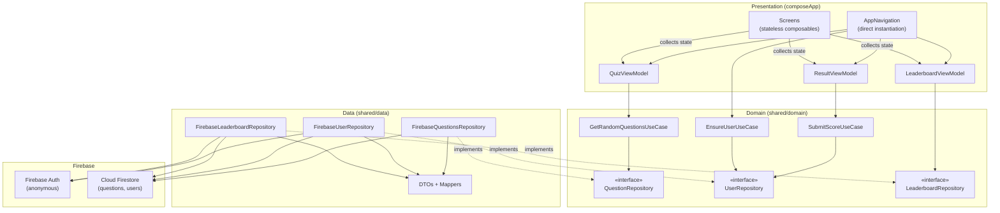
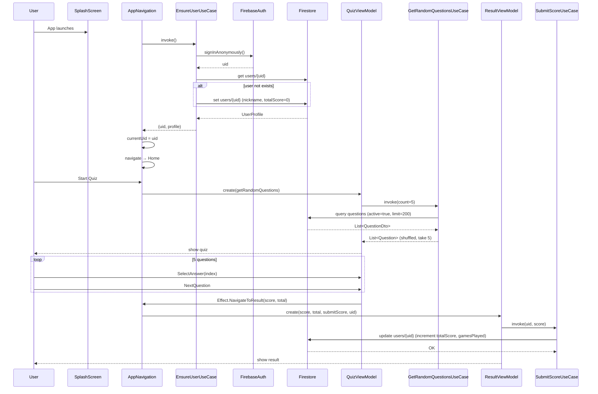
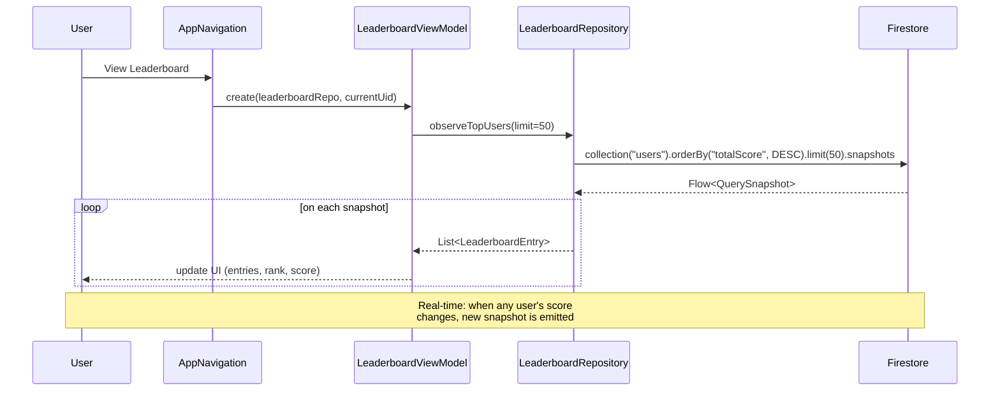
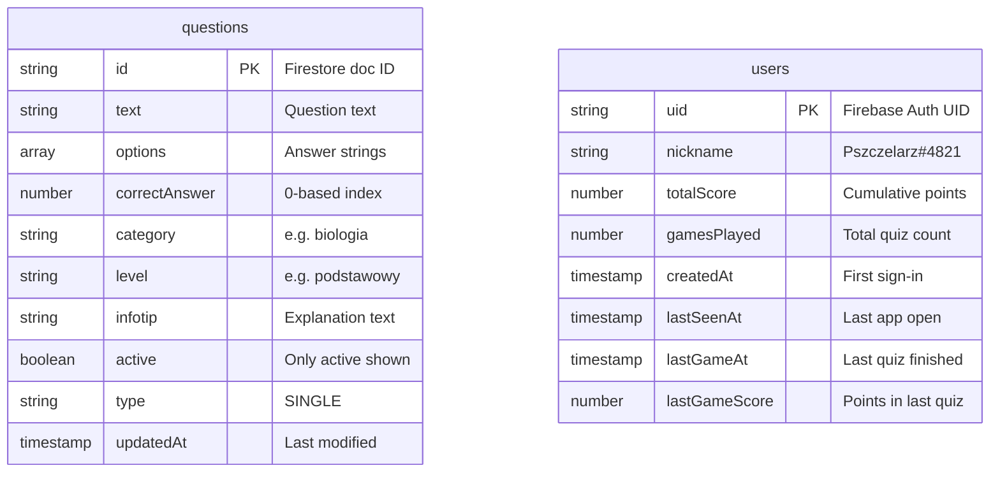

# Phase 2: Firebase Integration — Implementation Plan

> **Date:** 2026-02-17  
> **Goal:** Replace hardcoded data with Firebase Auth (anonymous) + Firestore.  
> **Prerequisite:** Phase 1 complete (all 5 screens, MVI, theme, navigation).  
> **ADR:** ADR-0004 (GitLive firebase-kotlin-sdk).  
> **Platforms:** Android + iOS.

---

## Table of Contents

1. [Summary](#summary)
2. [Phase 2A — Gradle & Firebase Config](#phase-2a)
3. [Phase 2B — Domain Layer (Interfaces & Models)](#phase-2b)
4. [Phase 2C — Data Layer (Firebase Repositories)](#phase-2c)
5. [Phase 2D — ViewModel Integration](#phase-2d)
6. [Phase 2E — Error Handling & Polish](#phase-2e)
7. [DoR Gaps](#dor-gaps)
8. [Risks & Mitigations](#risks)
9. [Diagrams](#diagrams)

---

<a id="summary"></a>
## Summary

| What | How |
|---|---|
| Firebase SDK | GitLive `firebase-kotlin-sdk` 2.1.0 (commonMain) |
| Auth | Anonymous sign-in → UID |
| Questions | Firestore `questions` collection → `QuestionsRepository` |
| Users | Firestore `users/{uid}` → `UserRepository` |
| Leaderboard | Firestore `users` ordered by `totalScore` desc → `LeaderboardRepository` |
| Nickname | Auto-generated `"Pszczelarz#XXXX"` on first sign-in |
| Scoring | Atomic `FieldValue.increment` on `totalScore` + `gamesPlayed` |

---

<a id="phase-2a"></a>
## Phase 2A — Gradle & Firebase Config (1 commit)

**Commit:** `build: add Firebase dependencies and config for Android + iOS`

### 2A.1 Version Catalog — `gradle/libs.versions.toml`

Add under `[versions]`:
```toml
firebase-gitlive = "2.1.0"
google-services = "4.4.2"
kotlinx-serialization = "1.8.1"
```

Add under `[libraries]`:
```toml
firebase-auth = { module = "dev.gitlive:firebase-auth", version.ref = "firebase-gitlive" }
firebase-firestore = { module = "dev.gitlive:firebase-firestore", version.ref = "firebase-gitlive" }
kotlinx-serialization-json = { module = "org.jetbrains.kotlinx:kotlinx-serialization-json", version.ref = "kotlinx-serialization" }
```

Add under `[plugins]`:
```toml
googleServices = { id = "com.google.gms.google-services", version.ref = "google-services" }
kotlinSerialization = { id = "org.jetbrains.kotlin.plugin.serialization", version.ref = "kotlin" }
```

### 2A.2 Root `build.gradle.kts`

Add to plugins block:
```kotlin
alias(libs.plugins.googleServices) apply false
alias(libs.plugins.kotlinSerialization) apply false
```

### 2A.3 `:shared` `build.gradle.kts`

Add serialization plugin:
```kotlin
plugins {
    alias(libs.plugins.kotlinMultiplatform)
    alias(libs.plugins.androidLibrary)
    alias(libs.plugins.kotlinSerialization)  // ← ADD
}
```

Add Firebase + serialization dependencies:
```kotlin
commonMain.dependencies {
    implementation(libs.kotlinx.coroutines.core)
    implementation(libs.firebase.auth)                // ← ADD
    implementation(libs.firebase.firestore)           // ← ADD
    implementation(libs.kotlinx.serialization.json)   // ← ADD
}
```

### 2A.4 `:composeApp` `build.gradle.kts`

Apply google-services plugin **at the bottom** (must be after `android {}` block):
```kotlin
plugins {
    alias(libs.plugins.kotlinMultiplatform)
    alias(libs.plugins.androidApplication)
    alias(libs.plugins.composeMultiplatform)
    alias(libs.plugins.composeCompiler)
    alias(libs.plugins.googleServices)  // ← ADD (must be last)
}
```

### 2A.5 Move `google-services.json`

Move from project root to `:composeApp` module root:
```bash
mv google-services.json composeApp/google-services.json
```

The google-services plugin expects this file at `<app-module>/google-services.json`.

> **CRITICAL:** Verify the `google-services.json` contains a client entry with
> `package_name: "pl.quizpszczelarski.app"` matching the Android `applicationId`.
> ✅ Confirmed: entry exists with `mobilesdk_app_id: 1:451121585757:android:fbf9e655b2ae0b8ecc37b4`.

### 2A.6 Android Manifest — Internet Permission

File: `composeApp/src/androidMain/AndroidManifest.xml`

Add before `<application>`:
```xml
<uses-permission android:name="android.permission.INTERNET" />
```

### 2A.7 iOS — GoogleService-Info.plist

1. **Copy** `GoogleService-Info.plist` from project root into `iosApp/iosApp/`:
   ```bash
   cp GoogleService-Info.plist iosApp/iosApp/GoogleService-Info.plist
   ```

2. **Add to Xcode project:**
   In Xcode → iosApp target → Build Phases → Copy Bundle Resources →
   ensure `GoogleService-Info.plist` is listed. If using "Generate Info.plist",
   add the file reference to the iosApp group in the project navigator.

3. **Add Firebase iOS SDK via SPM:**
   In Xcode → File → Add Package Dependencies →
   URL: `https://github.com/firebase/firebase-ios-sdk`
   Version: match the version expected by GitLive 2.1.0 (typically Firebase iOS 11.x).
   
   Select packages:
   - `FirebaseAuth`
   - `FirebaseFirestore`
   
   Add to target: `iosApp`.

4. **Initialize Firebase in Swift entrypoint:**

   File: `iosApp/iosApp/iOSApp.swift`
   ```swift
   import SwiftUI
   import ComposeApp
   import FirebaseCore  // ← ADD

   @main
   struct iOSApp: App {
       init() {
           FirebaseApp.configure()  // ← ADD
       }
       
       var body: some Scene {
           WindowGroup {
               ComposeView()
                   .ignoresSafeArea(.all)
           }
       }
   }
   ```

### 2A.8 Android — Firebase Auto-Init

No explicit initialization needed on Android. The google-services plugin generates
`google_app_id` and other values files. Firebase initializes automatically via
`FirebaseApp.initializeApp(context)` triggered by the content provider.

### Verification (2A)

- [ ] `./gradlew :shared:build` compiles with firebase-auth + firebase-firestore in classpath
- [ ] `./gradlew :composeApp:assembleDebug` picks up `google-services.json` without errors
- [ ] iOS Xcode build succeeds with Firebase SPM packages linked
- [ ] Android app launches (no crash on Firebase init)
- [ ] iOS app launches (no crash on `FirebaseApp.configure()`)

---

<a id="phase-2b"></a>
## Phase 2B — Domain Layer (Interfaces & Models) (1 commit)

**Commit:** `feat(domain): add Firebase-ready repository interfaces and models`

### 2B.1 New/Updated Domain Models

File: `shared/src/commonMain/kotlin/pl/quizpszczelarski/shared/domain/model/Question.kt`

**Update** existing `Question` to support Firestore fields:
```kotlin
data class Question(
    val id: String,              // ← Change Int → String (Firestore doc ID)
    val text: String,
    val options: List<String>,
    val correctAnswerIndex: Int,
    val category: String = "",
    val level: String = "",
    val infotip: String = "",
)
```

> **NOTE:** Changing `id: Int` → `id: String` is a breaking change. Update all
> references: `LocalQuestionDataSource`, `QuizState`, any test code.

File: `shared/src/commonMain/kotlin/pl/quizpszczelarski/shared/domain/model/UserProfile.kt` ← NEW
```kotlin
data class UserProfile(
    val uid: String,
    val nickname: String,
    val totalScore: Int,
    val gamesPlayed: Int,
)
```

File: `shared/src/commonMain/kotlin/pl/quizpszczelarski/shared/domain/model/LeaderboardEntry.kt`

**Update** to add `uid` field:
```kotlin
data class LeaderboardEntry(
    val uid: String,            // ← ADD
    val rank: Int,
    val name: String,
    val score: Int,
    val isCurrentUser: Boolean = false,
)
```

File: `shared/src/commonMain/kotlin/pl/quizpszczelarski/shared/domain/model/AppError.kt` ← NEW
```kotlin
sealed interface AppError {
    data class Network(val message: String? = null) : AppError
    data class NotFound(val entity: String) : AppError
    data class Unknown(val message: String? = null, val cause: Throwable? = null) : AppError
}
```

### 2B.2 Repository Interfaces

File: `shared/src/commonMain/kotlin/pl/quizpszczelarski/shared/domain/repository/QuestionRepository.kt`

**Replace** existing interface:
```kotlin
interface QuestionRepository {
    /**
     * Returns active questions with optional filters.
     * @param level Filter by difficulty level (null = all).
     * @param category Filter by category (null = all).
     * @param limit Maximum number of questions to return.
     */
    suspend fun getActiveQuestions(
        level: String? = null,
        category: String? = null,
        limit: Int = 200,
    ): List<Question>
}
```

> **Breaking:** `getAllQuestions(): List<Question>` becomes `suspend fun getActiveQuestions(...)`.
> Update `GetRandomQuestionsUseCase`, `LocalQuestionDataSource`, and `QuizViewModel` accordingly.

File: `shared/src/commonMain/kotlin/pl/quizpszczelarski/shared/domain/repository/UserRepository.kt` ← NEW
```kotlin
interface UserRepository {
    /**
     * Signs in anonymously if not already signed in.
     * @return Firebase UID.
     */
    suspend fun ensureSignedIn(): String

    /**
     * Creates user profile in Firestore if it doesn't exist.
     * Generates nickname like "Pszczelarz#4821".
     * Updates lastSeenAt on every call.
     * @return UserProfile.
     */
    suspend fun ensureUserProfile(uid: String): UserProfile

    /**
     * Atomically increments totalScore and gamesPlayed.
     * Sets lastGameAt and lastGameScore.
     */
    suspend fun addScore(uid: String, delta: Int)
}
```

File: `shared/src/commonMain/kotlin/pl/quizpszczelarski/shared/domain/repository/LeaderboardRepository.kt` ← NEW
```kotlin
import kotlinx.coroutines.flow.Flow

interface LeaderboardRepository {
    /**
     * Observes top users ordered by totalScore descending.
     * Emits new list on every Firestore snapshot change.
     */
    fun observeTopUsers(limit: Int = 50): Flow<List<LeaderboardEntry>>
}
```

### 2B.3 Use Cases

File: `shared/src/commonMain/kotlin/pl/quizpszczelarski/shared/domain/usecase/GetRandomQuestionsUseCase.kt`

**Update** to suspend + use new interface:
```kotlin
class GetRandomQuestionsUseCase(
    private val repository: QuestionRepository,
) {
    suspend operator fun invoke(count: Int = 5): List<Question> {
        return repository.getActiveQuestions()
            .shuffled()
            .take(count)
    }
}
```

File: `shared/src/commonMain/kotlin/pl/quizpszczelarski/shared/domain/usecase/SubmitScoreUseCase.kt` ← NEW
```kotlin
class SubmitScoreUseCase(
    private val userRepository: UserRepository,
) {
    /**
     * Submits quiz score: increments totalScore + gamesPlayed.
     * @param uid User UID.
     * @param score Points earned in this quiz.
     */
    suspend operator fun invoke(uid: String, score: Int) {
        userRepository.addScore(uid, score)
    }
}
```

File: `shared/src/commonMain/kotlin/pl/quizpszczelarski/shared/domain/usecase/EnsureUserUseCase.kt` ← NEW
```kotlin
class EnsureUserUseCase(
    private val userRepository: UserRepository,
) {
    /**
     * Signs in anonymously and ensures user profile exists.
     * @return Pair(uid, userProfile).
     */
    suspend operator fun invoke(): Pair<String, UserProfile> {
        val uid = userRepository.ensureSignedIn()
        val profile = userRepository.ensureUserProfile(uid)
        return uid to profile
    }
}
```

### 2B.4 Update LocalQuestionDataSource (backward-compat)

File: `shared/src/commonMain/kotlin/pl/quizpszczelarski/shared/data/source/LocalQuestionDataSource.kt`

Update to implement new interface (fallback data source):
```kotlin
class LocalQuestionDataSource : QuestionRepository {

    override suspend fun getActiveQuestions(
        level: String?,
        category: String?,
        limit: Int,
    ): List<Question> = questions.take(limit)

    companion object {
        private val questions = listOf(
            Question(id = "local-1", text = "Ile oczu ma pszczoła miodna?", ...),
            // ... update all ids to String
        )
    }
}
```

### Verification (2B)

- [ ] `:shared` compiles with new interfaces
- [ ] `CalculateScoreUseCaseTest` still passes (update if Question.id type changed)
- [ ] No Firebase imports in domain package
- [ ] `QuestionRepository` is `suspend` — `QuizViewModel.loadQuestions()` must launch in coroutine

---

<a id="phase-2c"></a>
## Phase 2C — Data Layer (Firebase Repositories) (1 commit)

**Commit:** `feat(data): add Firebase Auth, Firestore question, user, and leaderboard repositories`

### Target Package Structure

```
shared/src/commonMain/kotlin/pl/quizpszczelarski/shared/
├── data/
│   ├── dto/
│   │   ├── QuestionDto.kt
│   │   └── UserDto.kt
│   ├── mapper/
│   │   ├── QuestionMapper.kt
│   │   └── UserMapper.kt
│   ├── questions/
│   │   └── FirebaseQuestionsRepository.kt
│   ├── user/
│   │   └── FirebaseUserRepository.kt
│   ├── leaderboard/
│   │   └── FirebaseLeaderboardRepository.kt
│   └── source/
│       └── LocalQuestionDataSource.kt  (existing, updated)
```

### 2C.1 DTOs (Firestore document shapes)

File: `shared/src/commonMain/kotlin/pl/quizpszczelarski/shared/data/dto/QuestionDto.kt`
```kotlin
import kotlinx.serialization.Serializable

@Serializable
data class QuestionDto(
    val text: String = "",
    val options: List<String> = emptyList(),
    val correctAnswer: Int = 0,         // Firestore field name
    val category: String = "",
    val level: String = "",
    val infotip: String = "",
    val active: Boolean = true,
    val type: String = "SINGLE",
    // updatedAt is Timestamp — handled separately, not in DTO
)
```

File: `shared/src/commonMain/kotlin/pl/quizpszczelarski/shared/data/dto/UserDto.kt`
```kotlin
import kotlinx.serialization.Serializable

@Serializable
data class UserDto(
    val nickname: String = "",
    val totalScore: Int = 0,
    val gamesPlayed: Int = 0,
    // Timestamps handled via Firestore ServerTimestamp, not serialized
)
```

### 2C.2 Mappers

File: `shared/src/commonMain/kotlin/pl/quizpszczelarski/shared/data/mapper/QuestionMapper.kt`
```kotlin
object QuestionMapper {
    fun toDomain(id: String, dto: QuestionDto): Question {
        return Question(
            id = id,
            text = dto.text,
            options = dto.options,
            correctAnswerIndex = dto.correctAnswer,
            category = dto.category,
            level = dto.level,
            infotip = dto.infotip,
        )
    }
}
```

File: `shared/src/commonMain/kotlin/pl/quizpszczelarski/shared/data/mapper/UserMapper.kt`
```kotlin
object UserMapper {
    fun toDomain(uid: String, dto: UserDto): UserProfile {
        return UserProfile(
            uid = uid,
            nickname = dto.nickname,
            totalScore = dto.totalScore,
            gamesPlayed = dto.gamesPlayed,
        )
    }

    fun toLeaderboardEntry(uid: String, dto: UserDto, rank: Int, currentUid: String): LeaderboardEntry {
        return LeaderboardEntry(
            uid = uid,
            rank = rank,
            name = dto.nickname,
            score = dto.totalScore,
            isCurrentUser = uid == currentUid,
        )
    }
}
```

### 2C.3 FirebaseQuestionsRepository

File: `shared/src/commonMain/kotlin/pl/quizpszczelarski/shared/data/questions/FirebaseQuestionsRepository.kt`

```kotlin
package pl.quizpszczelarski.shared.data.questions

import dev.gitlive.firebase.firestore.FirebaseFirestore
import pl.quizpszczelarski.shared.data.dto.QuestionDto
import pl.quizpszczelarski.shared.data.mapper.QuestionMapper
import pl.quizpszczelarski.shared.domain.model.Question
import pl.quizpszczelarski.shared.domain.repository.QuestionRepository

class FirebaseQuestionsRepository(
    private val firestore: FirebaseFirestore,
) : QuestionRepository {

    override suspend fun getActiveQuestions(
        level: String?,
        category: String?,
        limit: Int,
    ): List<Question> {
        var query = firestore.collection("questions")
            .where { "active" equalTo true }

        if (level != null) {
            query = query.where { "level" equalTo level }
        }
        if (category != null) {
            query = query.where { "category" equalTo category }
        }

        val snapshot = query.limit(limit).get()

        return snapshot.documents.map { doc ->
            val dto = doc.data<QuestionDto>()
            QuestionMapper.toDomain(id = doc.id, dto = dto)
        }
    }
}
```

> **API note:** GitLive `doc.data<T>()` uses `kotlinx-serialization` to decode.
> The `QuestionDto` must be `@Serializable`. Field names must match Firestore
> document field names exactly (by default, property names are used).

### 2C.4 FirebaseUserRepository

File: `shared/src/commonMain/kotlin/pl/quizpszczelarski/shared/data/user/FirebaseUserRepository.kt`

```kotlin
package pl.quizpszczelarski.shared.data.user

import dev.gitlive.firebase.auth.FirebaseAuth
import dev.gitlive.firebase.firestore.FieldValue
import dev.gitlive.firebase.firestore.FirebaseFirestore
import pl.quizpszczelarski.shared.data.dto.UserDto
import pl.quizpszczelarski.shared.data.mapper.UserMapper
import pl.quizpszczelarski.shared.domain.model.UserProfile
import pl.quizpszczelarski.shared.domain.repository.UserRepository
import kotlin.random.Random

class FirebaseUserRepository(
    private val auth: FirebaseAuth,
    private val firestore: FirebaseFirestore,
) : UserRepository {

    override suspend fun ensureSignedIn(): String {
        val currentUser = auth.currentUser
        if (currentUser != null) return currentUser.uid

        val result = auth.signInAnonymously()
        return result.user?.uid
            ?: throw IllegalStateException("Anonymous sign-in returned null user")
    }

    override suspend fun ensureUserProfile(uid: String): UserProfile {
        val docRef = firestore.collection("users").document(uid)
        val snapshot = docRef.get()

        if (snapshot.exists) {
            // Update lastSeenAt
            docRef.update("lastSeenAt" to FieldValue.serverTimestamp)
            val dto = snapshot.data<UserDto>()
            return UserMapper.toDomain(uid, dto)
        }

        // Create new profile
        val nickname = generateNickname()
        val newUser = mapOf(
            "nickname" to nickname,
            "totalScore" to 0,
            "gamesPlayed" to 0,
            "createdAt" to FieldValue.serverTimestamp,
            "lastSeenAt" to FieldValue.serverTimestamp,
            "lastGameAt" to FieldValue.serverTimestamp,
            "lastGameScore" to 0,
        )
        docRef.set(newUser)

        return UserProfile(
            uid = uid,
            nickname = nickname,
            totalScore = 0,
            gamesPlayed = 0,
        )
    }

    override suspend fun addScore(uid: String, delta: Int) {
        val docRef = firestore.collection("users").document(uid)
        docRef.update(
            "totalScore" to FieldValue.increment(delta),
            "gamesPlayed" to FieldValue.increment(1),
            "lastGameAt" to FieldValue.serverTimestamp,
            "lastGameScore" to delta,
        )
    }

    private fun generateNickname(): String {
        val suffix = Random.nextInt(1000, 9999)
        return "Pszczelarz#$suffix"
    }
}
```

> **API notes:**
> - `FieldValue.serverTimestamp` is GitLive's wrapper for Firestore server timestamp.
> - `FieldValue.increment(n)` performs an atomic increment in Firestore.
> - `doc.data<T>()` decodes the document using kotlinx-serialization.
> - The `User` Firestore document uses `set()` for creation and `update()` for partial writes.

### 2C.5 FirebaseLeaderboardRepository

File: `shared/src/commonMain/kotlin/pl/quizpszczelarski/shared/data/leaderboard/FirebaseLeaderboardRepository.kt`

```kotlin
package pl.quizpszczelarski.shared.data.leaderboard

import dev.gitlive.firebase.auth.FirebaseAuth
import dev.gitlive.firebase.firestore.Direction
import dev.gitlive.firebase.firestore.FirebaseFirestore
import kotlinx.coroutines.flow.Flow
import kotlinx.coroutines.flow.map
import pl.quizpszczelarski.shared.data.dto.UserDto
import pl.quizpszczelarski.shared.data.mapper.UserMapper
import pl.quizpszczelarski.shared.domain.model.LeaderboardEntry
import pl.quizpszczelarski.shared.domain.repository.LeaderboardRepository

class FirebaseLeaderboardRepository(
    private val auth: FirebaseAuth,
    private val firestore: FirebaseFirestore,
) : LeaderboardRepository {

    override fun observeTopUsers(limit: Int): Flow<List<LeaderboardEntry>> {
        val currentUid = auth.currentUser?.uid ?: ""

        return firestore.collection("users")
            .orderBy("totalScore", Direction.DESCENDING)
            .limit(limit)
            .snapshots                       // GitLive: Flow<QuerySnapshot>
            .map { snapshot ->
                snapshot.documents.mapIndexed { index, doc ->
                    val dto = doc.data<UserDto>()
                    UserMapper.toLeaderboardEntry(
                        uid = doc.id,
                        dto = dto,
                        rank = index + 1,
                        currentUid = currentUid,
                    )
                }
            }
    }
}
```

> **API note:** GitLive exposes `.snapshots` as a `Flow<QuerySnapshot>` on collection
> queries. This provides real-time listener semantics matching `addSnapshotListener`.

### Verification (2C)

- [ ] `:shared` compiles with data layer implementations
- [ ] No domain model depends on Firebase imports
- [ ] All Firebase calls are in `data/` packages
- [ ] DTOs use `@Serializable` and field names match Firestore schema

---

<a id="phase-2d"></a>
## Phase 2D — ViewModel Integration (1 commit)

**Commit:** `feat(presentation): wire Firebase repos into ViewModels and navigation`

### 2D.1 AppNavigation — dependency wiring

File: `composeApp/src/commonMain/.../navigation/AppNavigation.kt`

Replace `LocalQuestionDataSource` + `GetRandomQuestionsUseCase` with Firebase-backed dependencies:

```kotlin
@Composable
fun AppNavigation() {
    var currentRoute by remember { mutableStateOf<Route>(Route.Splash) }

    // Firebase instances (GitLive singletons)
    val auth = remember { Firebase.auth }
    val firestore = remember { Firebase.firestore }

    // Repositories
    val questionRepository = remember { FirebaseQuestionsRepository(firestore) }
    val userRepository = remember { FirebaseUserRepository(auth, firestore) }
    val leaderboardRepository = remember { FirebaseLeaderboardRepository(auth, firestore) }

    // Use cases
    val getRandomQuestions = remember { GetRandomQuestionsUseCase(questionRepository) }
    val submitScore = remember { SubmitScoreUseCase(userRepository) }
    val ensureUser = remember { EnsureUserUseCase(userRepository) }

    // User session state (shared across screens)
    var currentUid by remember { mutableStateOf<String?>(null) }

    // ... AnimatedContent routes below
}
```

> `Firebase.auth` and `Firebase.firestore` are GitLive top-level accessors
> (import `dev.gitlive.firebase.Firebase`).

### 2D.2 Splash — bootstrap user session

In the `Route.Splash` branch of `AppNavigation`:

```kotlin
Route.Splash -> {
    SplashScreen(
        onSplashFinished = { /* handled by LaunchedEffect below */ },
    )
    LaunchedEffect(Unit) {
        try {
            val (uid, _) = ensureUser()
            currentUid = uid
            currentRoute = Route.Home
        } catch (e: Exception) {
            // Fallback: proceed without auth (offline mode / error screen)
            currentRoute = Route.Home
        }
    }
}
```

> The splash screen's visual 2s delay + user bootstrap happen in parallel.
> If the user sees the splash longer than 2s due to network, that's acceptable
> for MVP. If user bootstrap finishes first, the splash animation still plays
> for its minimum duration.

### 2D.3 QuizViewModel — async question loading

Update `QuizViewModel` to handle `suspend` repository:

```kotlin
class QuizViewModel(
    private val getRandomQuestions: GetRandomQuestionsUseCase,
) : MviViewModel<QuizState, QuizIntent, QuizEffect>(QuizState()) {

    init {
        loadQuestions()
    }

    private fun loadQuestions() {
        scope.launch {
            try {
                val questions = getRandomQuestions()
                onIntent(LoadQuestions(questions))
            } catch (e: Exception) {
                emitEffect(QuizEffect.ShowError("Nie udało się załadować pytań"))
            }
        }
    }
    // ... reduce() stays the same
}
```

Update `QuizEffect`:
```kotlin
sealed interface QuizEffect {
    data class NavigateToResult(val score: Int, val total: Int) : QuizEffect
    data class ShowError(val message: String) : QuizEffect  // ← ADD
}
```

### 2D.4 ResultViewModel — submit score after quiz

Update `ResultViewModel` to accept `SubmitScoreUseCase` + `uid`:

```kotlin
class ResultViewModel(
    score: Int,
    totalQuestions: Int,
    private val submitScore: SubmitScoreUseCase?,  // nullable for backward-compat
    private val uid: String?,
) : MviViewModel<ResultState, ResultIntent, ResultEffect>(
    ResultState(score = score, totalQuestions = totalQuestions),
) {
    init {
        submitQuizScore()
    }

    private fun submitQuizScore() {
        if (uid == null || submitScore == null) return
        scope.launch {
            try {
                submitScore(uid, state.value.score)
            } catch (e: Exception) {
                emitEffect(ResultEffect.ShowError("Nie udało się zapisać wyniku"))
            }
        }
    }

    override fun reduce(state: ResultState, intent: ResultIntent): ResultState {
        when (intent) {
            ResultIntent.PlayAgain -> emitEffect(ResultEffect.NavigateToQuiz)
            ResultIntent.ViewLeaderboard -> emitEffect(ResultEffect.NavigateToLeaderboard)
        }
        return state
    }
}
```

Update `ResultEffect`:
```kotlin
sealed interface ResultEffect {
    data object NavigateToQuiz : ResultEffect
    data object NavigateToLeaderboard : ResultEffect
    data class ShowError(val message: String) : ResultEffect  // ← ADD
}
```

Wire in `AppNavigation`:
```kotlin
is Route.Result -> {
    val vm = remember {
        ResultViewModel(
            score = route.score,
            totalQuestions = route.total,
            submitScore = submitScore,
            uid = currentUid,
        )
    }
    // ... rest unchanged
}
```

### 2D.5 LeaderboardViewModel — observe Firestore

Update `LeaderboardViewModel` to accept `LeaderboardRepository` + current UID:

```kotlin
class LeaderboardViewModel(
    private val leaderboardRepository: LeaderboardRepository,
    private val currentUid: String?,
) : MviViewModel<LeaderboardState, LeaderboardIntent, LeaderboardEffect>(
    LeaderboardState(isLoading = true),
) {
    init {
        observeLeaderboard()
    }

    private fun observeLeaderboard() {
        scope.launch {
            try {
                leaderboardRepository.observeTopUsers(limit = 50)
                    .collect { entries ->
                        val userEntry = entries.firstOrNull { it.isCurrentUser }
                        onIntent(LoadEntries(
                            entries = entries,
                            userRank = userEntry?.rank ?: 0,
                            userScore = userEntry?.score ?: 0,
                        ))
                    }
            } catch (e: Exception) {
                emitEffect(LeaderboardEffect.ShowError("Nie udało się załadować rankingu"))
            }
        }
    }

    override fun reduce(state: LeaderboardState, intent: LeaderboardIntent): LeaderboardState {
        return when (intent) {
            is LeaderboardIntent.SelectTab -> state.copy(selectedTabIndex = intent.index)
            is LeaderboardIntent.GoBack -> {
                emitEffect(LeaderboardEffect.NavigateBack)
                state
            }
            is LoadEntries -> state.copy(
                entries = intent.entries,
                userRank = intent.userRank,
                userScore = intent.userScore,
                isLoading = false,
            )
        }
    }
}
```

Update `LeaderboardEffect`:
```kotlin
sealed interface LeaderboardEffect {
    data object NavigateBack : LeaderboardEffect
    data class ShowError(val message: String) : LeaderboardEffect  // ← ADD
}
```

Wire in `AppNavigation`:
```kotlin
Route.Leaderboard -> {
    val vm = remember {
        LeaderboardViewModel(
            leaderboardRepository = leaderboardRepository,
            currentUid = currentUid,
        )
    }
    // ... rest unchanged
}
```

### Verification (2D)

- [ ] Splash → auto-signs-in anonymously → navigates to Home
- [ ] Quiz → loads questions from Firestore → quiz flow works
- [ ] Result → score submitted to Firestore `users/{uid}`
- [ ] Leaderboard → real-time entries from Firestore
- [ ] All errors show toast/snackbar via Effect (no crashes)

---

<a id="phase-2e"></a>
## Phase 2E — Error Handling & Polish (1 commit)

**Commit:** `feat: add error handling, loading states, and retry`

### 2E.1 QuizState loading + error

```kotlin
data class QuizState(
    val questions: List<Question> = emptyList(),
    val currentQuestionIndex: Int = 0,
    val selectedAnswerIndex: Int? = null,
    val score: Int = 0,
    val isLoading: Boolean = true,
    val errorMessage: String? = null,    // ← ADD
)
```

### 2E.2 LeaderboardState loading + error

```kotlin
data class LeaderboardState(
    val entries: List<LeaderboardEntry> = emptyList(),
    val selectedTabIndex: Int = 0,
    val isLoading: Boolean = true,       // ← Default changed to true
    val userRank: Int = 0,
    val userScore: Int = 0,
    val errorMessage: String? = null,    // ← ADD
)
```

### 2E.3 Error display in UI

Each screen that can error should show a simple error + retry pattern.
Implementation approach: conditional composable in each screen that shows
error message + "Spróbuj ponownie" button.

**This is a UI concern only** — no changes to data/domain layers.
The ViewModel emits `Effect.ShowError(msg)` which the navigation layer collects
and can display as a Snackbar or the screen can render `state.errorMessage`.

### 2E.4 Loading indicators

- `QuizScreen`: Show `CircularProgressIndicator` when `state.isLoading == true`
- `LeaderboardScreen`: Show `CircularProgressIndicator` when `state.isLoading == true`
- Use `MaterialTheme.colorScheme.primary` for indicator color

### Verification (2E)

- [ ] Turn off network → Quiz shows error message, not a crash
- [ ] Turn off network → Leaderboard shows loading or error
- [ ] Retry mechanism works after network restored
- [ ] Score submission failure doesn't block navigation to Result screen

---

<a id="dor-gaps"></a>
## DoR Gaps

| # | Gap | Status | Resolution |
|---|---|---|---|
| 1 | ~~UX for error states~~ | Not in Figma | Use simple inline error text + retry button. ADR not needed — minimal UI. |
| 2 | ~~Offline behavior~~ | Not specified | Rely on Firestore SDK offline cache. Questions load from cache if offline. Leaderboard may be stale. |
| 3 | **Weekly leaderboard tab** | Tab exists in UI but no Firestore structure for weekly reset | **Defer to Phase 3.** Show "Wkrótce" placeholder for weekly tab. Only "All-time" works in Phase 2. |
| 4 | ~~Telemetry~~ | Not required for Phase 2 | Skip. Introduce Crashlytics/Analytics via separate ADR. |
| 5 | **Nickname collisions** | `"Pszczelarz#XXXX"` has ~9000 values | Acceptable for MVP scale. No uniqueness check needed. |
| 6 | **GitLive version compatibility** | Must verify with Kotlin 2.2.21 | Action: build test in Phase 2A before proceeding. If incompatible, use latest compatible version. |

---

<a id="risks"></a>
## Risks & Mitigations

| Risk | Likelihood | Impact | Mitigation |
|---|---|---|---|
| GitLive doesn't support Kotlin 2.2.21 | Medium | High | Check before coding. Fallback: use latest compatible Kotlin or fork/patch. |
| Firestore query `where` + `orderBy` requires composite index | Medium | Medium | Create Firestore indexes in Firebase Console. The error message will tell you exactly which index to create. |
| `Question.id` type change breaks existing code | Certain | Low | Phase 2B must update all references. Small codebase, manageable. |
| iOS SPM + Kotlin framework linking issues | Medium | Medium | Test iOS build early in Phase 2A. Follow GitLive iOS setup guide. |
| Anonymous auth UID changes after app reinstall | By design | Low | Accept: new UID = new user. No account recovery in MVP. |
| `addScore` race condition (double submit) | Low | Low | `FieldValue.increment` is atomic. Duplicate calls just add score twice — acceptable for MVP. |

---

<a id="diagrams"></a>
## Diagrams

### Data Flow: Layers



### Sequence: Quiz Flow with Firebase



### Sequence: Leaderboard with Real-time Updates



### Firestore Schema



---

## Commit Sequence Summary

| Phase | Commit | Key Files |
|---|---|---|
| 2A | `build: add Firebase dependencies and config` | `libs.versions.toml`, `build.gradle.kts` (root, shared, composeApp), `AndroidManifest.xml`, `iOSApp.swift` |
| 2B | `feat(domain): add repository interfaces and models` | `Question.kt` (update), `UserProfile.kt`, `AppError.kt`, `QuestionRepository.kt` (update), `UserRepository.kt`, `LeaderboardRepository.kt`, `SubmitScoreUseCase.kt`, `EnsureUserUseCase.kt`, `GetRandomQuestionsUseCase.kt` (update), `LocalQuestionDataSource.kt` (update) |
| 2C | `feat(data): add Firebase repositories` | `QuestionDto.kt`, `UserDto.kt`, `QuestionMapper.kt`, `UserMapper.kt`, `FirebaseQuestionsRepository.kt`, `FirebaseUserRepository.kt`, `FirebaseLeaderboardRepository.kt` |
| 2D | `feat(presentation): wire Firebase into ViewModels` | `AppNavigation.kt`, `QuizViewModel.kt`, `ResultViewModel.kt`, `LeaderboardViewModel.kt`, `QuizEffect.kt`, `ResultEffect.kt`, `LeaderboardEffect.kt` |
| 2E | `feat: error handling and loading states` | `QuizState.kt`, `LeaderboardState.kt`, screen composables (loading/error UI) |

---

## Files Changed / Created (complete list)

### Modified

| File | Change |
|---|---|
| `gradle/libs.versions.toml` | Add firebase-gitlive, google-services, kotlinx-serialization versions + libraries + plugins |
| `build.gradle.kts` (root) | Add googleServices, kotlinSerialization plugins (apply false) |
| `shared/build.gradle.kts` | Add kotlinSerialization plugin + firebase-auth, firebase-firestore, kotlinx-serialization deps |
| `composeApp/build.gradle.kts` | Add googleServices plugin |
| `composeApp/src/androidMain/AndroidManifest.xml` | Add INTERNET permission |
| `iosApp/iosApp/iOSApp.swift` | Import FirebaseCore, call FirebaseApp.configure() |
| `shared/.../domain/model/Question.kt` | `id: Int` → `id: String`, add category/level/infotip fields |
| `shared/.../domain/model/LeaderboardEntry.kt` | Add `uid: String` field |
| `shared/.../domain/repository/QuestionRepository.kt` | `getAllQuestions()` → `suspend fun getActiveQuestions(...)` |
| `shared/.../domain/usecase/GetRandomQuestionsUseCase.kt` | Make `invoke()` suspend |
| `shared/.../data/source/LocalQuestionDataSource.kt` | Implement new interface, update Question ids to String |
| `composeApp/.../navigation/AppNavigation.kt` | Wire Firebase repos, pass to VMs, splash bootstrap |
| `composeApp/.../presentation/quiz/QuizViewModel.kt` | Launch coroutine for suspend question loading, error handling |
| `composeApp/.../presentation/quiz/QuizEffect.kt` | Add `ShowError` |
| `composeApp/.../presentation/quiz/QuizState.kt` | Add `errorMessage` |
| `composeApp/.../presentation/result/ResultViewModel.kt` | Accept SubmitScoreUseCase + uid, submit score in init |
| `composeApp/.../presentation/result/ResultEffect.kt` | Add `ShowError` |
| `composeApp/.../presentation/leaderboard/LeaderboardViewModel.kt` | Accept LeaderboardRepository, observe Flow |
| `composeApp/.../presentation/leaderboard/LeaderboardEffect.kt` | Add `ShowError` |
| `composeApp/.../presentation/leaderboard/LeaderboardState.kt` | Add `errorMessage`, default `isLoading=true` |
| `shared/.../domain/usecase/CalculateScoreUseCaseTest.kt` | Update Question ids from Int to String |

### Created

| File | Purpose |
|---|---|
| `shared/.../domain/model/UserProfile.kt` | User profile domain model |
| `shared/.../domain/model/AppError.kt` | Sealed error types |
| `shared/.../domain/repository/UserRepository.kt` | User auth + profile contract |
| `shared/.../domain/repository/LeaderboardRepository.kt` | Leaderboard contract (Flow) |
| `shared/.../domain/usecase/SubmitScoreUseCase.kt` | Score submission use case |
| `shared/.../domain/usecase/EnsureUserUseCase.kt` | Auth + profile bootstrap use case |
| `shared/.../data/dto/QuestionDto.kt` | Firestore question DTO |
| `shared/.../data/dto/UserDto.kt` | Firestore user DTO |
| `shared/.../data/mapper/QuestionMapper.kt` | DTO → domain mapper |
| `shared/.../data/mapper/UserMapper.kt` | DTO → domain mapper |
| `shared/.../data/questions/FirebaseQuestionsRepository.kt` | Firestore question repo |
| `shared/.../data/user/FirebaseUserRepository.kt` | Auth + Firestore user repo |
| `shared/.../data/leaderboard/FirebaseLeaderboardRepository.kt` | Firestore leaderboard repo |
| `docs/adr/ADR-0004-firebase-kmp-integration.md` | ADR for this decision |

### Moved

| From | To | Reason |
|---|---|---|
| `google-services.json` (project root) | `composeApp/google-services.json` | google-services plugin expects it in app module |

### Copied

| From | To | Reason |
|---|---|---|
| `GoogleService-Info.plist` (project root) | `iosApp/iosApp/GoogleService-Info.plist` | Must be in iOS app bundle |
