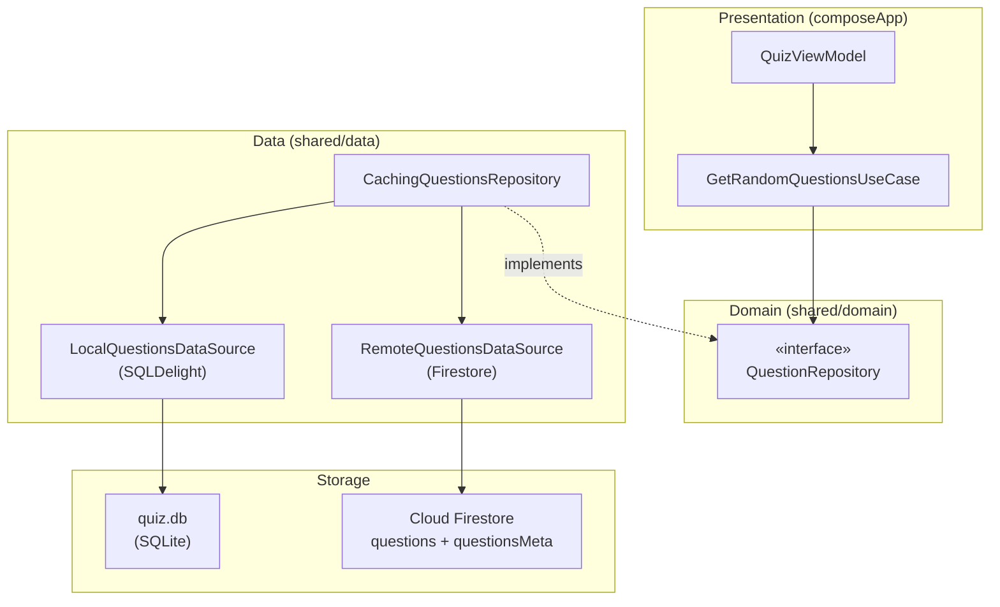
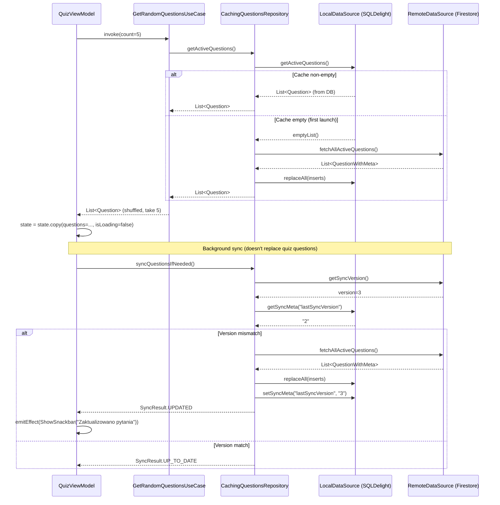
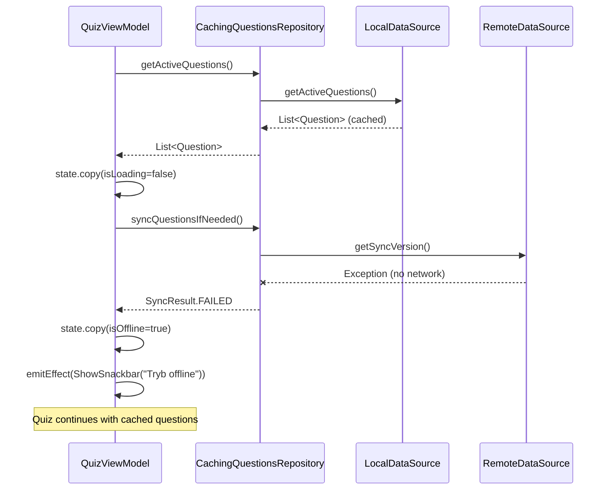
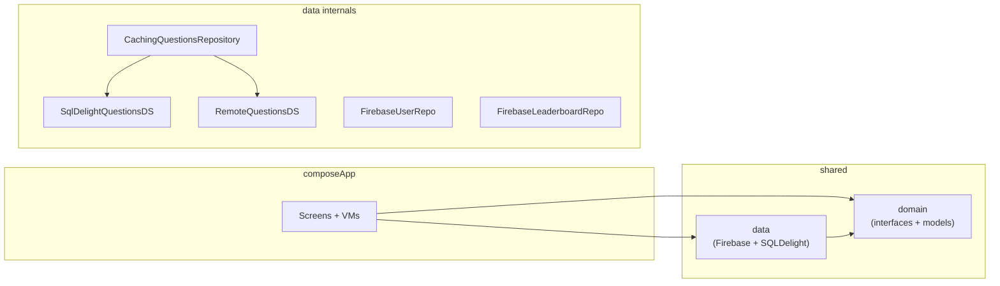

# Phase 3: Offline Cache + Fast Start — Implementation Plan

> **Date:** 2026-02-17  
> **Goal:** Cache questions locally (SQLDelight), load cache-first, refresh from Firestore in background.  
> **Prerequisite:** Phase 2 complete (Firebase Auth + Firestore repos working).  
> **ADR:** ADR-0005 (offline-cache-strategy).  
> **Platforms:** Android + iOS.

---

## Table of Contents

1. [Summary](#summary)
2. [Phase 3A — Gradle + SQLDelight Setup](#phase-3a)
3. [Phase 3B — SQLDelight Schema + Driver Factory](#phase-3b)
4. [Phase 3C — Data Sources (Local + Remote)](#phase-3c)
5. [Phase 3D — CachingQuestionsRepository](#phase-3d)
6. [Phase 3E — Wiring + MVI Offline States](#phase-3e)
7. [Phase 3F — Tests](#phase-3f)
8. [DoR Checklist](#dor)
9. [Risks & Mitigations](#risks)
10. [Diagrams](#diagrams)

---

<a id="summary"></a>
## Summary

| What | How |
|---|---|
| Local storage | SQLDelight 2.0.2 — `quiz.db` |
| Refresh strategy | Meta doc `questionsMeta/snapshot` with `version: Int` |
| Data sources | `LocalQuestionsDataSource` (SQLDelight) + `RemoteQuestionsDataSource` (Firestore) |
| Repository | `CachingQuestionsRepository` — cache-first, background refresh |
| Domain changes | None — `QuestionRepository` interface unchanged |
| MVI additions | `isRefreshing`, `isOffline` in QuizState; snackbar effects |
| Quiz determinism | Questions frozen in `QuizState` at quiz start; refresh doesn't mutate in-flight quiz |
| Leaderboard impact | None — stays real-time Firestore |

---

<a id="phase-3a"></a>
## Phase 3A — Gradle + SQLDelight Plugin Setup (1 commit)

**Commit:** `build: add SQLDelight plugin and platform drivers`

### 3A.1 Version Catalog — `gradle/libs.versions.toml`

Add under `[versions]`:
```toml
sqldelight = "2.0.2"
```

Add under `[libraries]`:
```toml
sqldelight-coroutines = { module = "app.cash.sqldelight:coroutines-extensions", version.ref = "sqldelight" }
sqldelight-android-driver = { module = "app.cash.sqldelight:android-driver", version.ref = "sqldelight" }
sqldelight-native-driver = { module = "app.cash.sqldelight:native-driver", version.ref = "sqldelight" }
```

Add under `[plugins]`:
```toml
sqldelight = { id = "app.cash.sqldelight", version.ref = "sqldelight" }
```

### 3A.2 Root `build.gradle.kts`

Add to plugins block:
```kotlin
alias(libs.plugins.sqldelight) apply false
```

### 3A.3 `:shared` `build.gradle.kts`

Apply SQLDelight plugin:
```kotlin
plugins {
    alias(libs.plugins.kotlinMultiplatform)
    alias(libs.plugins.androidLibrary)
    alias(libs.plugins.kotlinSerialization)
    alias(libs.plugins.sqldelight)           // ← ADD
}
```

Add SQLDelight configuration block:
```kotlin
sqldelight {
    databases {
        create("QuizDatabase") {
            packageName.set("pl.quizpszczelarski.shared.data.local.db")
        }
    }
}
```

Add platform-specific driver dependencies:
```kotlin
sourceSets {
    commonMain.dependencies {
        // ... existing ...
        implementation(libs.sqldelight.coroutines)
    }
    androidMain.dependencies {
        implementation(libs.sqldelight.android.driver)
    }
    iosMain.dependencies {
        implementation(libs.sqldelight.native.driver)
    }
}
```

> **NOTE:** If `iosMain` source set doesn't exist yet as a dependency target in `sourceSets`,
> create it. SQLDelight's native driver covers all iOS targets
> (`iosX64`, `iosArm64`, `iosSimulatorArm64`) through `iosMain`.

### Verification (3A)

- [ ] `./gradlew :shared:build` compiles with SQLDelight plugin active
- [ ] No version conflicts with Kotlin 2.2.21
- [ ] SQLDelight Gradle task `generateSqlDelightInterface` runs (even if schema is empty)

---

<a id="phase-3b"></a>
## Phase 3B — SQLDelight Schema + Driver Factory (1 commit)

**Commit:** `feat(data): add SQLDelight schema and platform driver factories`

### 3B.1 SQLDelight Schema

File: `shared/src/commonMain/sqldelight/pl/quizpszczelarski/shared/data/local/db/QuizDatabase.sq`

```sql
-- Questions table — mirrors Firestore 'questions' document structure.
CREATE TABLE QuestionEntity (
    id TEXT NOT NULL PRIMARY KEY,
    text TEXT NOT NULL,
    options TEXT NOT NULL,
    correctAnswer INTEGER NOT NULL DEFAULT 0,
    category TEXT NOT NULL DEFAULT '',
    level TEXT NOT NULL DEFAULT '',
    infotip TEXT NOT NULL DEFAULT '',
    active INTEGER NOT NULL DEFAULT 1,
    type TEXT NOT NULL DEFAULT 'SINGLE',
    updatedAt INTEGER NOT NULL DEFAULT 0
);

-- Sync metadata key-value store.
CREATE TABLE SyncMeta (
    key TEXT NOT NULL PRIMARY KEY,
    value TEXT NOT NULL
);

-- Questions queries --

selectActiveQuestions:
SELECT * FROM QuestionEntity
WHERE active = 1
ORDER BY id;

selectActiveByLevel:
SELECT * FROM QuestionEntity
WHERE active = 1 AND level = ?
ORDER BY id;

selectActiveByCategory:
SELECT * FROM QuestionEntity
WHERE active = 1 AND category = ?
ORDER BY id;

selectActiveByLevelAndCategory:
SELECT * FROM QuestionEntity
WHERE active = 1 AND level = ? AND category = ?
ORDER BY id;

selectById:
SELECT * FROM QuestionEntity
WHERE id = ?;

countActive:
SELECT COUNT(*) FROM QuestionEntity
WHERE active = 1;

insertOrReplace:
INSERT OR REPLACE INTO QuestionEntity (
    id, text, options, correctAnswer, category, level, infotip, active, type, updatedAt
) VALUES (?, ?, ?, ?, ?, ?, ?, ?, ?, ?);

deleteAll:
DELETE FROM QuestionEntity;

deleteById:
DELETE FROM QuestionEntity
WHERE id = ?;

-- Sync meta queries --

getSyncMeta:
SELECT value FROM SyncMeta
WHERE key = ?;

setSyncMeta:
INSERT OR REPLACE INTO SyncMeta (key, value)
VALUES (?, ?);
```

**Field notes:**
- `options` stored as JSON string (`["A","B","C","D"]`). Serialized/deserialized in mapper.
- `active` is `INTEGER` (SQLite has no boolean). 1 = true, 0 = false.
- `updatedAt` stored as epoch milliseconds (INTEGER). Converted from/to Firestore Timestamp.
- `SyncMeta` stores: `lastSyncVersion` (e.g. `"3"`), `lastSyncAt` (epoch ms as string).

### 3B.2 Database Driver Factory (expect/actual)

File: `shared/src/commonMain/kotlin/pl/quizpszczelarski/shared/data/local/DatabaseDriverFactory.kt`
```kotlin
package pl.quizpszczelarski.shared.data.local

import app.cash.sqldelight.db.SqlDriver

expect class DatabaseDriverFactory {
    fun create(): SqlDriver
}
```

File: `shared/src/androidMain/kotlin/pl/quizpszczelarski/shared/data/local/DatabaseDriverFactory.kt`
```kotlin
package pl.quizpszczelarski.shared.data.local

import android.content.Context
import app.cash.sqldelight.db.SqlDriver
import app.cash.sqldelight.driver.android.AndroidSqliteDriver
import pl.quizpszczelarski.shared.data.local.db.QuizDatabase

actual class DatabaseDriverFactory(private val context: Context) {
    actual fun create(): SqlDriver {
        return AndroidSqliteDriver(
            schema = QuizDatabase.Schema,
            context = context,
            name = "quiz.db",
        )
    }
}
```

File: `shared/src/iosMain/kotlin/pl/quizpszczelarski/shared/data/local/DatabaseDriverFactory.kt`
```kotlin
package pl.quizpszczelarski.shared.data.local

import app.cash.sqldelight.db.SqlDriver
import app.cash.sqldelight.driver.native.NativeSqliteDriver
import pl.quizpszczelarski.shared.data.local.db.QuizDatabase

actual class DatabaseDriverFactory {
    actual fun create(): SqlDriver {
        return NativeSqliteDriver(
            schema = QuizDatabase.Schema,
            name = "quiz.db",
        )
    }
}
```

> **Android note:** `DatabaseDriverFactory` on Android needs a `Context`. This will be passed
> from the Activity or Application. See Phase 3E for wiring.

### Verification (3B)

- [ ] `./gradlew :shared:generateCommonMainQuizDatabaseInterface` succeeds
- [ ] Generated `QuizDatabase` class has `questionEntityQueries` + `syncMetaQueries`
- [ ] Android and iOS actuals compile

---

<a id="phase-3c"></a>
## Phase 3C — Data Sources (Local + Remote) (1 commit)

**Commit:** `feat(data): add LocalQuestionsDataSource and RemoteQuestionsDataSource`

### Target Package Structure (new/changed files marked)

```
shared/src/commonMain/kotlin/pl/quizpszczelarski/shared/
├── data/
│   ├── dto/
│   │   ├── QuestionDto.kt                      (MODIFIED — add updatedAt)
│   │   └── UserDto.kt
│   ├── mapper/
│   │   ├── QuestionMapper.kt                   (MODIFIED — add DB mapping)
│   │   └── UserMapper.kt
│   ├── local/                                    ← NEW package
│   │   ├── DatabaseDriverFactory.kt             (expect — from 3B)
│   │   ├── LocalQuestionsDataSource.kt          (NEW — interface)
│   │   └── SqlDelightQuestionsDataSource.kt     (NEW — implementation)
│   ├── remote/                                   ← NEW package
│   │   └── RemoteQuestionsDataSource.kt         (NEW — extracted Firestore calls)
│   ├── questions/
│   │   ├── FirebaseQuestionsRepository.kt       (KEEP — becomes unused, or delete)
│   │   └── CachingQuestionsRepository.kt        (NEW — Phase 3D)
│   ├── user/
│   │   └── FirebaseUserRepository.kt
│   ├── leaderboard/
│   │   └── FirebaseLeaderboardRepository.kt
│   └── source/
│       └── LocalQuestionDataSource.kt           (existing fallback — can remove)
```

### 3C.1 QuestionDto Update — add `updatedAt`

File: `shared/src/commonMain/kotlin/pl/quizpszczelarski/shared/data/dto/QuestionDto.kt`

The DTO itself does NOT include `updatedAt` because Firestore Timestamps are not
directly `kotlinx-serialization` compatible in GitLive. Instead, `updatedAt` is read
separately from the Firestore DocumentSnapshot in `RemoteQuestionsDataSource`.

**No change needed** to `QuestionDto.kt`. The `updatedAt` extraction happens in the
remote data source.

### 3C.2 QuestionMapper Update — add DB mapping

File: `shared/src/commonMain/kotlin/pl/quizpszczelarski/shared/data/mapper/QuestionMapper.kt`

Add function to map DB entity to domain model:
```kotlin
object QuestionMapper {

    // Existing: Firestore DTO → domain
    fun toDomain(id: String, dto: QuestionDto): Question { ... }

    // NEW: DB entity → domain
    fun entityToDomain(entity: QuestionEntity): Question {
        return Question(
            id = entity.id,
            text = entity.text,
            options = Json.decodeFromString<List<String>>(entity.options),
            correctAnswerIndex = entity.correctAnswer.toInt(),
            category = entity.category,
            level = entity.level,
            infotip = entity.infotip,
        )
    }
}
```

> `QuestionEntity` is the SQLDelight-generated data class from the `.sq` schema.
> `options` is stored as a JSON array string and deserialized here.

### 3C.3 Data model for remote sync result

File: `shared/src/commonMain/kotlin/pl/quizpszczelarski/shared/data/remote/SyncPayload.kt` (NEW)

```kotlin
package pl.quizpszczelarski.shared.data.remote

import pl.quizpszczelarski.shared.data.dto.QuestionDto

/**
 * Result of fetching questions + metadata from Firestore.
 */
data class QuestionWithMeta(
    val id: String,
    val dto: QuestionDto,
    val updatedAtMillis: Long,
)

data class SyncSnapshot(
    val version: Int,
    val questions: List<QuestionWithMeta>,
)
```

### 3C.4 RemoteQuestionsDataSource

File: `shared/src/commonMain/kotlin/pl/quizpszczelarski/shared/data/remote/RemoteQuestionsDataSource.kt` (NEW)

```kotlin
package pl.quizpszczelarski.shared.data.remote

import dev.gitlive.firebase.firestore.FirebaseFirestore

/**
 * Reads questions + sync metadata from Firestore.
 * No caching logic — pure remote reads.
 */
class RemoteQuestionsDataSource(
    private val firestore: FirebaseFirestore,
) {

    /**
     * Reads the current sync version from `questionsMeta/snapshot`.
     * Returns null if the document doesn't exist.
     */
    suspend fun getSyncVersion(): Int? {
        val doc = firestore.collection("questionsMeta").document("snapshot").get()
        if (!doc.exists) return null
        return doc.get<Int>("version")
    }

    /**
     * Fetches all active questions with their updatedAt timestamps.
     */
    suspend fun fetchAllActiveQuestions(): List<QuestionWithMeta> {
        val snapshot = firestore.collection("questions")
            .where { "active" equalTo true }
            .get()

        return snapshot.documents.map { doc ->
            val dto = doc.data<QuestionDto>()
            val updatedAtMillis = try {
                doc.get<Long>("updatedAt")  // epoch millis
            } catch (_: Exception) {
                0L
            }
            QuestionWithMeta(
                id = doc.id,
                dto = dto,
                updatedAtMillis = updatedAtMillis,
            )
        }
    }
}
```

> **Note on `updatedAt` extraction:** GitLive's Firestore Timestamp handling varies.
> If the field is a Firestore `Timestamp`, `doc.get<Long>()` may fail. The developer
> should test and potentially use `doc.get<com.google.firebase.Timestamp>()` and convert.
> For MVP, storing epoch millis in Firestore simplifies this. The `catch` block handles
> the edge case gracefully.

### 3C.5 LocalQuestionsDataSource (interface)

File: `shared/src/commonMain/kotlin/pl/quizpszczelarski/shared/data/local/LocalQuestionsDataSource.kt` (NEW)

```kotlin
package pl.quizpszczelarski.shared.data.local

import pl.quizpszczelarski.shared.domain.model.Question

/**
 * Local persistence for questions (read/write).
 */
interface LocalQuestionsDataSource {

    /** Returns all active questions from local DB, optionally filtered. */
    suspend fun getActiveQuestions(
        level: String? = null,
        category: String? = null,
    ): List<Question>

    /** Returns count of active questions in local DB. */
    suspend fun countActive(): Long

    /** Replaces all questions in local DB (full sync). */
    suspend fun replaceAll(questions: List<QuestionInsert>)

    /** Reads sync metadata value by key. */
    suspend fun getSyncMeta(key: String): String?

    /** Writes sync metadata value by key. */
    suspend fun setSyncMeta(key: String, value: String)
}

/**
 * Insert model for writing a question to local DB.
 * Decoupled from domain model to include storage-specific fields.
 */
data class QuestionInsert(
    val id: String,
    val text: String,
    val options: String,        // JSON-encoded list
    val correctAnswer: Int,
    val category: String,
    val level: String,
    val infotip: String,
    val active: Boolean,
    val type: String,
    val updatedAtMillis: Long,
)
```

### 3C.6 SqlDelightQuestionsDataSource (implementation)

File: `shared/src/commonMain/kotlin/pl/quizpszczelarski/shared/data/local/SqlDelightQuestionsDataSource.kt` (NEW)

```kotlin
package pl.quizpszczelarski.shared.data.local

import kotlinx.coroutines.withContext
import kotlinx.coroutines.Dispatchers
import pl.quizpszczelarski.shared.data.local.db.QuizDatabase
import pl.quizpszczelarski.shared.data.mapper.QuestionMapper
import pl.quizpszczelarski.shared.domain.model.Question

class SqlDelightQuestionsDataSource(
    private val database: QuizDatabase,
) : LocalQuestionsDataSource {

    private val queries get() = database.quizDatabaseQueries

    override suspend fun getActiveQuestions(
        level: String?,
        category: String?,
    ): List<Question> = withContext(Dispatchers.Default) {
        val entities = when {
            level != null && category != null ->
                queries.selectActiveByLevelAndCategory(level, category).executeAsList()
            level != null ->
                queries.selectActiveByLevel(level).executeAsList()
            category != null ->
                queries.selectActiveByCategory(category).executeAsList()
            else ->
                queries.selectActiveQuestions().executeAsList()
        }
        entities.map { QuestionMapper.entityToDomain(it) }
    }

    override suspend fun countActive(): Long = withContext(Dispatchers.Default) {
        queries.countActive().executeAsOne()
    }

    override suspend fun replaceAll(questions: List<QuestionInsert>) = withContext(Dispatchers.Default) {
        database.transaction {
            queries.deleteAll()
            questions.forEach { q ->
                queries.insertOrReplace(
                    id = q.id,
                    text = q.text,
                    options = q.options,
                    correctAnswer = q.correctAnswer.toLong(),
                    category = q.category,
                    level = q.level,
                    infotip = q.infotip,
                    active = if (q.active) 1L else 0L,
                    type = q.type,
                    updatedAt = q.updatedAtMillis,
                )
            }
        }
    }

    override suspend fun getSyncMeta(key: String): String? = withContext(Dispatchers.Default) {
        queries.getSyncMeta(key).executeAsOneOrNull()
    }

    override suspend fun setSyncMeta(key: String, value: String) = withContext(Dispatchers.Default) {
        queries.setSyncMeta(key, value)
    }
}
```

> **Dispatchers.Default** used because SQLDelight native driver on iOS is not
> thread-safe for concurrent writes. Using Default (single-threaded on iOS)
> avoids race conditions. For Android, `AndroidSqliteDriver` handles threading internally.

### Verification (3C)

- [ ] `RemoteQuestionsDataSource` compiles with GitLive Firestore API
- [ ] `SqlDelightQuestionsDataSource` compiles against generated `QuizDatabase`
- [ ] `QuestionMapper.entityToDomain()` correctly deserializes JSON options
- [ ] `LocalQuestionsDataSource` interface has no platform dependencies

---

<a id="phase-3d"></a>
## Phase 3D — CachingQuestionsRepository (1 commit)

**Commit:** `feat(data): add CachingQuestionsRepository with cache-first + background sync`

### 3D.1 CachingQuestionsRepository

File: `shared/src/commonMain/kotlin/pl/quizpszczelarski/shared/data/questions/CachingQuestionsRepository.kt` (NEW)

```kotlin
package pl.quizpszczelarski.shared.data.questions

import kotlinx.coroutines.flow.MutableStateFlow
import kotlinx.coroutines.flow.StateFlow
import kotlinx.coroutines.flow.asStateFlow
import kotlinx.serialization.json.Json
import kotlinx.serialization.builtins.ListSerializer
import kotlinx.serialization.builtins.serializer
import pl.quizpszczelarski.shared.data.local.LocalQuestionsDataSource
import pl.quizpszczelarski.shared.data.local.QuestionInsert
import pl.quizpszczelarski.shared.data.remote.RemoteQuestionsDataSource
import pl.quizpszczelarski.shared.domain.model.Question
import pl.quizpszczelarski.shared.domain.repository.QuestionRepository

/**
 * Cache-first question loading with background Firestore sync.
 *
 * Algorithm:
 * 1. getActiveQuestions() → reads from local DB.
 *    - If cache is non-empty → returns immediately.
 *    - If cache is empty (first launch) → fetches from remote, stores, returns.
 * 2. syncQuestionsIfNeeded() → compares local version with remote meta doc.
 *    - If version mismatch → re-downloads all active questions, replaces local DB.
 * 3. forceRefreshQuestions() → unconditionally re-downloads + replaces.
 */
class CachingQuestionsRepository(
    private val local: LocalQuestionsDataSource,
    private val remote: RemoteQuestionsDataSource,
) : QuestionRepository {

    companion object {
        const val KEY_LAST_SYNC_VERSION = "lastSyncVersion"
        const val KEY_LAST_SYNC_AT = "lastSyncAt"
    }

    private val _syncState = MutableStateFlow(SyncStatus.IDLE)
    val syncState: StateFlow<SyncStatus> = _syncState.asStateFlow()

    /**
     * Cache-first: returns local questions if available.
     * On first launch (empty cache), blocks on remote fetch.
     */
    override suspend fun getActiveQuestions(
        level: String?,
        category: String?,
        limit: Int,
    ): List<Question> {
        val cached = local.getActiveQuestions(level, category)
        if (cached.isNotEmpty()) {
            return cached.take(limit)
        }

        // Empty cache (first launch) — must fetch from remote
        return try {
            _syncState.value = SyncStatus.SYNCING
            val result = fetchAndStore()
            _syncState.value = SyncStatus.IDLE
            result.take(limit)
        } catch (e: Exception) {
            _syncState.value = SyncStatus.ERROR
            // Return empty — caller (ViewModel) handles error state
            emptyList()
        }
    }

    /**
     * Checks remote meta doc version and syncs if needed.
     * Call this in background after UI is already showing cached data.
     *
     * @return SyncResult indicating what happened.
     */
    suspend fun syncQuestionsIfNeeded(): SyncResult {
        return try {
            _syncState.value = SyncStatus.SYNCING
            val remoteVersion = remote.getSyncVersion()
            val localVersion = local.getSyncMeta(KEY_LAST_SYNC_VERSION)?.toIntOrNull()

            if (remoteVersion == null) {
                // Meta doc doesn't exist — skip sync
                _syncState.value = SyncStatus.IDLE
                return SyncResult.NO_META_DOC
            }

            if (localVersion != null && localVersion == remoteVersion) {
                _syncState.value = SyncStatus.IDLE
                return SyncResult.UP_TO_DATE
            }

            fetchAndStore()
            local.setSyncMeta(KEY_LAST_SYNC_VERSION, remoteVersion.toString())
            local.setSyncMeta(KEY_LAST_SYNC_AT, currentTimeMillis().toString())

            _syncState.value = SyncStatus.IDLE
            SyncResult.UPDATED
        } catch (e: Exception) {
            _syncState.value = SyncStatus.ERROR
            SyncResult.FAILED
        }
    }

    /**
     * Forces a full re-download regardless of version.
     */
    suspend fun forceRefreshQuestions(): SyncResult {
        return try {
            _syncState.value = SyncStatus.SYNCING
            fetchAndStore()

            val remoteVersion = remote.getSyncVersion()
            if (remoteVersion != null) {
                local.setSyncMeta(KEY_LAST_SYNC_VERSION, remoteVersion.toString())
            }
            local.setSyncMeta(KEY_LAST_SYNC_AT, currentTimeMillis().toString())

            _syncState.value = SyncStatus.IDLE
            SyncResult.UPDATED
        } catch (e: Exception) {
            _syncState.value = SyncStatus.ERROR
            SyncResult.FAILED
        }
    }

    /**
     * Returns the lastSyncAt timestamp (epoch millis) or null if never synced.
     */
    suspend fun getLastSyncAt(): Long? {
        return local.getSyncMeta(KEY_LAST_SYNC_AT)?.toLongOrNull()
    }

    private suspend fun fetchAndStore(): List<Question> {
        val remoteQuestions = remote.fetchAllActiveQuestions()

        val inserts = remoteQuestions.map { q ->
            QuestionInsert(
                id = q.id,
                text = q.dto.text,
                options = Json.encodeToString(
                    ListSerializer(String.serializer()),
                    q.dto.options,
                ),
                correctAnswer = q.dto.correctAnswer,
                category = q.dto.category,
                level = q.dto.level,
                infotip = q.dto.infotip,
                active = q.dto.active,
                type = q.dto.type,
                updatedAtMillis = q.updatedAtMillis,
            )
        }

        local.replaceAll(inserts)

        return remoteQuestions.map { q ->
            QuestionMapper.toDomain(id = q.id, dto = q.dto)
        }
    }
}

enum class SyncStatus { IDLE, SYNCING, ERROR }

enum class SyncResult {
    UP_TO_DATE,
    UPDATED,
    NO_META_DOC,
    FAILED,
}
```

> **`currentTimeMillis()`:** Use `kotlinx.datetime.Clock.System.now().toEpochMilliseconds()`
> or a simple `expect fun currentTimeMillis(): Long` with `System.currentTimeMillis()` on
> Android and `NSDate().timeIntervalSince1970 * 1000` on iOS. For MVP, a minimal expect/actual
> is simplest unless `kotlinx-datetime` is already a dependency.

### Verification (3D)

- [ ] `CachingQuestionsRepository` compiles and implements `QuestionRepository`
- [ ] `syncQuestionsIfNeeded()` returns `UP_TO_DATE` when versions match
- [ ] `syncQuestionsIfNeeded()` returns `UPDATED` when versions differ
- [ ] `getActiveQuestions()` returns cached data when available
- [ ] `getActiveQuestions()` fetches from remote when cache is empty
- [ ] `forceRefreshQuestions()` always re-downloads

---

<a id="phase-3e"></a>
## Phase 3E — Wiring + MVI Offline States (1 commit)

**Commit:** `feat(presentation): wire CachingQuestionsRepository + offline MVI states`

### 3E.1 Android Context for SQLDelight

The `DatabaseDriverFactory` on Android needs a `Context`. Two approaches:

**Option 1 (simpler for MVP):** Pass `Context` via `LocalContext.current` in AppNavigation:

```kotlin
// In AppNavigation.kt
val context = LocalContext.current  // Android only

// Platform-specific factory creation
val driverFactory = remember { DatabaseDriverFactory(context) }
```

But `LocalContext` is Android-only. For KMP, use `expect/actual` for providing the factory:

**Option 2 (recommended):** Create `DatabaseDriverFactory` in platform-specific entry points
and pass it down:

- **Android:** Create in `MainActivity.onCreate()`, pass to `App()` composable.
- **iOS:** Create in `iOSApp.swift` (no context needed), passed via composition.

The simplest KMP-clean approach: `App()` composable accepts `DatabaseDriverFactory` as a parameter.

File: `composeApp/src/commonMain/.../App.kt` (or wherever the root composable is)
```kotlin
@Composable
fun App(driverFactory: DatabaseDriverFactory) {
    // ... theme, AppNavigation(driverFactory)
}
```

File: `composeApp/src/androidMain/.../MainActivity.kt`
```kotlin
setContent {
    App(driverFactory = DatabaseDriverFactory(applicationContext))
}
```

File: `iosApp/iosApp/iOSApp.swift` — no change needed to Swift; the `DatabaseDriverFactory()`
on iOS has no constructor parameters.

The ComposeApp framework's entry point for iOS must pass `DatabaseDriverFactory()`:
File: `composeApp/src/iosMain/.../MainViewController.kt`
```kotlin
fun MainViewController(): UIViewController {
    return ComposeUIViewController {
        App(driverFactory = DatabaseDriverFactory())
    }
}
```

### 3E.2 AppNavigation — replace repository wiring

File: `composeApp/src/commonMain/.../navigation/AppNavigation.kt`

Replace `FirebaseQuestionsRepository` with `CachingQuestionsRepository`:

```kotlin
@Composable
fun AppNavigation(driverFactory: DatabaseDriverFactory) {
    // ...
    val firestore = remember { Firebase.firestore }

    // NEW: database + data sources
    val database = remember { QuizDatabase(driverFactory.create()) }
    val localDataSource = remember { SqlDelightQuestionsDataSource(database) }
    val remoteDataSource = remember { RemoteQuestionsDataSource(firestore) }

    // CHANGED: CachingQuestionsRepository instead of FirebaseQuestionsRepository
    val questionRepository = remember {
        CachingQuestionsRepository(localDataSource, remoteDataSource)
    }
    
    // Use cases — unchanged (they take QuestionRepository interface)
    val getRandomQuestions = remember { GetRandomQuestionsUseCase(questionRepository) }
    // ...
}
```

### 3E.3 QuizState — add offline fields

File: `composeApp/src/commonMain/.../presentation/quiz/QuizState.kt`

```kotlin
data class QuizState(
    val questions: List<Question> = emptyList(),
    val currentQuestionIndex: Int = 0,
    val selectedAnswerIndex: Int? = null,
    val score: Int = 0,
    val isLoading: Boolean = true,
    val isRefreshing: Boolean = false,         // ← ADD: background sync in progress
    val isOffline: Boolean = false,            // ← ADD: true if remote sync failed
    val lastSyncAt: Long? = null,              // ← ADD: epoch millis of last successful sync
    val errorMessage: String? = null,
) {
    // ... existing computed properties unchanged
}
```

### 3E.4 QuizIntent — add sync intents

File: `composeApp/src/commonMain/.../presentation/quiz/QuizIntent.kt`

No new public intents needed (user doesn't manually trigger sync in quiz).
Internal intents for state updates:

```kotlin
// In QuizViewModel.kt — internal intents
internal data class SyncStarted(val unit: Unit = Unit) : QuizIntent
internal data class SyncCompleted(val result: SyncResult, val lastSyncAt: Long?) : QuizIntent
```

### 3E.5 QuizEffect — add snackbar effects

File: `composeApp/src/commonMain/.../presentation/quiz/QuizEffect.kt`

```kotlin
sealed interface QuizEffect {
    data class NavigateToResult(val score: Int, val total: Int) : QuizEffect
    data class ShowSnackbar(val message: String) : QuizEffect     // ← ADD
}
```

### 3E.6 QuizViewModel — load from cache + background sync

File: `composeApp/src/commonMain/.../presentation/quiz/QuizViewModel.kt`

```kotlin
class QuizViewModel(
    private val getRandomQuestions: GetRandomQuestionsUseCase,
    private val cachingRepository: CachingQuestionsRepository,  // ← ADD for sync
) : MviViewModel<QuizState, QuizIntent, QuizEffect>(QuizState()) {

    init {
        loadQuestions()
    }

    private fun loadQuestions() {
        scope.launch {
            try {
                // Step 1: Load from cache (or remote if first launch)
                val questions = getRandomQuestions()
                onIntent(LoadQuestions(questions))

                // Step 2: Background sync (doesn't replace current quiz questions)
                onIntent(SyncStarted())
                val syncResult = cachingRepository.syncQuestionsIfNeeded()
                val lastSyncAt = cachingRepository.getLastSyncAt()
                onIntent(SyncCompleted(syncResult, lastSyncAt))

                when (syncResult) {
                    SyncResult.UPDATED ->
                        emitEffect(QuizEffect.ShowSnackbar("Zaktualizowano pytania"))
                    SyncResult.FAILED ->
                        emitEffect(QuizEffect.ShowSnackbar("Tryb offline — używam zapisanych pytań"))
                    else -> { /* no user notification needed */ }
                }
            } catch (_: Exception) {
                onIntent(ShowLoadError("Nie udało się załadować pytań"))
            }
        }
    }

    override fun reduce(state: QuizState, intent: QuizIntent): QuizState {
        return when (intent) {
            // ... existing intents unchanged ...

            is SyncStarted -> state.copy(isRefreshing = true)

            is SyncCompleted -> state.copy(
                isRefreshing = false,
                isOffline = intent.result == SyncResult.FAILED,
                lastSyncAt = intent.lastSyncAt,
            )

            // ... rest unchanged
        }
    }
}
```

**Quiz determinism:** The sync result does NOT replace `state.questions`. The updated
questions will be available for the *next* quiz start. The current quiz runs against
the questions already in `QuizState`.

### 3E.7 Splash — trigger sync on boot

Optionally, move the sync trigger to the splash/bootstrap phase so questions are
up-to-date before the user starts a quiz:

```kotlin
// In Splash LaunchedEffect (AppNavigation.kt)
LaunchedEffect(Unit) {
    val bootstrapJob = async {
        try {
            val (uid, _) = ensureUser()
            currentUid = uid
        } catch (_: Exception) { }
    }

    // Background: sync questions while splash shows
    val syncJob = async {
        try {
            cachingRepository.syncQuestionsIfNeeded()
        } catch (_: Exception) { }
    }

    delay(2000L)
    bootstrapJob.await()
    syncJob.await() // Wait for sync (max splash duration = sync time; acceptable)
    currentRoute = Route.Home
}
```

> This ensures questions are synced before the quiz screen is reached,
> while the splash animation is already showing (no perceived delay).

### Verification (3E)

- [ ] Quiz loads from cache on second launch (no Firestore reads visible in logs)
- [ ] On first launch, quiz fetches from Firestore, stores in SQLDelight, shows questions
- [ ] In airplane mode, quiz loads from cache; snackbar shows "Tryb offline"
- [ ] After sync, next quiz start uses updated questions
- [ ] Current in-progress quiz is NOT affected by background sync
- [ ] Leaderboard still works (unchanged wiring)

---

<a id="phase-3f"></a>
## Phase 3F — Tests (1 commit)

**Commit:** `test: add unit tests for CachingQuestionsRepository and sync logic`

### Test Location

```
shared/src/commonTest/kotlin/pl/quizpszczelarski/shared/
├── data/
│   ├── questions/
│   │   └── CachingQuestionsRepositoryTest.kt    (NEW)
│   └── mapper/
│       └── QuestionMapperTest.kt                (NEW)
```

### 3F.1 Fake Data Sources

```kotlin
// In test source set

class FakeLocalQuestionsDataSource : LocalQuestionsDataSource {
    private val questions = mutableListOf<QuestionInsert>()
    private val meta = mutableMapOf<String, String>()

    override suspend fun getActiveQuestions(level: String?, category: String?): List<Question> {
        return questions
            .filter { it.active }
            .filter { level == null || it.level == level }
            .filter { category == null || it.category == category }
            .map { /* map to domain Question */ }
    }

    override suspend fun countActive(): Long = questions.count { it.active }.toLong()

    override suspend fun replaceAll(questions: List<QuestionInsert>) {
        this.questions.clear()
        this.questions.addAll(questions)
    }

    override suspend fun getSyncMeta(key: String): String? = meta[key]
    override suspend fun setSyncMeta(key: String, value: String) { meta[key] = value }
}

class FakeRemoteQuestionsDataSource : RemoteQuestionsDataSource {
    var syncVersion: Int? = 1
    var questions: List<QuestionWithMeta> = emptyList()
    var shouldFail: Boolean = false

    override suspend fun getSyncVersion(): Int? {
        if (shouldFail) throw Exception("Network error")
        return syncVersion
    }

    override suspend fun fetchAllActiveQuestions(): List<QuestionWithMeta> {
        if (shouldFail) throw Exception("Network error")
        return questions
    }
}
```

> **Note:** `FakeRemoteQuestionsDataSource` requires `RemoteQuestionsDataSource` to be
> an interface (or open class). Currently it's a concrete class.
> **Action:** Extract interface `RemoteQuestionsDataSource` and rename the Firestore
> implementation to `FirestoreQuestionsDataSource`. This improves testability.

### 3F.2 Test Cases for CachingQuestionsRepository

```kotlin
class CachingQuestionsRepositoryTest {

    // --- cache-first ---

    @Test
    fun `getActiveQuestions returns cached questions when cache is non-empty`()
    // Assert: local.getActiveQuestions() called, remote NOT called.

    @Test
    fun `getActiveQuestions fetches from remote when cache is empty`()
    // Assert: remote.fetchAllActiveQuestions() called, result stored in local.

    @Test
    fun `getActiveQuestions returns empty list when cache empty and remote fails`()
    // Assert: returns emptyList(), no crash.

    // --- syncQuestionsIfNeeded ---

    @Test
    fun `syncQuestionsIfNeeded returns UP_TO_DATE when versions match`()
    // Setup: local version = 3, remote version = 3.
    // Assert: returns UP_TO_DATE, no fetch.

    @Test
    fun `syncQuestionsIfNeeded returns UPDATED when versions differ`()
    // Setup: local version = 2, remote version = 3.
    // Assert: returns UPDATED, local.replaceAll() called, version updated.

    @Test
    fun `syncQuestionsIfNeeded returns NO_META_DOC when remote has no meta`()
    // Setup: remote.getSyncVersion() returns null.
    // Assert: returns NO_META_DOC, no fetch.

    @Test
    fun `syncQuestionsIfNeeded returns FAILED when remote throws`()
    // Setup: remote.shouldFail = true.
    // Assert: returns FAILED, local data unchanged.

    @Test
    fun `syncQuestionsIfNeeded stores new version and timestamp on success`()
    // Assert: local.getSyncMeta("lastSyncVersion") == new version.

    // --- forceRefreshQuestions ---

    @Test
    fun `forceRefreshQuestions re-downloads even when versions match`()
    // Assert: remote.fetchAllActiveQuestions() called regardless.

    @Test
    fun `forceRefreshQuestions returns FAILED when remote throws`()
    // Assert: returns FAILED, existing cache preserved.
}
```

### 3F.3 Test Cases for QuestionMapper

```kotlin
class QuestionMapperTest {

    @Test
    fun `entityToDomain maps all fields correctly`()
    // Verify options JSON deserialization, correctAnswer mapping, etc.

    @Test
    fun `entityToDomain handles empty options JSON`()
    // Input: options = "[]"
    // Assert: Question.options == emptyList()

    @Test
    fun `toDomain maps DTO to Question correctly`()
    // Existing test coverage for Firestore DTO mapping.
}
```

### Verification (3F)

- [ ] All tests pass on `./gradlew :shared:allTests`
- [ ] No real Firebase calls in tests
- [ ] Fake data sources cover all interface methods
- [ ] Test names describe behavior, not implementation

---

<a id="dor"></a>
## DoR Checklist

| Criteria | Status |
|---|---|
| User goal | ✅ "Use the app offline with cached questions; fast startup." |
| Non-goals | ✅ No offline leaderboard; no offline score submission. |
| Platforms | ✅ Android + iOS (SQLDelight drivers for both). |
| UX reference | ⚠️ No Figma needed. Offline state = snackbar + existing UI. |
| Data sources | ✅ SQLDelight (local), Firestore (remote), `questionsMeta/snapshot` (sync). |
| Acceptance criteria | ✅ See Phase 3E verification checklist. |
| Edge cases | ✅ Empty cache + offline, meta doc missing, mid-quiz sync. |
| Offline behavior | ✅ Fully defined. |
| Telemetry | N/A for Phase 3. |
| Test strategy | ✅ Fake data sources, repository unit tests, mapper tests. |
| Architecture impact | ✅ ADR-0005 written. SQLDelight added. No module boundary changes. |

---

<a id="risks"></a>
## Risks & Mitigations

| Risk | Likelihood | Impact | Mitigation |
|---|---|---|---|
| SQLDelight 2.0.2 incompatible with Kotlin 2.2.21 | Low | High | Test in Phase 3A before proceeding. Fallback: use compatible version or file-based JSON cache. |
| GitLive Timestamp handling differs per platform | Medium | Medium | Store `updatedAt` as epoch millis (Long) in Firestore. Avoid Firestore Timestamp type. |
| First launch with no network = empty quiz | Medium | Medium | Show clear error: "Brak połączenia. Nie można załadować pytań." with retry button. |
| `questionsMeta/snapshot` not maintained | Medium | Medium | Document admin procedure. Consider Cloud Function on question write. |
| SQLDelight DB corruption on app update | Low | Low | SQLDelight migrations handle schema changes. Use `.sqm` migration files. |
| iOS `NativeSqliteDriver` threading issues | Low | Medium | Wrap all DB access in `withContext(Dispatchers.Default)`. |

---

<a id="diagrams"></a>
## Diagrams

### Data Flow: Cache-First Loading



### Sequence: Cache-First Question Loading



### Sequence: Offline Scenario



### Module Dependency After Phase 3



---

## Commit Sequence Summary

| Phase | Commit | Key Files |
|---|---|---|
| 3A | `build: add SQLDelight plugin and platform drivers` | `libs.versions.toml`, `build.gradle.kts` (root, shared) |
| 3B | `feat(data): add SQLDelight schema and driver factories` | `QuizDatabase.sq`, `DatabaseDriverFactory.kt` (expect + 2 actuals) |
| 3C | `feat(data): add Local + Remote data sources` | `LocalQuestionsDataSource.kt`, `SqlDelightQuestionsDataSource.kt`, `RemoteQuestionsDataSource.kt`, `SyncPayload.kt`, `QuestionMapper.kt` (update) |
| 3D | `feat(data): add CachingQuestionsRepository` | `CachingQuestionsRepository.kt` |
| 3E | `feat(presentation): wire offline + MVI states` | `AppNavigation.kt`, `QuizState.kt`, `QuizIntent.kt`, `QuizEffect.kt`, `QuizViewModel.kt`, platform entry points |
| 3F | `test: repository + mapper unit tests` | `CachingQuestionsRepositoryTest.kt`, `QuestionMapperTest.kt`, fake data sources |

Each commit is independently compilable and reviewable.

---

## Files Changed / Created (Complete List)

### Modified

| File | Change |
|---|---|
| `gradle/libs.versions.toml` | Add sqldelight version + libraries + plugin |
| `build.gradle.kts` (root) | Add sqldelight plugin (apply false) |
| `shared/build.gradle.kts` | Add sqldelight plugin + config + platform drivers |
| `shared/.../data/mapper/QuestionMapper.kt` | Add `entityToDomain()` for DB → domain mapping |
| `composeApp/.../navigation/AppNavigation.kt` | Replace `FirebaseQuestionsRepository` → `CachingQuestionsRepository`, pass `DatabaseDriverFactory` |
| `composeApp/.../presentation/quiz/QuizState.kt` | Add `isRefreshing`, `isOffline`, `lastSyncAt` |
| `composeApp/.../presentation/quiz/QuizIntent.kt` | Add internal sync intents |
| `composeApp/.../presentation/quiz/QuizEffect.kt` | Add `ShowSnackbar` |
| `composeApp/.../presentation/quiz/QuizViewModel.kt` | Accept `CachingQuestionsRepository`, add sync logic |
| Platform entry points (`MainActivity`, `MainViewController`) | Pass `DatabaseDriverFactory` |

### Created

| File | Purpose |
|---|---|
| `docs/adr/ADR-0005-offline-cache-strategy.md` | Architecture decision record |
| `shared/src/commonMain/sqldelight/.../QuizDatabase.sq` | SQLDelight schema |
| `shared/src/commonMain/.../data/local/DatabaseDriverFactory.kt` | expect class |
| `shared/src/androidMain/.../data/local/DatabaseDriverFactory.kt` | actual (Android) |
| `shared/src/iosMain/.../data/local/DatabaseDriverFactory.kt` | actual (iOS) |
| `shared/src/commonMain/.../data/local/LocalQuestionsDataSource.kt` | Interface + QuestionInsert |
| `shared/src/commonMain/.../data/local/SqlDelightQuestionsDataSource.kt` | SQLDelight implementation |
| `shared/src/commonMain/.../data/remote/RemoteQuestionsDataSource.kt` | Firestore data source |
| `shared/src/commonMain/.../data/remote/SyncPayload.kt` | Sync result models |
| `shared/src/commonMain/.../data/questions/CachingQuestionsRepository.kt` | Cache-first repository |
| `shared/src/commonTest/.../data/questions/CachingQuestionsRepositoryTest.kt` | Repository unit tests |
| `shared/src/commonTest/.../data/mapper/QuestionMapperTest.kt` | Mapper unit tests |
| `shared/src/commonTest/.../data/questions/FakeLocalQuestionsDataSource.kt` | Test fake |
| `shared/src/commonTest/.../data/questions/FakeRemoteQuestionsDataSource.kt` | Test fake |

### Not Changed (explicitly unaffected)

| File | Reason |
|---|---|
| `shared/.../domain/repository/QuestionRepository.kt` | Interface unchanged |
| `shared/.../domain/model/Question.kt` | Model unchanged |
| `shared/.../data/user/FirebaseUserRepository.kt` | Not part of caching flow |
| `shared/.../data/leaderboard/FirebaseLeaderboardRepository.kt` | Stays real-time |
| Leaderboard screens/VMs | No changes needed |

### Potentially Removed

| File | Reason |
|---|---|
| `shared/.../data/questions/FirebaseQuestionsRepository.kt` | Replaced by `CachingQuestionsRepository` + `RemoteQuestionsDataSource`. Can be deleted or kept as reference. |
| `shared/.../data/source/LocalQuestionDataSource.kt` | Hardcoded fallback no longer needed (SQLDelight replaces it). Keep only if you want a last-resort built-in question set. |
