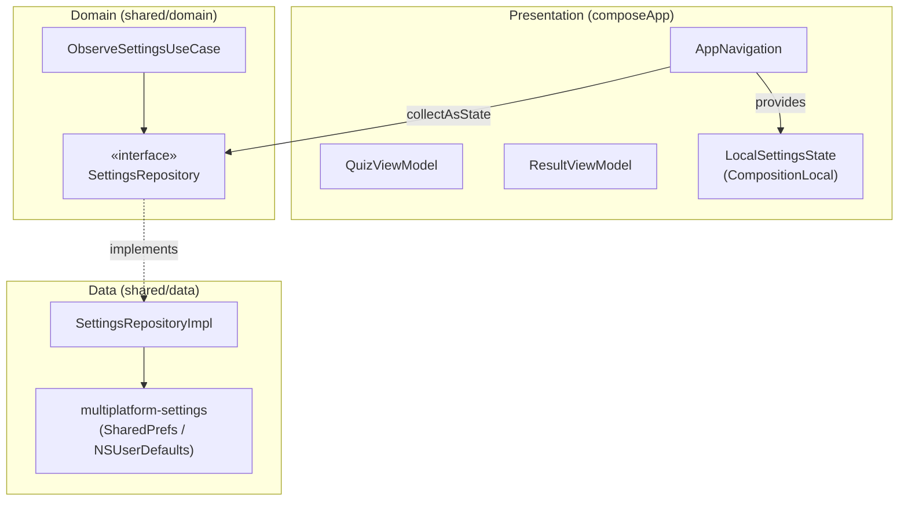
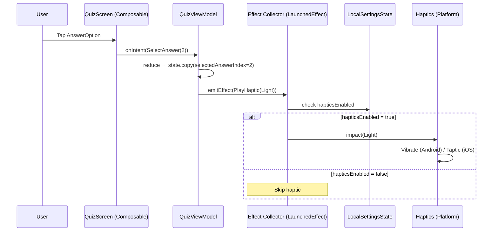
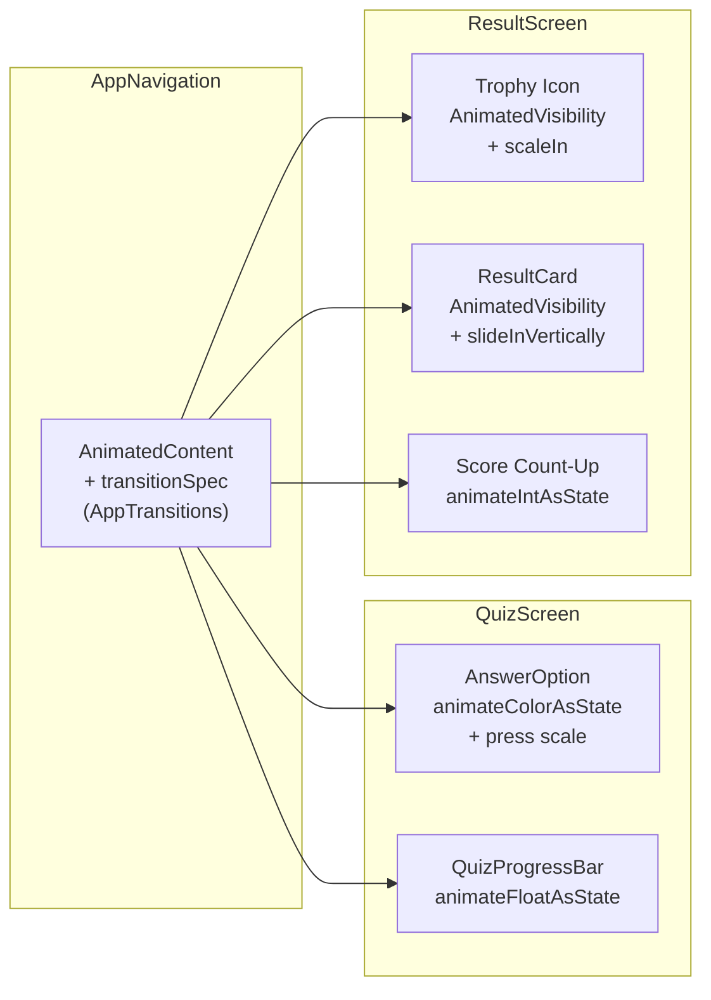
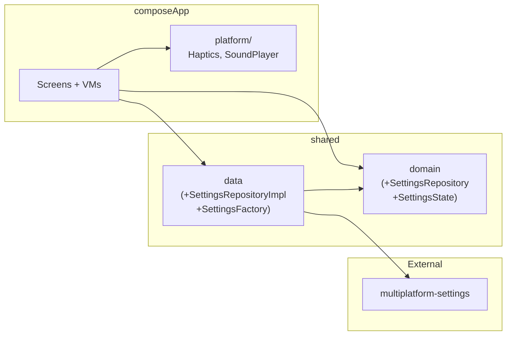

# Phase 4: Micro-Animations, Haptics & Global Settings — Implementation Plan

> **Date:** 2026-02-17  
> **Goal:** Add iOS-smooth micro-animations, haptic feedback with global toggle, sound toggle plumbing.  
> **Prerequisite:** Phase 3 complete (offline cache, SQLDelight).  
> **ADR:** ADR-0006 (animations-haptics-settings).  
> **Platforms:** Android + iOS.

---

## Table of Contents

1. [Summary](#summary)
2. [Phase 4A — Settings Persistence (Gradle + multiplatform-settings)](#phase-4a)
3. [Phase 4B — Settings Domain + Data Layer](#phase-4b)
4. [Phase 4C — Haptics Abstraction (expect/actual)](#phase-4c)
5. [Phase 4D — MVI Effects for Haptics + Settings Integration](#phase-4d)
6. [Phase 4E — Screen Transition Animations](#phase-4e)
7. [Phase 4F — Component Animations (AnswerOption, ProgressBar, ResultCard)](#phase-4f)
8. [Phase 4G — Sound Toggle Plumbing (no implementation)](#phase-4g)
9. [Phase 4H — Tests](#phase-4h)
10. [DoR Checklist](#dor)
11. [Risks & Mitigations](#risks)
12. [Diagrams](#diagrams)
13. [Integration Checklist](#integration-checklist)

---

<a id="summary"></a>
## Summary

| What | How |
|---|---|
| Settings persistence | `multiplatform-settings` 1.3.0 (SharedPreferences / NSUserDefaults) |
| Settings model | `SettingsState(hapticsEnabled, soundEnabled)` in domain |
| Haptics | `expect/actual` in `composeApp` platform source sets |
| Haptic trigger | MVI `Effect.PlayHaptic(ImpactType)` → UI collector → `Haptics.impact()` |
| Screen transitions | Custom `transitionSpec` on existing `AnimatedContent` in `AppNavigation` |
| Component animations | `animateColorAsState`, `animateFloatAsState`, `AnimatedVisibility` |
| Sound | Toggle + interface only; no audio playback in Phase 4 |
| New dependency | `com.russhwolf:multiplatform-settings:1.3.0` (+coroutines ext) |
| Skeleton loading | NOT added (explicit non-goal) |

---

<a id="phase-4a"></a>
## Phase 4A — Gradle + multiplatform-settings Setup (1 commit)

**Commit:** `build: add multiplatform-settings dependency`

### 4A.1 Version Catalog — `gradle/libs.versions.toml`

Add under `[versions]`:
```toml
multiplatform-settings = "1.3.0"
```

Add under `[libraries]`:
```toml
multiplatform-settings = { module = "com.russhwolf:multiplatform-settings", version.ref = "multiplatform-settings" }
multiplatform-settings-coroutines = { module = "com.russhwolf:multiplatform-settings-coroutines", version.ref = "multiplatform-settings" }
multiplatform-settings-test = { module = "com.russhwolf:multiplatform-settings-test", version.ref = "multiplatform-settings" }
```

### 4A.2 `:shared` `build.gradle.kts`

Add to `commonMain.dependencies`:
```kotlin
implementation(libs.multiplatform.settings)
implementation(libs.multiplatform.settings.coroutines)
```

Add to `commonTest.dependencies`:
```kotlin
implementation(libs.multiplatform.settings.test)
```

### Verification (4A)

- [ ] `./gradlew :shared:build` compiles with multiplatform-settings
- [ ] No version conflicts with Kotlin 2.2.21

---

<a id="phase-4b"></a>
## Phase 4B — Settings Domain + Data Layer (1 commit)

**Commit:** `feat(settings): add SettingsRepository + persistence + use cases`

### 4B.1 Domain Model

File: `shared/src/commonMain/kotlin/pl/quizpszczelarski/shared/domain/model/SettingsState.kt`

```kotlin
package pl.quizpszczelarski.shared.domain.model

/**
 * Global app settings. Immutable snapshot.
 */
data class SettingsState(
    val hapticsEnabled: Boolean = true,
    val soundEnabled: Boolean = true,
)
```

### 4B.2 Domain Repository Interface

File: `shared/src/commonMain/kotlin/pl/quizpszczelarski/shared/domain/repository/SettingsRepository.kt`

```kotlin
package pl.quizpszczelarski.shared.domain.repository

import kotlinx.coroutines.flow.Flow
import pl.quizpszczelarski.shared.domain.model.SettingsState

/**
 * Repository for reading and writing app-level settings.
 */
interface SettingsRepository {
    /** Observe settings changes as a Flow. */
    fun getSettingsFlow(): Flow<SettingsState>

    /** Get current settings snapshot (non-suspending). */
    fun getSettings(): SettingsState

    /** Toggle haptics on/off. */
    suspend fun setHapticsEnabled(enabled: Boolean)

    /** Toggle sound on/off. */
    suspend fun setSoundEnabled(enabled: Boolean)
}
```

### 4B.3 Domain Use Cases

File: `shared/src/commonMain/kotlin/pl/quizpszczelarski/shared/domain/usecase/ObserveSettingsUseCase.kt`

```kotlin
package pl.quizpszczelarski.shared.domain.usecase

import kotlinx.coroutines.flow.Flow
import pl.quizpszczelarski.shared.domain.model.SettingsState
import pl.quizpszczelarski.shared.domain.repository.SettingsRepository

class ObserveSettingsUseCase(
    private val repository: SettingsRepository,
) {
    operator fun invoke(): Flow<SettingsState> = repository.getSettingsFlow()
}
```

File: `shared/src/commonMain/kotlin/pl/quizpszczelarski/shared/domain/usecase/SetHapticsEnabledUseCase.kt`

```kotlin
package pl.quizpszczelarski.shared.domain.usecase

import pl.quizpszczelarski.shared.domain.repository.SettingsRepository

class SetHapticsEnabledUseCase(
    private val repository: SettingsRepository,
) {
    suspend operator fun invoke(enabled: Boolean) {
        repository.setHapticsEnabled(enabled)
    }
}
```

File: `shared/src/commonMain/kotlin/pl/quizpszczelarski/shared/domain/usecase/SetSoundEnabledUseCase.kt`

```kotlin
package pl.quizpszczelarski.shared.domain.usecase

import pl.quizpszczelarski.shared.domain.repository.SettingsRepository

class SetSoundEnabledUseCase(
    private val repository: SettingsRepository,
) {
    suspend operator fun invoke(enabled: Boolean) {
        repository.setSoundEnabled(enabled)
    }
}
```

### 4B.4 Settings Factory (expect/actual)

File: `shared/src/commonMain/kotlin/pl/quizpszczelarski/shared/data/settings/SettingsFactory.kt`

```kotlin
package pl.quizpszczelarski.shared.data.settings

import com.russhwolf.settings.Settings

expect class SettingsFactory {
    fun create(): Settings
}
```

File: `shared/src/androidMain/kotlin/pl/quizpszczelarski/shared/data/settings/SettingsFactory.kt`

```kotlin
package pl.quizpszczelarski.shared.data.settings

import android.content.Context
import com.russhwolf.settings.Settings
import com.russhwolf.settings.SharedPreferencesSettings

actual class SettingsFactory(private val context: Context) {
    actual fun create(): Settings {
        return SharedPreferencesSettings(
            context.getSharedPreferences("quiz_settings", Context.MODE_PRIVATE),
        )
    }
}
```

File: `shared/src/iosMain/kotlin/pl/quizpszczelarski/shared/data/settings/SettingsFactory.kt`

```kotlin
package pl.quizpszczelarski.shared.data.settings

import com.russhwolf.settings.NSUserDefaultsSettings
import com.russhwolf.settings.Settings

actual class SettingsFactory {
    actual fun create(): Settings {
        return NSUserDefaultsSettings.Factory().create("quiz_settings")
    }
}
```

### 4B.5 Data Layer — SettingsRepositoryImpl

File: `shared/src/commonMain/kotlin/pl/quizpszczelarski/shared/data/settings/SettingsRepositoryImpl.kt`

```kotlin
package pl.quizpszczelarski.shared.data.settings

import com.russhwolf.settings.Settings
import com.russhwolf.settings.get
import com.russhwolf.settings.set
import kotlinx.coroutines.flow.Flow
import kotlinx.coroutines.flow.MutableStateFlow
import kotlinx.coroutines.flow.asStateFlow
import pl.quizpszczelarski.shared.domain.model.SettingsState
import pl.quizpszczelarski.shared.domain.repository.SettingsRepository

class SettingsRepositoryImpl(
    private val settings: Settings,
) : SettingsRepository {

    companion object {
        private const val KEY_HAPTICS_ENABLED = "haptics_enabled"
        private const val KEY_SOUND_ENABLED = "sound_enabled"
    }

    private val _state = MutableStateFlow(readFromDisk())

    override fun getSettingsFlow(): Flow<SettingsState> = _state.asStateFlow()

    override fun getSettings(): SettingsState = _state.value

    override suspend fun setHapticsEnabled(enabled: Boolean) {
        settings[KEY_HAPTICS_ENABLED] = enabled
        _state.value = _state.value.copy(hapticsEnabled = enabled)
    }

    override suspend fun setSoundEnabled(enabled: Boolean) {
        settings[KEY_SOUND_ENABLED] = enabled
        _state.value = _state.value.copy(soundEnabled = enabled)
    }

    private fun readFromDisk(): SettingsState {
        return SettingsState(
            hapticsEnabled = settings[KEY_HAPTICS_ENABLED, true],
            soundEnabled = settings[KEY_SOUND_ENABLED, true],
        )
    }
}
```

**Design notes:**
- `MutableStateFlow` used for reactive observation. `multiplatform-settings-coroutines` has `FlowSettings` but wrapping with a `StateFlow` gives us a consistent snapshot.
- Defaults: both toggles `true` (haptics and sound on by default).
- No suspend needed for reads — `Settings.get()` is synchronous.

### Verification (4B)

- [ ] `SettingsRepositoryImpl` reads/writes `SharedPreferences` on Android
- [ ] `SettingsRepositoryImpl` reads/writes `NSUserDefaults` on iOS
- [ ] `getSettingsFlow()` emits updated state after `setHapticsEnabled(false)`
- [ ] Use cases compile and delegate correctly

---

<a id="phase-4c"></a>
## Phase 4C — Haptics Abstraction (1 commit)

**Commit:** `feat(platform): add Haptics expect/actual for Android + iOS`

### 4C.1 Haptics Interface (commonMain)

File: `composeApp/src/commonMain/kotlin/pl/quizpszczelarski/app/platform/Haptics.kt`

```kotlin
package pl.quizpszczelarski.app.platform

/**
 * Cross-platform haptic feedback abstraction.
 * Implementations in androidMain and iosMain.
 *
 * Called from UI layer only, gated by SettingsState.hapticsEnabled.
 */
interface Haptics {
    fun impact(type: ImpactType)
}

enum class ImpactType {
    Light,
    Medium,
    Success,
    Error,
}
```

### 4C.2 CompositionLocal (commonMain)

File: `composeApp/src/commonMain/kotlin/pl/quizpszczelarski/app/platform/LocalHaptics.kt`

```kotlin
package pl.quizpszczelarski.app.platform

import androidx.compose.runtime.staticCompositionLocalOf

/**
 * CompositionLocal providing the platform-specific [Haptics] implementation.
 * Set at the root composable (App.kt) via CompositionLocalProvider.
 */
val LocalHaptics = staticCompositionLocalOf<Haptics> {
    // Default no-op; overridden by platform provider
    object : Haptics {
        override fun impact(type: ImpactType) { /* no-op */ }
    }
}
```

### 4C.3 Android Implementation

File: `composeApp/src/androidMain/kotlin/pl/quizpszczelarski/app/platform/AndroidHaptics.kt`

```kotlin
package pl.quizpszczelarski.app.platform

import android.content.Context
import android.os.Build
import android.os.VibrationEffect
import android.os.Vibrator
import android.os.VibratorManager

/**
 * Android haptic feedback using Vibrator API.
 * API 26+ (VibrationEffect). Our minSdk is 26, so no compat fallback needed.
 */
class AndroidHaptics(context: Context) : Haptics {

    private val vibrator: Vibrator = if (Build.VERSION.SDK_INT >= 31) {
        val mgr = context.getSystemService(Context.VIBRATOR_MANAGER_SERVICE) as VibratorManager
        mgr.defaultVibrator
    } else {
        @Suppress("DEPRECATION")
        context.getSystemService(Context.VIBRATOR_SERVICE) as Vibrator
    }

    override fun impact(type: ImpactType) {
        if (!vibrator.hasVibrator()) return

        val effect = when (type) {
            ImpactType.Light -> VibrationEffect.createOneShot(30, 80)
            ImpactType.Medium -> VibrationEffect.createOneShot(50, 150)
            ImpactType.Success -> VibrationEffect.createOneShot(60, 200)
            ImpactType.Error -> VibrationEffect.createWaveform(
                longArrayOf(0, 40, 30, 40),
                intArrayOf(0, 200, 0, 200),
                -1,
            )
        }
        vibrator.vibrate(effect)
    }
}
```

**Notes:**
- `minSdk = 26` → `VibrationEffect` is always available. No need for SDK version checks on effect creation.
- `VIBRATE` permission required in `AndroidManifest.xml` — add `<uses-permission android:name="android.permission.VIBRATE"/>`.
- Error type uses a double-pulse pattern for distinctiveness.

### 4C.4 iOS Implementation

File: `composeApp/src/iosMain/kotlin/pl/quizpszczelarski/app/platform/IosHaptics.kt`

```kotlin
package pl.quizpszczelarski.app.platform

import platform.UIKit.UIImpactFeedbackGenerator
import platform.UIKit.UIImpactFeedbackStyle
import platform.UIKit.UINotificationFeedbackGenerator
import platform.UIKit.UINotificationFeedbackType

/**
 * iOS haptic feedback using UIKit feedback generators.
 */
class IosHaptics : Haptics {

    override fun impact(type: ImpactType) {
        when (type) {
            ImpactType.Light -> {
                val generator = UIImpactFeedbackGenerator(style = UIImpactFeedbackStyle.UIImpactFeedbackStyleLight)
                generator.prepare()
                generator.impactOccurred()
            }
            ImpactType.Medium -> {
                val generator = UIImpactFeedbackGenerator(style = UIImpactFeedbackStyle.UIImpactFeedbackStyleMedium)
                generator.prepare()
                generator.impactOccurred()
            }
            ImpactType.Success -> {
                val generator = UINotificationFeedbackGenerator()
                generator.prepare()
                generator.notificationOccurred(UINotificationFeedbackType.UINotificationFeedbackTypeSuccess)
            }
            ImpactType.Error -> {
                val generator = UINotificationFeedbackGenerator()
                generator.prepare()
                generator.notificationOccurred(UINotificationFeedbackType.UINotificationFeedbackTypeError)
            }
        }
    }
}
```

### 4C.5 Wiring — provide via CompositionLocal

In `App.kt` (or `AppNavigation.kt`), wrap with `CompositionLocalProvider`:

**Android path** (in `MainActivity` or `App` composable called from Android):
```kotlin
val haptics = remember { AndroidHaptics(context) }
CompositionLocalProvider(LocalHaptics provides haptics) {
    AppNavigation(...)
}
```

**iOS path** (in `MainViewController.kt`):
```kotlin
val haptics = remember { IosHaptics() }
CompositionLocalProvider(LocalHaptics provides haptics) {
    AppNavigation(...)
}
```

**Alternative (recommended for cleanliness):** Create a `expect fun rememberHaptics(): Haptics` composable function that returns the platform implementation, instead of wiring in each entry point. Either approach works; the developer should pick one.

### Verification (4C)

- [ ] `Haptics.impact(Light)` triggers vibration on Android device/emulator
- [ ] `Haptics.impact(Light)` triggers taptic feedback on iOS device (simulator may not vibrate)
- [ ] No-op default works when `LocalHaptics` is not provided (no crash)
- [ ] No UIKit / Android imports in commonMain

---

<a id="phase-4d"></a>
## Phase 4D — MVI Effects for Haptics + Settings Wiring (1 commit)

**Commit:** `feat(presentation): add PlayHaptic effect + settings CompositionLocal`

### 4D.1 QuizEffect — add PlayHaptic

File: `composeApp/src/commonMain/.../presentation/quiz/QuizEffect.kt`

```kotlin
sealed interface QuizEffect {
    data class NavigateToResult(val score: Int, val total: Int) : QuizEffect
    data class ShowSnackbar(val message: String) : QuizEffect
    data class PlayHaptic(val type: pl.quizpszczelarski.app.platform.ImpactType) : QuizEffect
}
```

### 4D.2 ResultEffect — add PlayHaptic

File: `composeApp/src/commonMain/.../presentation/result/ResultEffect.kt`

```kotlin
sealed interface ResultEffect {
    data object NavigateToQuiz : ResultEffect
    data object NavigateToLeaderboard : ResultEffect
    data class ShowError(val message: String) : ResultEffect
    data class PlayHaptic(val type: pl.quizpszczelarski.app.platform.ImpactType) : ResultEffect
}
```

### 4D.3 QuizViewModel — emit haptic on answer selection

In `QuizViewModel.reduce()`, when handling `QuizIntent.SelectAnswer`:

```kotlin
is QuizIntent.SelectAnswer -> {
    emitEffect(QuizEffect.PlayHaptic(ImpactType.Light))
    state.copy(selectedAnswerIndex = intent.index)
}
```

In `QuizViewModel.reduce()`, when handling `QuizIntent.NextQuestion` (on last question):

```kotlin
if (state.isLastQuestion) {
    val hapticType = if (newScore > state.totalQuestions / 2) ImpactType.Success else ImpactType.Medium
    emitEffect(QuizEffect.PlayHaptic(hapticType))
    emitEffect(QuizEffect.NavigateToResult(score = newScore, total = state.totalQuestions))
    state.copy(score = newScore)
}
```

### 4D.4 ResultViewModel — emit haptic on result display

In `ResultViewModel.init` block (or wherever result is computed):

```kotlin
init {
    val hapticType = if (ResultState(...).isHighScore) ImpactType.Success else ImpactType.Error
    emitEffect(ResultEffect.PlayHaptic(hapticType))
    // ... existing score submission
}
```

### 4D.5 Settings CompositionLocal

File: `composeApp/src/commonMain/kotlin/pl/quizpszczelarski/app/platform/LocalSettings.kt`

```kotlin
package pl.quizpszczelarski.app.platform

import androidx.compose.runtime.compositionLocalOf
import pl.quizpszczelarski.shared.domain.model.SettingsState

/**
 * CompositionLocal providing the current [SettingsState].
 * Updated from AppNavigation by collecting the SettingsRepository flow.
 */
val LocalSettingsState = compositionLocalOf { SettingsState() }
```

### 4D.6 AppNavigation — settings wiring + haptic effect collector

In `AppNavigation.kt`:

```kotlin
@Composable
fun AppNavigation(driverFactory: DatabaseDriverFactory, settingsFactory: SettingsFactory) {
    // ... existing ...

    // Settings
    val settingsRepo = remember {
        SettingsRepositoryImpl(settingsFactory.create())
    }
    val settingsState by settingsRepo.getSettingsFlow()
        .collectAsState(initial = settingsRepo.getSettings())

    val haptics = LocalHaptics.current

    // Provide settings to all children
    CompositionLocalProvider(LocalSettingsState provides settingsState) {
        // ... existing Scaffold + AnimatedContent ...
    }

    // In each screen's LaunchedEffect effect collector, add haptic handling:
    // Example for Quiz:
    LaunchedEffect(Unit) {
        vm.effect.collect { effect ->
            when (effect) {
                is QuizEffect.NavigateToResult -> { ... }
                is QuizEffect.ShowSnackbar -> { ... }
                is QuizEffect.PlayHaptic -> {
                    if (settingsState.hapticsEnabled) {
                        haptics.impact(effect.type)
                    }
                }
            }
        }
    }
```

### Verification (4D)

- [ ] Answer selection triggers haptic on device (when enabled)
- [ ] Haptic does NOT fire when `hapticsEnabled = false`
- [ ] Quiz completion triggers Success/Medium haptic
- [ ] Result screen entry triggers Success/Error haptic
- [ ] `LocalSettingsState.current` is accessible from any composable

---

<a id="phase-4e"></a>
## Phase 4E — Screen Transition Animations (1 commit)

**Commit:** `feat(ui): add smooth screen transition animations`

### 4E.1 AppTransitions Object

File: `composeApp/src/commonMain/kotlin/pl/quizpszczelarski/app/navigation/AppTransitions.kt`

```kotlin
package pl.quizpszczelarski.app.navigation

import androidx.compose.animation.*
import androidx.compose.animation.core.tween

/**
 * Centralized transition specs for AnimatedContent screen switching.
 * iOS-smooth: gentle fade + slight slide, short duration.
 */
object AppTransitions {

    private const val DURATION_MS = 300
    private const val SLIDE_OFFSET_DP = 16  // subtle, not aggressive

    /**
     * Default screen transition: fade + slight slide from right.
     */
    fun screenTransition(): ContentTransform {
        val enterTransition = fadeIn(
            animationSpec = tween(durationMillis = DURATION_MS),
        ) + slideInHorizontally(
            animationSpec = tween(durationMillis = DURATION_MS),
            initialOffsetX = { SLIDE_OFFSET_DP * 3 }, // ~48px, subtle
        )

        val exitTransition = fadeOut(
            animationSpec = tween(durationMillis = DURATION_MS / 2),
        ) + slideOutHorizontally(
            animationSpec = tween(durationMillis = DURATION_MS),
            targetOffsetX = { -SLIDE_OFFSET_DP * 2 }, // slight slide left on exit
        )

        return enterTransition togetherWith exitTransition
    }

    /**
     * Backward navigation: slide from left.
     */
    fun screenTransitionBack(): ContentTransform {
        val enterTransition = fadeIn(
            animationSpec = tween(durationMillis = DURATION_MS),
        ) + slideInHorizontally(
            animationSpec = tween(durationMillis = DURATION_MS),
            initialOffsetX = { -SLIDE_OFFSET_DP * 3 },
        )

        val exitTransition = fadeOut(
            animationSpec = tween(durationMillis = DURATION_MS / 2),
        ) + slideOutHorizontally(
            animationSpec = tween(durationMillis = DURATION_MS),
            targetOffsetX = { SLIDE_OFFSET_DP * 2 },
        )

        return enterTransition togetherWith exitTransition
    }

    /**
     * Splash → Home: simple crossfade (no slide).
     */
    fun splashTransition(): ContentTransform {
        return fadeIn(
            animationSpec = tween(durationMillis = 500),
        ) togetherWith fadeOut(
            animationSpec = tween(durationMillis = 300),
        )
    }
}
```

### 4E.2 Apply to AnimatedContent in AppNavigation

Currently in `AppNavigation.kt`:
```kotlin
AnimatedContent(targetState = currentRoute) { route ->
```

Change to:
```kotlin
AnimatedContent(
    targetState = currentRoute,
    transitionSpec = {
        when {
            // Splash -> anything: crossfade
            initialState is Route.Splash -> AppTransitions.splashTransition()
            // Going "back" (Result->Quiz, Leaderboard->Home, Quiz->Home)
            targetState is Route.Home -> AppTransitions.screenTransitionBack()
            // Forward navigation
            else -> AppTransitions.screenTransition()
        }
    },
    label = "ScreenTransition",
) { route ->
```

**Navigation direction heuristic:** The `Route` sealed interface doesn't have a depth.
Simple rule: navigating TO `Home` = back direction. Everything else = forward.
If more nuance is needed later, add a `Route.depth: Int` property.

### Verification (4E)

- [ ] Splash → Home: smooth crossfade (no slide)
- [ ] Home → Quiz: fade + slide from right
- [ ] Quiz → Result: fade + slide from right
- [ ] Result → Home: fade + slide from left (back direction)
- [ ] Leaderboard → Home: fade + slide from left (back direction)
- [ ] No abrupt content jumps or size flicker during transition

---

<a id="phase-4f"></a>
## Phase 4F — Component Animations (1 commit)

**Commit:** `feat(ui): add AnswerOption, ProgressBar, ResultCard animations`

### 4F.1 AnswerOption — Animated Colors + Press Scale

Changes to `AnswerOption.kt`:

1. **Replace static color variables with `animateColorAsState`:**

```kotlin
val animatedBorderColor by animateColorAsState(
    targetValue = borderColor,
    animationSpec = tween(durationMillis = 250),
    label = "AnswerBorderColor",
)
val animatedBackgroundColor by animateColorAsState(
    targetValue = backgroundColor,
    animationSpec = tween(durationMillis = 250),
    label = "AnswerBgColor",
)
val animatedRadioColor by animateColorAsState(
    targetValue = radioColor,
    animationSpec = tween(durationMillis = 250),
    label = "AnswerRadioColor",
)
```

Then use `animatedBorderColor`, `animatedBackgroundColor`, `animatedRadioColor` in the Card and RadioCircle.

2. **Add subtle press-scale feedback:**

```kotlin
val interactionSource = remember { MutableInteractionSource() }
val isPressed by interactionSource.collectIsPressedAsState()
val scale by animateFloatAsState(
    targetValue = if (isPressed) 0.98f else 1f,
    animationSpec = tween(durationMillis = 100),
    label = "AnswerScale",
)

Card(
    modifier = modifier
        .fillMaxWidth()
        .graphicsLayer {
            scaleX = scale
            scaleY = scale
        }
        .clickable(
            interactionSource = interactionSource,
            indication = null, // custom feedback via scale
            enabled = enabled && state != AnswerOptionState.Disabled,
        ) { onClick() },
    // ...
)
```

**Note:** Setting `indication = null` removes the default ripple since we're using scale instead. If the team prefers keeping the ripple, remove `indication = null` and keep both effects. Decision for developer.

### 4F.2 QuizProgressBar — Animated Progress

Changes to `QuizProgressBar.kt`:

Replace direct `progress` usage with animated value:

```kotlin
val animatedProgress by animateFloatAsState(
    targetValue = progress,
    animationSpec = tween(durationMillis = 400, easing = EaseInOutCubic),
    label = "ProgressAnimation",
)
val animatedPercentage = (animatedProgress * 100).toInt()

// Then use animatedProgress in LinearProgressIndicator:
LinearProgressIndicator(
    progress = { animatedProgress },
    // ...
)

// And animatedPercentage in the text:
Text(text = "$animatedPercentage%", ...)
```

**Import needed:** `import androidx.compose.animation.core.EaseInOutCubic`

### 4F.3 ResultCard — Entry Animation

Changes to `ResultScreen.kt`:

Wrap `ResultCard` + trophy icon with `AnimatedVisibility`:

```kotlin
var showResult by remember { mutableStateOf(false) }

LaunchedEffect(Unit) {
    delay(150) // slight stagger after screen enters
    showResult = true
}

// Trophy icon
AnimatedVisibility(
    visible = showResult,
    enter = fadeIn(tween(400)) + scaleIn(
        initialScale = 0.8f,
        animationSpec = tween(400, easing = EaseOutCubic),
    ),
) {
    Text(
        text = if (state.isHighScore) "🏆" else "🎯",
        style = MaterialTheme.typography.displayLarge,
        textAlign = TextAlign.Center,
    )
}

// ... spacers, message text (can also animate) ...

// ResultCard
AnimatedVisibility(
    visible = showResult,
    enter = fadeIn(tween(500, delayMillis = 100)) + slideInVertically(
        initialOffsetY = { it / 4 },  // slide up from 25% below
        animationSpec = tween(500, delayMillis = 100, easing = EaseOutCubic),
    ),
) {
    ResultCard(
        score = state.score,
        totalQuestions = state.totalQuestions,
        percentage = state.percentage,
    )
}
```

### 4F.4 Optional: Score Count-Up Animation in ResultCard

If desired, add a smooth count-up inside `ResultCard`:

```kotlin
@Composable
fun ResultCard(score: Int, totalQuestions: Int, percentage: Int, ...) {
    // Animate the displayed score from 0 to actual
    val animatedScore by animateIntAsState(
        targetValue = score,
        animationSpec = tween(durationMillis = 800, easing = EaseOutCubic),
        label = "ScoreCountUp",
    )
    val animatedPercentage by animateIntAsState(
        targetValue = percentage,
        animationSpec = tween(durationMillis = 800, delayMillis = 200, easing = EaseOutCubic),
        label = "PercentageCountUp",
    )

    // Use animatedScore and animatedPercentage in Text composables
    Text(text = "$animatedScore/$totalQuestions", ...)
    Text(text = "$animatedPercentage%", ...)
}
```

**Note:** `animateIntAsState` requires `import androidx.compose.animation.core.animateIntAsState`.

### Verification (4F)

- [ ] AnswerOption: colors transition smoothly on selection (no snap)
- [ ] AnswerOption: subtle scale-down on press (0.98), release returns to 1.0
- [ ] ProgressBar: progress value animates smoothly between questions
- [ ] ProgressBar: percentage text updates smoothly
- [ ] ResultCard: fades in + slides up after screen enters
- [ ] Trophy icon: fades in + scales from 0.8 → 1.0
- [ ] Score counter: counts up from 0 (smooth, no bounce)
- [ ] All animations feel subtle, not aggressive or bouncy

---

<a id="phase-4g"></a>
## Phase 4G — Sound Toggle Plumbing (1 commit)

**Commit:** `feat(platform): add SoundPlayer interface + sound toggle plumbing`

### 4G.1 SoundPlayer Interface

File: `composeApp/src/commonMain/kotlin/pl/quizpszczelarski/app/platform/SoundPlayer.kt`

```kotlin
package pl.quizpszczelarski.app.platform

/**
 * Cross-platform sound effect player.
 * Phase 4: interface only, no implementation.
 * Phase 5+: implement with actual audio playback.
 */
interface SoundPlayer {
    fun play(effect: SoundEffect)
}

enum class SoundEffect {
    Tap,
    Success,
    Error,
}
```

### 4G.2 No-op Implementation

File: `composeApp/src/commonMain/kotlin/pl/quizpszczelarski/app/platform/NoOpSoundPlayer.kt`

```kotlin
package pl.quizpszczelarski.app.platform

/**
 * Placeholder implementation — no actual audio.
 * TODO: Replace with platform implementations in Phase 5+.
 */
object NoOpSoundPlayer : SoundPlayer {
    override fun play(effect: SoundEffect) {
        // No-op. Sound playback not implemented yet.
    }
}
```

### 4G.3 CompositionLocal

File: `composeApp/src/commonMain/kotlin/pl/quizpszczelarski/app/platform/LocalSoundPlayer.kt`

```kotlin
package pl.quizpszczelarski.app.platform

import androidx.compose.runtime.staticCompositionLocalOf

val LocalSoundPlayer = staticCompositionLocalOf<SoundPlayer> { NoOpSoundPlayer }
```

### 4G.4 Sound Toggle in Settings

`soundEnabled` is already part of `SettingsState` and persisted via `SettingsRepository` (done in Phase 4B).

No settings UI screen in Phase 4. The toggle is accessible programmatically.

**If a temporary debug toggle is needed:** Add a long-press gesture on the app title in HomeScreen that toggles haptics/sound. This is optional and up to the developer.

### Verification (4G)

- [ ] `SoundPlayer` interface compiles
- [ ] `NoOpSoundPlayer.play()` does nothing (no crash)
- [ ] `LocalSoundPlayer.current` returns `NoOpSoundPlayer` by default
- [ ] `soundEnabled` persists across app restarts

---

<a id="phase-4h"></a>
## Phase 4H — Tests (1 commit)

**Commit:** `test: add settings repository + haptics integration tests`

### 4H.1 SettingsRepositoryImpl Tests

File: `shared/src/commonTest/kotlin/pl/quizpszczelarski/shared/data/settings/SettingsRepositoryImplTest.kt`

```kotlin
class SettingsRepositoryImplTest {

    @Test
    fun `default settings have haptics and sound enabled`()
    // Assert: getSettings() == SettingsState(hapticsEnabled = true, soundEnabled = true)

    @Test
    fun `setHapticsEnabled persists and emits new state`()
    // Action: setHapticsEnabled(false)
    // Assert: getSettings().hapticsEnabled == false
    // Assert: flow emits SettingsState(hapticsEnabled = false, ...)

    @Test
    fun `setSoundEnabled persists and emits new state`()
    // Action: setSoundEnabled(false)
    // Assert: getSettings().soundEnabled == false

    @Test
    fun `settings survive re-creation with same Settings backend`()
    // Action: set haptics false, create new SettingsRepositoryImpl with same MapSettings
    // Assert: getSettings().hapticsEnabled == false
}
```

Use `com.russhwolf:multiplatform-settings-test` → `MapSettings()` for in-memory backend.

### 4H.2 Use Case Tests (trivial, optional)

Use cases are thin wrappers. Test only if project convention requires it.

### Verification (4H)

- [ ] All tests pass on `./gradlew :shared:allTests`
- [ ] Tests use `MapSettings` (no real SharedPreferences/NSUserDefaults)

---

<a id="dor"></a>
## DoR Checklist

| Criteria | Status |
|---|---|
| User goal | ✅ "Smooth animations, haptic on answer tap, toggleable." |
| Non-goals | ✅ No skeleton loading. No sound playback (Phase 5). |
| Platforms | ✅ Android + iOS. |
| UX reference | ⚠️ No Figma for animations. Specs defined in plan (duration, easing, offset). |
| Data sources | ✅ `multiplatform-settings` for key-value. |
| Acceptance criteria | ✅ Per-phase verification checklists. |
| Edge cases | ✅ Haptics disabled, no vibrator hardware, simulator. |
| Offline behavior | N/A (settings are local-only). |
| Telemetry | N/A for Phase 4. |
| Test strategy | ✅ SettingsRepository unit tests with MapSettings. |
| Architecture impact | ✅ ADR-0006 written. One new dependency. |

---

<a id="risks"></a>
## Risks & Mitigations

| Risk | Likelihood | Impact | Mitigation |
|---|---|---|---|
| `multiplatform-settings` incompatible with Kotlin 2.2.21 | Low | High | Test in Phase 4A. Fallback: manual expect/actual with DataStore/NSUserDefaults. |
| iOS simulator doesn't produce haptic feedback | Certain | Low | Expected behavior. Test on real device. |
| Animations feel different on low-end Android devices | Medium | Low | Keep durations short (≤400ms). `graphicsLayer` uses hardware acceleration. |
| `animateColorAsState` causes recomposition storms | Low | Medium | `animateColorAsState` is optimized. Profile if framerate drops. |
| `VIBRATE` permission missing on Android | Low | High | Add to AndroidManifest in Phase 4C. |
| `interactionSource.collectIsPressedAsState()` not available in CMP | Low | Medium | Standard Compose Foundation API — should be available. Verify in 4F. |

---

<a id="diagrams"></a>
## Diagrams

### Settings Data Flow



### Haptics Flow (MVI Effect → Platform)



### Animation Application Map



### Module Dependencies After Phase 4



---

<a id="integration-checklist"></a>
## Integration Checklist (Step-by-Step Build Order)

Execute these phases in order. Each phase is independently compilable.

### Phase 4A — Gradle Setup
- [ ] Add `multiplatform-settings` to `libs.versions.toml`
- [ ] Add dependencies to `:shared` `build.gradle.kts`
- [ ] Run `./gradlew :shared:build` — must compile

### Phase 4B — Settings Layer
- [ ] Create `SettingsState.kt` in `shared/domain/model/`
- [ ] Create `SettingsRepository.kt` in `shared/domain/repository/`
- [ ] Create `ObserveSettingsUseCase.kt`, `SetHapticsEnabledUseCase.kt`, `SetSoundEnabledUseCase.kt` in `shared/domain/usecase/`
- [ ] Create `SettingsFactory.kt` (expect + 2 actuals) in `shared/data/settings/`
- [ ] Create `SettingsRepositoryImpl.kt` in `shared/data/settings/`
- [ ] Run `./gradlew :shared:build` — must compile

### Phase 4C — Haptics
- [ ] Create `Haptics.kt` + `ImpactType` in `composeApp/src/commonMain/.../platform/`
- [ ] Create `LocalHaptics.kt` in same package
- [ ] Create `AndroidHaptics.kt` in `composeApp/src/androidMain/.../platform/`
- [ ] Create `IosHaptics.kt` in `composeApp/src/iosMain/.../platform/`
- [ ] Add `VIBRATE` permission to `composeApp/src/androidMain/AndroidManifest.xml`
- [ ] Run `./gradlew :composeApp:build` — must compile

### Phase 4D — MVI Effects + Wiring
- [ ] Add `PlayHaptic` to `QuizEffect` and `ResultEffect`
- [ ] Modify `QuizViewModel.reduce()` to emit haptic on answer selection
- [ ] Modify `ResultViewModel` to emit haptic on result
- [ ] Create `LocalSettings.kt` (`LocalSettingsState` CompositionLocal)
- [ ] Wire `SettingsFactory` param into `AppNavigation`
- [ ] Wire `CompositionLocalProvider` for `LocalSettingsState` + `LocalHaptics`
- [ ] Update effect collectors to handle `PlayHaptic`
- [ ] Update `App.kt`, `MainActivity.kt`, `MainViewController.kt` to pass `SettingsFactory`
- [ ] Run `./gradlew :composeApp:build` — must compile

### Phase 4E — Screen Transitions
- [ ] Create `AppTransitions.kt` in `composeApp/src/commonMain/.../navigation/`
- [ ] Update `AnimatedContent` in `AppNavigation.kt` with `transitionSpec`
- [ ] Run app on both platforms — verify visual transitions

### Phase 4F — Component Animations
- [ ] Update `AnswerOption.kt` — add `animateColorAsState` + press scale
- [ ] Update `QuizProgressBar.kt` — add `animateFloatAsState`
- [ ] Update `ResultScreen.kt` — add `AnimatedVisibility` for trophy + card
- [ ] Update `ResultCard.kt` — add score count-up (optional)
- [ ] Run app — verify per-component animation smoothness

### Phase 4G — Sound Plumbing
- [ ] Create `SoundPlayer.kt`, `NoOpSoundPlayer.kt`, `LocalSoundPlayer.kt`
- [ ] Verify `soundEnabled` toggle persists
- [ ] Run `./gradlew :composeApp:build` — must compile

### Phase 4H — Tests
- [ ] Create `SettingsRepositoryImplTest.kt` using `MapSettings`
- [ ] Run `./gradlew :shared:allTests` — all pass

---

## Commit Sequence Summary

| Phase | Commit Message | Key Files |
|---|---|---|
| 4A | `build: add multiplatform-settings dependency` | `libs.versions.toml`, `shared/build.gradle.kts` |
| 4B | `feat(settings): add SettingsRepository + persistence + use cases` | domain model, repository interface, 3 use cases, expect/actual factory, impl |
| 4C | `feat(platform): add Haptics expect/actual for Android + iOS` | `Haptics.kt`, `LocalHaptics.kt`, `AndroidHaptics.kt`, `IosHaptics.kt`, AndroidManifest |
| 4D | `feat(presentation): add PlayHaptic effect + settings wiring` | QuizEffect, ResultEffect, QuizVM, ResultVM, AppNavigation, LocalSettings, entry points |
| 4E | `feat(ui): add smooth screen transition animations` | `AppTransitions.kt`, AppNavigation (transitionSpec) |
| 4F | `feat(ui): add AnswerOption, ProgressBar, ResultCard animations` | AnswerOption.kt, QuizProgressBar.kt, ResultScreen.kt, ResultCard.kt |
| 4G | `feat(platform): add SoundPlayer interface + sound toggle plumbing` | `SoundPlayer.kt`, `NoOpSoundPlayer.kt`, `LocalSoundPlayer.kt` |
| 4H | `test: settings repository unit tests` | `SettingsRepositoryImplTest.kt` |

Each commit is independently compilable and reviewable.

---

## Files Changed / Created (Complete List)

### Modified

| File | Change |
|---|---|
| `gradle/libs.versions.toml` | Add multiplatform-settings version + libraries |
| `shared/build.gradle.kts` | Add multiplatform-settings deps |
| `composeApp/.../navigation/AppNavigation.kt` | Add `transitionSpec`, settings wiring, haptic effect collector, accept `SettingsFactory` |
| `composeApp/.../presentation/quiz/QuizEffect.kt` | Add `PlayHaptic` |
| `composeApp/.../presentation/result/ResultEffect.kt` | Add `PlayHaptic` |
| `composeApp/.../presentation/quiz/QuizViewModel.kt` | Emit haptic effects |
| `composeApp/.../presentation/result/ResultViewModel.kt` | Emit haptic effects |
| `composeApp/.../ui/components/AnswerOption.kt` | animateColorAsState + press scale |
| `composeApp/.../ui/components/QuizProgressBar.kt` | animateFloatAsState |
| `composeApp/.../ui/components/ResultCard.kt` | animateIntAsState count-up |
| `composeApp/.../ui/screens/ResultScreen.kt` | AnimatedVisibility for trophy + card |
| `composeApp/.../App.kt` | CompositionLocalProvider for Haptics + Settings |
| `composeApp/src/androidMain/.../MainActivity.kt` | Pass SettingsFactory + AndroidHaptics |
| `composeApp/src/iosMain/.../MainViewController.kt` | Pass SettingsFactory + IosHaptics |
| `composeApp/src/androidMain/AndroidManifest.xml` | Add VIBRATE permission |

### Created

| File | Purpose |
|---|---|
| `docs/adr/ADR-0006-animations-haptics-settings.md` | Architecture decision record |
| `shared/.../domain/model/SettingsState.kt` | Settings domain model |
| `shared/.../domain/repository/SettingsRepository.kt` | Settings repository interface |
| `shared/.../domain/usecase/ObserveSettingsUseCase.kt` | Observe settings flow |
| `shared/.../domain/usecase/SetHapticsEnabledUseCase.kt` | Toggle haptics |
| `shared/.../domain/usecase/SetSoundEnabledUseCase.kt` | Toggle sound |
| `shared/.../data/settings/SettingsFactory.kt` | expect class |
| `shared/src/androidMain/.../data/settings/SettingsFactory.kt` | actual (Android) |
| `shared/src/iosMain/.../data/settings/SettingsFactory.kt` | actual (iOS) |
| `shared/.../data/settings/SettingsRepositoryImpl.kt` | Implementation |
| `composeApp/.../platform/Haptics.kt` | Interface + ImpactType enum |
| `composeApp/.../platform/LocalHaptics.kt` | CompositionLocal |
| `composeApp/.../platform/AndroidHaptics.kt` | Android actual |
| `composeApp/.../platform/IosHaptics.kt` | iOS actual |
| `composeApp/.../platform/SoundPlayer.kt` | Interface + SoundEffect enum |
| `composeApp/.../platform/NoOpSoundPlayer.kt` | Placeholder |
| `composeApp/.../platform/LocalSoundPlayer.kt` | CompositionLocal |
| `composeApp/.../platform/LocalSettings.kt` | CompositionLocal for SettingsState |
| `composeApp/.../navigation/AppTransitions.kt` | Transition specs |
| `shared/src/commonTest/.../data/settings/SettingsRepositoryImplTest.kt` | Unit tests |

### Not Changed

| File | Reason |
|---|---|
| `shared/.../domain/model/Question.kt` | Unchanged |
| `shared/.../domain/repository/QuestionRepository.kt` | Unchanged |
| `shared/.../data/questions/CachingQuestionsRepository.kt` | Unchanged |
| Leaderboard screens/VMs | No animations needed for Phase 4 |
| `SplashScreen.kt` | Transition handled by `AnimatedContent` in AppNavigation, not inside screen |
