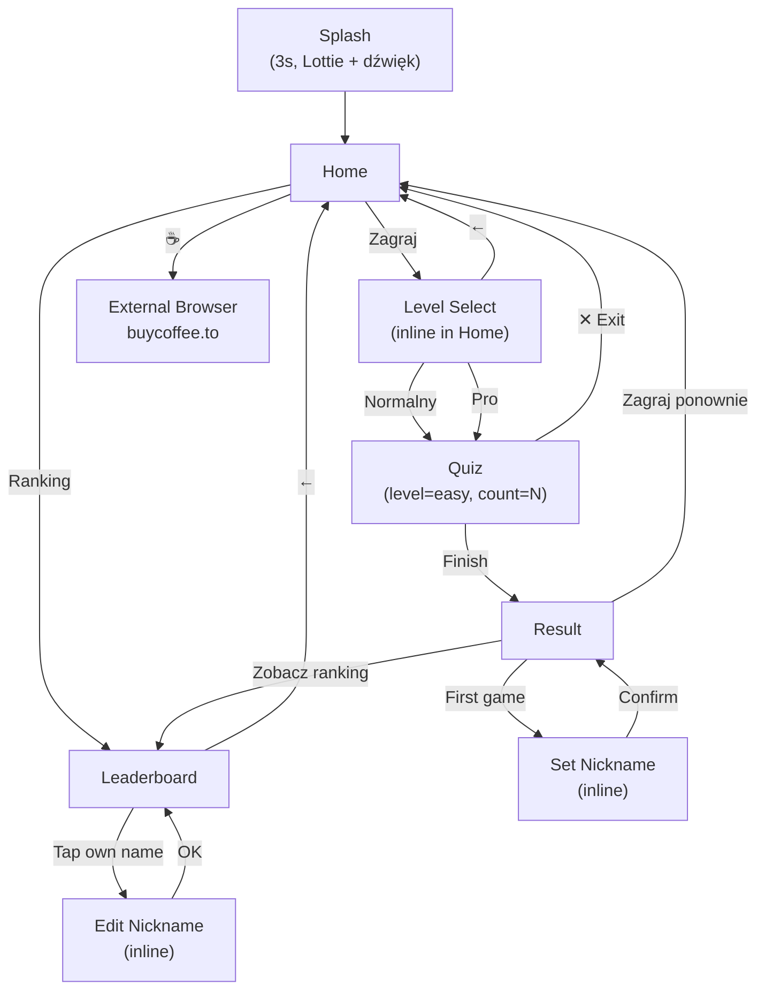
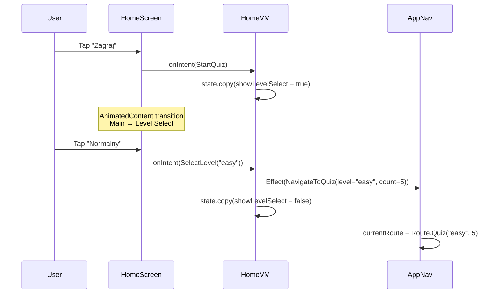
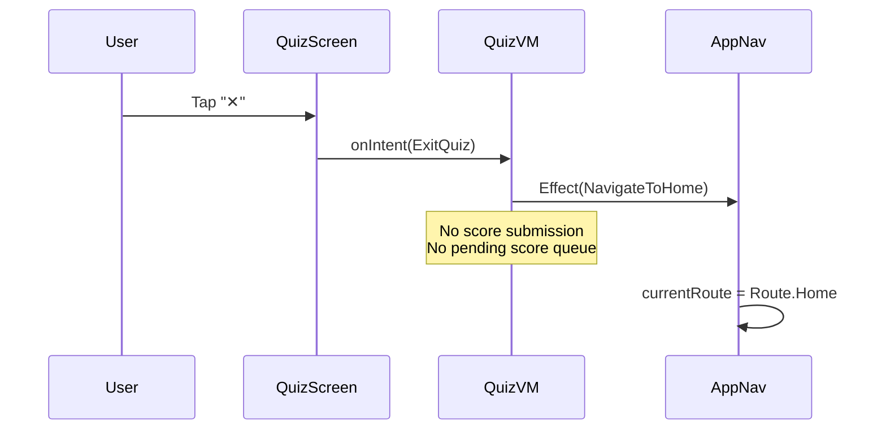
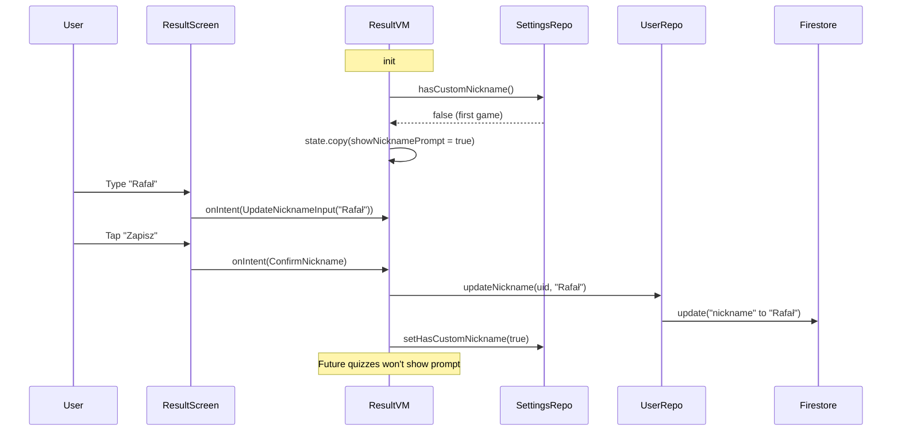

# Phase 5: UX Improvements — App Icon, Level Selection, Nickname, Exit Quiz, Coffee Link

> **Date:** 2026-02-17
> **Goal:** 8 UX improvements: app icon, safe-area top bar, quiz exit, nickname flow, level selection, question count config, coffee link, splash animation + dźwięk.
> **Prerequisite:** Phase 4 complete (animations, haptics, settings).
> **Platforms:** Android + iOS.
> **ADR:** ADR-0007 (level-selection-and-quiz-config).

---

## Table of Contents

1. [Feature Summary](#summary)
2. [Phase 5A — App Icon (logo.png)](#phase-5a)
3. [Phase 5B — Top Bar Safe Area Fix](#phase-5b)
4. [Phase 5C — Quiz Exit Button ("X")](#phase-5c)
5. [Phase 5D — Set Nickname on First Quiz Completion](#phase-5d)
6. [Phase 5E — Change Nickname from Leaderboard](#phase-5e)
7. [Phase 5F — Level Selection + Question Count](#phase-5f)
8. [Phase 5G — Coffee Link (Footer)](#phase-5g)
9. [Phase 5H — Splash: Animacja Lottie + Dźwięk Pszczoły](#phase-5h)
10. [Risks & Mitigations](#risks)
11. [Diagrams](#diagrams)
12. [DoR Checklist](#dor)
13. [Integration Checklist](#integration-checklist)

---

<a id="summary"></a>
## Feature Summary

| # | Feature | Scope | Complexity |
|---|---------|-------|------------|
| 1 | App icon from `logo.png` | Android (mipmap) + iOS (AppIcon asset) | Low |
| 2 | Top bar safe area fix | `AppNavigation.kt` layout | Low |
| 3 | Quiz exit "X" button | QuizScreen + QuizVM (discard results) | Low-Medium |
| 4 | "Set nickname" on first quiz end | ResultScreen + ResultVM + UserRepository | Medium |
| 5 | Change nickname from leaderboard | LeaderboardScreen + LeaderboardVM + UserRepository | Medium |
| 6 | Level selection + question count | New sub-screen on Home, Route update, QuizVM, GetRandomQuestionsUseCase | High |
| 7 | Coffee link in footer | HomeScreen UI only | Low |
| 8 | Splash: animacja pszczoły + dźwięk | SplashScreen + Lottie + audio playback | Medium |

---

<a id="phase-5a"></a>
## Phase 5A — App Icon from `logo.png` (1 commit)

**Commit:** `chore: set app icon from logo.png for Android + iOS`

### Context

- Source: `/logo.png` (2048×2048 RGBA PNG) — already exists at project root and in `composeApp/src/commonMain/resources/logo.png`
- Android: needs `ic_launcher.png` in mipmap folders (`mdpi` through `xxxhdpi`)
- iOS: needs `AppIcon` in `iosApp/iosApp/Assets.xcassets/AppIcon.appiconset/`

### 5A.1 Android — Generate Mipmap Icons

Use `sips` (macOS) or ImageMagick to generate resized PNGs from the 2048×2048 source:

| Density | Size | File |
|---------|------|------|
| mdpi | 48×48 | `composeApp/src/androidMain/res/mipmap-mdpi/ic_launcher.png` |
| hdpi | 72×72 | `composeApp/src/androidMain/res/mipmap-hdpi/ic_launcher.png` |
| xhdpi | 96×96 | `composeApp/src/androidMain/res/mipmap-xhdpi/ic_launcher.png` |
| xxhdpi | 144×144 | `composeApp/src/androidMain/res/mipmap-xxhdpi/ic_launcher.png` |
| xxxhdpi | 192×192 | `composeApp/src/androidMain/res/mipmap-xxxhdpi/ic_launcher.png` |

**Also** generate round variants (`ic_launcher_round.png`) at same sizes, or use the same square image if logo has no background issues. Ideally, use Android Studio adaptive icon (foreground layer = logo, background = #FFF9ED), but a simple PNG icon is valid for MVP.

**AndroidManifest.xml** — ensure:
```xml
android:icon="@mipmap/ic_launcher"
android:roundIcon="@mipmap/ic_launcher_round"
```

### 5A.2 iOS — Set AppIcon Asset

Place a 1024×1024 version in:
- `iosApp/iosApp/Assets.xcassets/AppIcon.appiconset/app_icon_1024.png`

Update `Contents.json`:
```json
{
  "images": [
    {
      "filename": "app_icon_1024.png",
      "idiom": "universal",
      "platform": "ios",
      "size": "1024x1024"
    }
  ],
  "info": {
    "author": "xcode",
    "version": 1
  }
}
```

Since Xcode 15+, a single 1024×1024 asset with `idiom: universal` is sufficient — Xcode generates all sizes automatically.

### 5A.3 Generation Commands (macOS)

```bash
# From project root
SRC="logo.png"

# Android mipmap
sips -z 48 48   "$SRC" --out composeApp/src/androidMain/res/mipmap-mdpi/ic_launcher.png
sips -z 72 72   "$SRC" --out composeApp/src/androidMain/res/mipmap-hdpi/ic_launcher.png
sips -z 96 96   "$SRC" --out composeApp/src/androidMain/res/mipmap-xhdpi/ic_launcher.png
sips -z 144 144 "$SRC" --out composeApp/src/androidMain/res/mipmap-xxhdpi/ic_launcher.png
sips -z 192 192 "$SRC" --out composeApp/src/androidMain/res/mipmap-xxxhdpi/ic_launcher.png

# Duplicate as round (square with alpha is acceptable)
for d in mdpi hdpi xhdpi xxhdpi xxxhdpi; do
  cp "composeApp/src/androidMain/res/mipmap-$d/ic_launcher.png" \
     "composeApp/src/androidMain/res/mipmap-$d/ic_launcher_round.png"
done

# iOS
sips -z 1024 1024 "$SRC" --out iosApp/iosApp/Assets.xcassets/AppIcon.appiconset/app_icon_1024.png
```

### Verification (5A)

- [ ] Android app shows logo as launcher icon
- [ ] iOS app shows logo as launcher icon
- [ ] Icons look crisp on both platforms (no pixelation at any density)

---

<a id="phase-5b"></a>
## Phase 5B — Top Bar Safe Area Fix (1 commit)

**Commit:** `fix(ui): move top bar below status/notification bar`

### Problem

The top bar ("Ranking", "Pytanie 1/5") is positioned too low or overlapping with system UI. The layout needs to respect the system status bar / notch / Dynamic Island insets.

### Current Implementation

In [AppNavigation.kt](composeApp/src/commonMain/kotlin/pl/quizpszczelarski/app/navigation/AppNavigation.kt):
```kotlin
Box(
    modifier = Modifier
        .fillMaxSize()
        .padding(innerPadding)
        .statusBarsPadding(),  // ← already present
)
```

`statusBarsPadding()` is already applied. The issue is that `innerPadding` from `Scaffold` AND `statusBarsPadding()` may be double-stacking, OR the status bar insets aren't propagated properly.

### Fix Strategy

1. **Remove redundant `statusBarsPadding()`** — `Scaffold` already provides `innerPadding` which includes status bar insets. Using both causes double padding or conflicts.

2. **Verify `WindowCompat.setDecorFitsSystemWindows(window, false)`** is called in Android `MainActivity` (edge-to-edge). If not set, `innerPadding` may not include status bar insets.

3. **iOS:** Compose Multiplatform should handle safe area automatically. If not, verify that the `ComposeUIViewController` configuration includes safe area insets.

### Changes

**File:** `AppNavigation.kt`

Replace:
```kotlin
Box(
    modifier = Modifier
        .fillMaxSize()
        .padding(innerPadding)
        .statusBarsPadding(),
)
```

With:
```kotlin
Box(
    modifier = Modifier
        .fillMaxSize()
        .padding(innerPadding),
)
```

If that doesn't fix it (meaning `Scaffold` doesn't account for status bar), switch to:
```kotlin
Scaffold(
    // ... remove containerColor, keep snackbarHost
) { _ ->
    Box(
        modifier = Modifier
            .fillMaxSize()
            .statusBarsPadding(),
    ) {
```

**File:** Android `MainActivity.kt` — ensure edge-to-edge:
```kotlin
override fun onCreate(savedInstanceState: Bundle?) {
    super.onCreate(savedInstanceState)
    WindowCompat.setDecorFitsSystemWindows(window, false)
    // ...
}
```

### Verification (5B)

- [ ] Top bar content ("Ranking", "Pytanie X/Y") appears BELOW status bar / notch on Android
- [ ] Same on iOS — below Dynamic Island / status bar
- [ ] No double padding (content not pushed too far down)
- [ ] Splash screen still fills the entire screen edge-to-edge

---

<a id="phase-5c"></a>
## Phase 5C — Quiz Exit Button "X" (1 commit)

**Commit:** `feat(quiz): add exit button — discard score on quit`

### Behavior

- "X" icon button in top-right corner of QuizScreen
- Tapping it immediately navigates back to Home
- **Score and answers are NOT saved** — no `addScore()`, no pending score
- No confirmation dialog needed (MVP simplicity)

### Changes

#### 5C.1 QuizIntent — add `ExitQuiz`

**File:** `QuizIntent.kt`

```kotlin
sealed interface QuizIntent {
    data class SelectAnswer(val index: Int) : QuizIntent
    data object NextQuestion : QuizIntent
    data object RetryLoad : QuizIntent
    data object ExitQuiz : QuizIntent  // NEW
}
```

#### 5C.2 QuizEffect — add `NavigateToHome`

**File:** `QuizEffect.kt`

```kotlin
sealed interface QuizEffect {
    // ... existing ...
    data object NavigateToHome : QuizEffect  // NEW
}
```

#### 5C.3 QuizViewModel — handle ExitQuiz

In `reduce()`:
```kotlin
is QuizIntent.ExitQuiz -> {
    emitEffect(QuizEffect.NavigateToHome)
    state // no state change, no score submission
}
```

#### 5C.4 AppNavigation — handle NavigateToHome

In the Quiz route effect collector:
```kotlin
is QuizEffect.NavigateToHome -> {
    currentRoute = Route.Home
}
```

#### 5C.5 QuizScreen — add "X" button

In `QuizScreen.kt`, inside the main `Column` (right after the offline/refreshing indicators), add a top bar `Row` with:

```kotlin
Row(
    modifier = Modifier
        .fillMaxWidth()
        .padding(horizontal = spacing.md, vertical = spacing.sm),
    horizontalArrangement = Arrangement.SpaceBetween,
    verticalAlignment = Alignment.CenterVertically,
) {
    // Question progress text (e.g. "Pytanie 1/5") — moved here from QuizProgressBar header
    Text(
        text = "Pytanie ${state.currentQuestionIndex + 1}/${state.totalQuestions}",
        style = MaterialTheme.typography.titleMedium,
        color = MaterialTheme.colorScheme.onSurface,
    )

    // Exit button
    IconButton(
        onClick = { onIntent(QuizIntent.ExitQuiz) },
        modifier = Modifier.size(40.dp),
    ) {
        Box(
            modifier = Modifier
                .size(40.dp)
                .clip(CircleShape)
                .background(MaterialTheme.colorScheme.surfaceVariant),
            contentAlignment = Alignment.Center,
        ) {
            Text(
                text = "✕",
                style = MaterialTheme.typography.bodyLarge,
                color = MaterialTheme.colorScheme.onSurface,
            )
        }
    }
}
```

Alternatively, use the existing `QuizTopBar` component extended with a trailing action slot. Recommended approach: add an optional `trailingAction` composable lambda to `QuizTopBar`.

### Verification (5C)

- [ ] "X" button visible in top-right of quiz screen
- [ ] Tapping "X" navigates to Home immediately
- [ ] Score is NOT submitted to Firestore or pending queue
- [ ] User can start a new quiz normally after exiting
- [ ] Back button / gesture on Android also does NOT submit score (same as exit)

---

<a id="phase-5d"></a>
## Phase 5D — Set Nickname on First Quiz Completion (1 commit)

**Commit:** `feat(result): nickname dialog on first game completion`

### Behavior

- After the FIRST quiz (when `gamesPlayed == 1` or was `0` before this quiz), show a "Ustaw nick" button on the ResultScreen
- Tapping it shows an inline text field / dialog where the user can type a nickname
- On confirm, update nickname in Firestore via `UserRepository.updateNickname(uid, newNick)`
- On subsequent quizzes, the "Ustaw nick" button is NOT shown (nick already set)

### Detection of "First Game"

The `ResultViewModel` already submits score, which increments `gamesPlayed`. We can check if this is the first game by:
- **Option A:** After `submitScore()`, fetch the user profile and check `gamesPlayed == 1`
- **Option B:** Track `isFirstGame: Boolean` in navigation args passed from Home → Quiz → Result
- **Option C:** Store a local flag `nickname_set` in `multiplatform-settings`

**Recommended: Option C** — simplest, no extra network call. A settings flag `has_custom_nickname` (default `false`) is set to `true` after the user sets a nickname. The "Ustaw nick" button shows whenever this flag is `false`.

### Changes

#### 5D.1 SettingsRepository / SettingsRepositoryImpl — add nickname flag

Add to `SettingsRepository`:
```kotlin
fun hasCustomNickname(): Boolean
suspend fun setHasCustomNickname(value: Boolean)
```

Add to `SettingsRepositoryImpl`:
```kotlin
companion object {
    // ... existing keys ...
    private const val KEY_HAS_CUSTOM_NICKNAME = "has_custom_nickname"
}

fun hasCustomNickname(): Boolean = settings[KEY_HAS_CUSTOM_NICKNAME, false]

suspend fun setHasCustomNickname(value: Boolean) {
    settings[KEY_HAS_CUSTOM_NICKNAME] = value
}
```

#### 5D.2 UserRepository — add `updateNickname`

**File:** `UserRepository.kt` (domain interface)

```kotlin
suspend fun updateNickname(uid: String, newNickname: String)
```

**File:** `FirebaseUserRepository.kt` (data implementation)

```kotlin
override suspend fun updateNickname(uid: String, newNickname: String) {
    val docRef = firestore.collection("users").document(uid)
    docRef.update("nickname" to newNickname)
}
```

#### 5D.3 ResultState — add nickname fields

```kotlin
data class ResultState(
    val score: Int = 0,
    val totalQuestions: Int = 0,
    val showNicknamePrompt: Boolean = false,  // NEW
    val nicknameInput: String = "",            // NEW
    val isSubmittingNickname: Boolean = false,  // NEW
) {
    // ... existing computed properties ...
}
```

#### 5D.4 ResultIntent — add nickname intents

```kotlin
sealed interface ResultIntent {
    data object PlayAgain : ResultIntent
    data object ViewLeaderboard : ResultIntent
    data object ShowNicknameDialog : ResultIntent     // NEW
    data class UpdateNicknameInput(val text: String) : ResultIntent  // NEW
    data object ConfirmNickname : ResultIntent         // NEW
    data object DismissNicknameDialog : ResultIntent   // NEW
}
```

#### 5D.5 ResultViewModel — handle nickname logic

Constructor gains: `userRepository`, `settingsRepo`, `uid`

```kotlin
init {
    // ... existing haptic + score submission ...
    // Check if first game
    if (settingsRepo.hasCustomNickname().not()) {
        onIntent(ShowFirstGameNicknamePrompt)
    }
}
```

In `reduce()`:
```kotlin
is ResultIntent.ShowNicknameDialog -> state.copy(showNicknamePrompt = true)
is ResultIntent.UpdateNicknameInput -> state.copy(nicknameInput = intent.text)
is ResultIntent.DismissNicknameDialog -> state.copy(showNicknamePrompt = false)
is ResultIntent.ConfirmNickname -> {
    val nick = state.nicknameInput.trim()
    if (nick.isNotEmpty() && uid != null) {
        scope.launch {
            try {
                userRepository.updateNickname(uid, nick)
                settingsRepo.setHasCustomNickname(true)
            } catch (e: Exception) {
                emitEffect(ResultEffect.ShowError("Nie udało się zapisać nicku"))
            }
        }
    }
    state.copy(showNicknamePrompt = false, nicknameInput = "")
}
```

#### 5D.6 ResultScreen — nickname UI

Below the action buttons, conditionally show:

```kotlin
if (state.showNicknamePrompt) {
    // Card with TextField + Confirm button
    Card(modifier = Modifier.fillMaxWidth().padding(horizontal = spacing.lg)) {
        Column(modifier = Modifier.padding(spacing.lg)) {
            Text("Ustaw swój nick", style = MaterialTheme.typography.titleMedium)
            Spacer(modifier = Modifier.height(spacing.md))
            OutlinedTextField(
                value = state.nicknameInput,
                onValueChange = { onIntent(ResultIntent.UpdateNicknameInput(it)) },
                label = { Text("Nick") },
                singleLine = true,
                modifier = Modifier.fillMaxWidth(),
            )
            Spacer(modifier = Modifier.height(spacing.md))
            AppButton(
                text = "Zapisz",
                onClick = { onIntent(ResultIntent.ConfirmNickname) },
                enabled = state.nicknameInput.trim().isNotEmpty(),
            )
        }
    }
}
```

**Alternative:** Show a separate button "Ustaw nick" that expands into the inline form on tap.

### Verification (5D)

- [ ] First quiz completion: "Ustaw nick" section visible on ResultScreen
- [ ] User can type a nickname and save it
- [ ] Nickname updates in Firestore `users/{uid}` document
- [ ] After setting nickname, subsequent quiz completions do NOT show the prompt
- [ ] Dismissing the dialog without saving keeps `has_custom_nickname = false`
- [ ] Empty nickname is rejected (button disabled)

---

<a id="phase-5e"></a>
## Phase 5E — Change Nickname from Leaderboard (1 commit)

**Commit:** `feat(leaderboard): tap own name to change nickname`

### Behavior

- In the leaderboard, the row marked as `isCurrentUser == true` is tappable
- Tapping it shows an inline edit field (similar to Phase 5D)
- User can type a new nickname and confirm
- Nickname updates in Firestore

### Changes

#### 5E.1 LeaderboardState — add edit fields

```kotlin
data class LeaderboardState(
    // ... existing ...
    val isEditingNickname: Boolean = false,   // NEW
    val nicknameInput: String = "",            // NEW
)
```

#### 5E.2 LeaderboardIntent — add rename intents

```kotlin
sealed interface LeaderboardIntent {
    data class SelectTab(val index: Int) : LeaderboardIntent
    data object GoBack : LeaderboardIntent
    data object StartEditNickname : LeaderboardIntent   // NEW
    data class UpdateNicknameInput(val text: String) : LeaderboardIntent  // NEW
    data object ConfirmNickname : LeaderboardIntent      // NEW
    data object CancelEditNickname : LeaderboardIntent   // NEW
}
```

#### 5E.3 LeaderboardEffect — add ShowSnackbar

```kotlin
sealed interface LeaderboardEffect {
    data object NavigateBack : LeaderboardEffect
    data class ShowSnackbar(val message: String) : LeaderboardEffect  // NEW
}
```

#### 5E.4 LeaderboardViewModel — add userRepository dep + handle rename

Constructor adds: `userRepository: UserRepository`

```kotlin
is LeaderboardIntent.StartEditNickname -> state.copy(isEditingNickname = true)
is LeaderboardIntent.UpdateNicknameInput -> state.copy(nicknameInput = intent.text)
is LeaderboardIntent.CancelEditNickname -> state.copy(isEditingNickname = false, nicknameInput = "")
is LeaderboardIntent.ConfirmNickname -> {
    val nick = state.nicknameInput.trim()
    if (nick.isNotEmpty() && currentUid != null) {
        scope.launch {
            try {
                userRepository.updateNickname(currentUid, nick)
                emitEffect(LeaderboardEffect.ShowSnackbar("Nick zmieniony!"))
                // Leaderboard will auto-update via Firestore listener
            } catch (e: Exception) {
                emitEffect(LeaderboardEffect.ShowSnackbar("Nie udało się zmienić nicku"))
            }
        }
    }
    state.copy(isEditingNickname = false, nicknameInput = "")
}
```

#### 5E.5 LeaderboardScreen — tappable user row + edit UI

In `LeaderboardEntryRow` for `isCurrentUser == true`:
- Make the row clickable → emit `StartEditNickname`

Below the row (or as a replacement for it), show the edit field when `isEditingNickname == true`:

```kotlin
if (state.isEditingNickname) {
    Card(modifier = Modifier.fillMaxWidth().padding(spacing.md)) {
        Row(modifier = Modifier.padding(spacing.md), verticalAlignment = Alignment.CenterVertically) {
            OutlinedTextField(
                value = state.nicknameInput,
                onValueChange = { onIntent(LeaderboardIntent.UpdateNicknameInput(it)) },
                singleLine = true,
                modifier = Modifier.weight(1f),
                label = { Text("Nowy nick") },
            )
            Spacer(modifier = Modifier.width(spacing.sm))
            AppButton(text = "OK", onClick = { onIntent(LeaderboardIntent.ConfirmNickname) })
        }
    }
}
```

#### 5E.6 AppNavigation — wire userRepository to LeaderboardViewModel

```kotlin
Route.Leaderboard -> {
    val vm = remember {
        LeaderboardViewModel(
            leaderboardRepository = leaderboardRepository,
            currentUid = currentUid,
            userRepository = userRepository,  // NEW
        )
    }
```

Also handle `ShowSnackbar` effect:
```kotlin
is LeaderboardEffect.ShowSnackbar -> showSnackbar(effect.message)
```

### Verification (5E)

- [ ] User's own leaderboard row is visually distinct and tappable
- [ ] Tapping shows inline edit field with nickname input
- [ ] Confirming updates nickname in Firestore
- [ ] Leaderboard auto-refreshes to show new name (Firestore listener)
- [ ] Snackbar confirms success or shows error
- [ ] Other users' rows are NOT tappable

---

<a id="phase-5f"></a>
## Phase 5F — Level Selection + Question Count (1 commit)

**Commit:** `feat(home): add level selection screen + configurable question count`

### Behavior

1. User taps "Zagraj" on HomeScreen
2. All HomeScreen buttons animate out (slide/fade)
3. New content appears: heading "Wybierz poziom" + two buttons:
   - **"Normalny"** → loads questions filtered by `level = "easy"`
   - **"Pro dla Pszczelarzy"** → loads questions filtered by `level = "pro"`
4. Below: question count selector (default 5; options: 5, 10, 15, 20)
5. Selected level + count are passed to Quiz route

### Architecture

**Option A:** Separate `ModeSelectScreen` with its own Route
**Option B:** Inline sub-state within `HomeScreen`

**Recommended: Option B** — avoids a new route. The `HomeState` gains a `showLevelSelect: Boolean` field. When `true`, the home content fades out and the level selector fades in. This keeps navigation simple and enables smooth animation within one screen.

### Changes

#### 5F.1 Route — update Quiz to carry level + count

**File:** `Route.kt`

```kotlin
sealed interface Route {
    data object Splash : Route
    data object Home : Route
    data class Quiz(val level: String, val questionCount: Int = 5) : Route  // CHANGED
    data class Result(val score: Int, val total: Int) : Route
    data object Leaderboard : Route
}
```

#### 5F.2 HomeState — add level selection fields

```kotlin
data class HomeState(
    val appTitle: String = "Quiz Pszczelarski",
    val appDescription: String = "Sprawdź swoją wiedzę o pszczołach i pszczelarstwie!",
    val showLevelSelect: Boolean = false,      // NEW
    val selectedQuestionCount: Int = 5,          // NEW
)
```

#### 5F.3 HomeIntent — add level selection intents

```kotlin
sealed interface HomeIntent {
    data object StartQuiz : HomeIntent           // opens level selection
    data object ViewLeaderboard : HomeIntent
    data object ToggleHaptics : HomeIntent
    data class SelectLevel(val level: String) : HomeIntent     // NEW — triggers navigation
    data object BackFromLevelSelect : HomeIntent               // NEW
    data class SetQuestionCount(val count: Int) : HomeIntent   // NEW
}
```

#### 5F.4 HomeEffect — update NavigateToQuiz

```kotlin
sealed interface HomeEffect {
    data class NavigateToQuiz(val level: String, val questionCount: Int) : HomeEffect  // CHANGED
    data object NavigateToLeaderboard : HomeEffect
    data class PlayHaptic(val type: ImpactType) : HomeEffect
    data object ToggleHaptics : HomeEffect
}
```

#### 5F.5 HomeViewModel — handle level selection

```kotlin
override fun reduce(state: HomeState, intent: HomeIntent): HomeState {
    when (intent) {
        HomeIntent.StartQuiz -> {
            emitEffect(HomeEffect.PlayHaptic(ImpactType.Light))
            return state.copy(showLevelSelect = true)  // show level picker
        }
        HomeIntent.ViewLeaderboard -> {
            emitEffect(HomeEffect.PlayHaptic(ImpactType.Light))
            emitEffect(HomeEffect.NavigateToLeaderboard)
        }
        HomeIntent.ToggleHaptics -> {
            emitEffect(HomeEffect.ToggleHaptics)
        }
        is HomeIntent.SelectLevel -> {
            emitEffect(HomeEffect.PlayHaptic(ImpactType.Medium))
            emitEffect(HomeEffect.NavigateToQuiz(intent.level, state.selectedQuestionCount))
            return state.copy(showLevelSelect = false)
        }
        HomeIntent.BackFromLevelSelect -> {
            return state.copy(showLevelSelect = false)
        }
        is HomeIntent.SetQuestionCount -> {
            return state.copy(selectedQuestionCount = intent.count)
        }
    }
    return state
}
```

#### 5F.6 AppNavigation — update effect handler + Quiz route

```kotlin
// Home effect collector
is HomeEffect.NavigateToQuiz -> {
    currentRoute = Route.Quiz(level = effect.level, questionCount = effect.questionCount)
}

// Quiz route
is Route.Quiz -> {
    val vm = remember(route.level, route.questionCount) {
        QuizViewModel(
            getRandomQuestions = getRandomQuestions,
            syncService = questionSyncService,
            level = route.level,
            questionCount = route.questionCount,
        )
    }
    // ...
}
```

#### 5F.7 QuizViewModel — accept level + count

```kotlin
class QuizViewModel(
    private val getRandomQuestions: GetRandomQuestionsUseCase,
    private val syncService: QuestionSyncService,
    private val level: String = "easy",          // NEW
    private val questionCount: Int = 5,           // NEW
) : MviViewModel<QuizState, QuizIntent, QuizEffect>(QuizState()) {

    private fun loadQuestions() {
        scope.launch {
            try {
                val questions = getRandomQuestions(count = questionCount, level = level)
                // ...
```

#### 5F.8 GetRandomQuestionsUseCase — accept level filter

```kotlin
class GetRandomQuestionsUseCase(
    private val repository: QuestionRepository,
) {
    suspend operator fun invoke(count: Int = 5, level: String? = null): List<Question> {
        return repository.getActiveQuestions(level = level)
            .shuffled()
            .take(count)
    }
}
```

Note: `QuestionRepository.getActiveQuestions()` already supports `level` parameter. No changes needed at repository level.

#### 5F.9 HomeScreen — level selection UI

When `state.showLevelSelect == true`, render the level picker with animation:

```kotlin
@Composable
fun HomeScreen(state: HomeState, onIntent: (HomeIntent) -> Unit, modifier: Modifier) {
    // ...
    Box(modifier = modifier.fillMaxSize().background(...)) {
        AnimatedContent(
            targetState = state.showLevelSelect,
            transitionSpec = {
                if (targetState) {
                    // Enter: fade in + slide up
                    fadeIn(tween(300)) + slideInVertically(
                        initialOffsetY = { it / 4 },
                        animationSpec = tween(300),
                    ) togetherWith fadeOut(tween(200)) + slideOutVertically(
                        targetOffsetY = { -it / 4 },
                        animationSpec = tween(200),
                    )
                } else {
                    // Exit: reverse
                    fadeIn(tween(300)) + slideInVertically(
                        initialOffsetY = { -it / 4 },
                        animationSpec = tween(300),
                    ) togetherWith fadeOut(tween(200)) + slideOutVertically(
                        targetOffsetY = { it / 4 },
                        animationSpec = tween(200),
                    )
                }
            },
            label = "HomeLevelToggle",
        ) { showLevel ->
            if (!showLevel) {
                // Existing home content (header + action cards + footer)
                HomeMainContent(state, onIntent)
            } else {
                // Level selection content
                LevelSelectContent(state, onIntent)
            }
        }
    }
}
```

**`LevelSelectContent`:**

```kotlin
@Composable
private fun LevelSelectContent(state: HomeState, onIntent: (HomeIntent) -> Unit) {
    Column(
        modifier = Modifier.fillMaxSize().padding(horizontal = spacing.lg, vertical = spacing.xxxl),
        horizontalAlignment = Alignment.CenterHorizontally,
        verticalArrangement = Arrangement.Center,
    ) {
        // Back arrow
        Row(modifier = Modifier.fillMaxWidth()) {
            IconButton(onClick = { onIntent(HomeIntent.BackFromLevelSelect) }) {
                Text("←", style = MaterialTheme.typography.headlineSmall)
            }
        }

        Spacer(modifier = Modifier.weight(1f))

        Text(
            text = "Wybierz poziom",
            style = MaterialTheme.typography.headlineMedium,
            color = MaterialTheme.colorScheme.onBackground,
        )

        Spacer(modifier = Modifier.height(spacing.xxl))

        AppButton(
            text = "Normalny",
            onClick = { onIntent(HomeIntent.SelectLevel("easy")) },
            leadingIcon = { Text("🐝") },
        )

        Spacer(modifier = Modifier.height(spacing.lg))

        AppButton(
            text = "Pro dla Pszczelarzy",
            onClick = { onIntent(HomeIntent.SelectLevel("pro")) },
            variant = AppButtonVariant.Secondary,
            leadingIcon = { Text("🏆") },
        )

        Spacer(modifier = Modifier.height(spacing.xxl))

        // Question count selector
        Text(
            text = "Liczba pytań: ${state.selectedQuestionCount}",
            style = MaterialTheme.typography.bodyMedium,
            color = MaterialTheme.colorScheme.onSurfaceVariant,
        )

        Spacer(modifier = Modifier.height(spacing.md))

        Row(horizontalArrangement = Arrangement.spacedBy(spacing.sm)) {
            listOf(5, 10, 15, 20).forEach { count ->
                AppButton(
                    text = "$count",
                    onClick = { onIntent(HomeIntent.SetQuestionCount(count)) },
                    variant = if (count == state.selectedQuestionCount) {
                        AppButtonVariant.Primary
                    } else {
                        AppButtonVariant.Tertiary
                    },
                    modifier = Modifier.width(56.dp),
                )
            }
        }

        Spacer(modifier = Modifier.weight(1f))
    }
}
```

### Data Requirement

Questions in Firestore must have `level` field values:
- `"easy"` — for normal mode
- `"pro"` — for pro mode

Verify that existing questions have these values set. If not, an admin update is needed.

### Verification (5F)

- [ ] "Zagraj" opens level selection (home buttons animate out)
- [ ] "Normalny" starts quiz with only `level = "easy"` questions
- [ ] "Pro dla Pszczelarzy" starts quiz with only `level = "pro"` questions
- [ ] Question count selector defaults to 5
- [ ] Changing count to 10 passes `count = 10` to quiz
- [ ] Back arrow returns to home main content with animation
- [ ] If fewer questions exist than requested count, quiz uses all available

---

<a id="phase-5g"></a>
## Phase 5G — Coffee Link (Footer) (1 commit)

**Commit:** `feat(home): replace footer with coffee donation link`

### Behavior

Replace the text "Każdy quiz składa się z 5 pytań" in `HomeScreen` footer with:
- Coffee cup icon (☕ emoji or custom icon)
- Text: "Postaw mi kawę"
- Clickable → opens `https://buycoffee.to/codewithhoney` in system browser

### Changes

#### 5G.1 HomeScreen — replace footer

Replace footer `Text` with clickable row:

```kotlin
// Replace:
// Text(text = "Każdy quiz składa się z 5 pytań", ...)

// With:
Row(
    modifier = Modifier
        .clickable { onIntent(HomeIntent.OpenCoffeeLink) }
        .padding(spacing.md),
    verticalAlignment = Alignment.CenterVertically,
    horizontalArrangement = Arrangement.Center,
) {
    Text("☕", style = MaterialTheme.typography.titleLarge)
    Spacer(modifier = Modifier.width(spacing.sm))
    Text(
        text = "Postaw mi kawę",
        style = MaterialTheme.typography.bodyMedium,
        color = MaterialTheme.colorScheme.tertiary,
    )
}
```

#### 5G.2 HomeIntent — add OpenCoffeeLink

```kotlin
data object OpenCoffeeLink : HomeIntent  // NEW
```

#### 5G.3 HomeEffect — add OpenUrl

```kotlin
data class OpenUrl(val url: String) : HomeEffect  // NEW
```

#### 5G.4 HomeViewModel — handle coffee link

```kotlin
HomeIntent.OpenCoffeeLink -> {
    emitEffect(HomeEffect.OpenUrl("https://buycoffee.to/codewithhoney"))
}
```

#### 5G.5 AppNavigation — handle OpenUrl effect

Use platform URL opener. In Compose Multiplatform, use `LocalUriHandler`:

```kotlin
val uriHandler = LocalUriHandler.current

// In Home effect collector:
is HomeEffect.OpenUrl -> {
    uriHandler.openUri(effect.url)
}
```

`LocalUriHandler` is available in `androidx.compose.ui.platform` and works cross-platform in Compose Multiplatform.

### Verification (5G)

- [ ] Footer shows coffee icon + "Postaw mi kawę" text
- [ ] Tapping opens `https://buycoffee.to/codewithhoney` in system browser
- [ ] Works on both Android and iOS
- [ ] Old "Każdy quiz składa się z 5 pytań" text is removed

---

<a id="phase-5h"></a>
## Phase 5H — Splash: Animacja Lottie + Dźwięk Pszczoły (1 commit)

**Commit:** `feat(splash): animacja Lottie pszczoły + dźwięk przy starcie`

### Zachowanie

- Splash screen trwa **3 sekundy** (zmiana z obecnych 2s)
- Zamiast emoji 🐝 wyświetlana jest **animacja Lottie** z pliku `bee_animation.json`
- Jednocześnie z animacją odtwarzany jest **dźwięk** z pliku `Pszczoła 8.mp3`
- Po 3 sekundach — przejście do ekranu Home (jak dotychczas)
- Animacja Lottie zapętla się (loop) przez cały czas trwania splasha
- Dźwięk odtwarzany jest jednokrotnie (bez loopa)

### Pliki źródłowe

| Plik | Format | Rozmiar | Opis |
|------|--------|---------|------|
| `bee_animation.json` | Lottie JSON v5.7.5 | 30KB | 25fps, 125 klatek (~5s), animacja pszczoły |
| `Pszczoła 8.mp3` | MP3 128kbps 44.1kHz | 48KB | Dźwięk bzyczenia pszczoły |

### 5H.1 Nowa zależność — Compottie (Lottie for Compose Multiplatform)

Biblioteka: [`io.github.alexzhirkevich:compottie`](https://github.com/nicholasnet/compottie) — multiplatformowa implementacja Lottie dla Compose.

**Alternatywa:** `com.airbnb.android:lottie-compose` (tylko Android) — NIE odpowiednia dla KMP.

**`gradle/libs.versions.toml`:**

```toml
[versions]
compottie = "2.0.0-rc01"

[libraries]
compottie = { module = "io.github.alexzhirkevich:compottie", version.ref = "compottie" }
compottie-resources = { module = "io.github.alexzhirkevich:compottie-resources", version.ref = "compottie" }
```

**`composeApp/build.gradle.kts` — `commonMain.dependencies`:**

```kotlin
implementation(libs.compottie)
implementation(libs.compottie.resources)
```

> **Uwaga:** Sprawdzić kompatybilność Compottie z Compose Multiplatform 1.10.1 i Kotlin 2.2.21.
> Jeśli niekompatybilna — fallback: użyć `AnimatedVisibility` + `animateFloatAsState` do prostej animacji skali/obrotu obrazka logo zamiast Lottie.

### 5H.2 Umiejscowienie zasobów

Przenieść pliki z katalogu głównego projektu do zasobów Compose Multiplatform:

```
composeApp/src/commonMain/composeResources/files/
  bee_animation.json
  bee_sound.mp3          ← renamed from "Pszczoła 8.mp3" (ASCII, bez spacji)
```

> **WAŻNE:** Nazwa pliku `Pszczoła 8.mp3` zawiera polskie znaki i spację. Przemianować na `bee_sound.mp3` aby uniknąć problemów z ładowaniem zasobów na obu platformach.

W Compose Multiplatform 1.10+ zasoby z `composeResources/files/` dostępne są przez `Res.readBytes("files/bee_animation.json")`.

### 5H.3 SplashScreen — Animacja Lottie

Zmieniony `SplashScreen.kt`:

```kotlin
@Composable
fun SplashScreen(
    onSplashFinished: () -> Unit,
    modifier: Modifier = Modifier,
) {
    val spacing = AppTheme.spacing

    // Lottie animation
    val composition by rememberLottieComposition {
        LottieCompositionSpec.JsonString(
            Res.readBytes("files/bee_animation.json").decodeToString()
        )
    }
    val progress by animateLottieCompositionAsState(
        composition = composition,
        iterations = LottieConstants.IterateForever,  // loop
    )

    LaunchedEffect(Unit) {
        delay(3000L)  // 3 sekundy zamiast 2
        onSplashFinished()
    }

    Column(
        modifier = modifier
            .fillMaxSize()
            .background(MaterialTheme.colorScheme.background),
        verticalArrangement = Arrangement.Center,
        horizontalAlignment = Alignment.CenterHorizontally,
    ) {
        // Animacja pszczoły (zastępuje emoji 🐝)
        LottieAnimation(
            composition = composition,
            progress = { progress },
            modifier = Modifier.size(200.dp),
        )

        Spacer(modifier = Modifier.height(spacing.xl))

        Text(
            text = "Quiz Pszczelarski",
            style = MaterialTheme.typography.headlineLarge,
            color = MaterialTheme.colorScheme.onBackground,
            textAlign = TextAlign.Center,
        )

        Spacer(modifier = Modifier.height(spacing.sm))

        Text(
            text = "Sprawdź swoją wiedzę o pszczołach",
            style = MaterialTheme.typography.bodyMedium,
            color = MaterialTheme.colorScheme.onSurfaceVariant,
            textAlign = TextAlign.Center,
        )
    }
}
```

### 5H.4 Odtwarzanie dźwięku — SplashSoundPlayer (expect/actual)

Dźwięk na splash jest odtwarzany jednorazowo i nie jest powiązany z istniejącym `SoundPlayer` (który jest do efektów UI). Potrzebna jest prosta abstrakcja `SplashSoundPlayer`.

#### Interfejs (commonMain)

**Plik:** `composeApp/src/commonMain/kotlin/pl/quizpszczelarski/app/platform/SplashSoundPlayer.kt`

```kotlin
package pl.quizpszczelarski.app.platform

/**
 * Jednorazowy odtwarzacz dźwięku na splash screenie.
 * Każda platforma implementuje to osobno (MediaPlayer / AVAudioPlayer).
 */
interface SplashSoundPlayer {
    /** Odtwórz dźwięk z podanej ścieżki zasobu. */
    fun play(resourceBytes: ByteArray)
    /** Zwolnij zasoby po zakończeniu splash. */
    fun release()
}
```

#### Android (androidMain)

**Plik:** `composeApp/src/androidMain/kotlin/pl/quizpszczelarski/app/platform/AndroidSplashSoundPlayer.kt`

```kotlin
package pl.quizpszczelarski.app.platform

import android.media.MediaPlayer
import java.io.File
import java.io.FileOutputStream

class AndroidSplashSoundPlayer(private val cacheDir: File) : SplashSoundPlayer {

    private var mediaPlayer: MediaPlayer? = null

    override fun play(resourceBytes: ByteArray) {
        try {
            val tempFile = File(cacheDir, "splash_sound.mp3")
            FileOutputStream(tempFile).use { it.write(resourceBytes) }

            mediaPlayer = MediaPlayer().apply {
                setDataSource(tempFile.absolutePath)
                prepare()
                start()
            }
        } catch (_: Exception) {
            // Nie blokuj startu aplikacji jeśli dźwięk nie działa
        }
    }

    override fun release() {
        mediaPlayer?.release()
        mediaPlayer = null
    }
}
```

#### iOS (iosMain)

**Plik:** `composeApp/src/iosMain/kotlin/pl/quizpszczelarski/app/platform/IosSplashSoundPlayer.kt`

```kotlin
package pl.quizpszczelarski.app.platform

import kotlinx.cinterop.ExperimentalForeignApi
import platform.AVFAudio.AVAudioPlayer
import platform.Foundation.NSData
import platform.Foundation.create

class IosSplashSoundPlayer : SplashSoundPlayer {

    private var audioPlayer: AVAudioPlayer? = null

    @OptIn(ExperimentalForeignApi::class)
    override fun play(resourceBytes: ByteArray) {
        try {
            val nsData = resourceBytes.toNSData()
            audioPlayer = AVAudioPlayer(data = nsData, error = null)
            audioPlayer?.prepareToPlay()
            audioPlayer?.play()
        } catch (_: Exception) {
            // Nie blokuj startu jeśli dźwięk nie działa
        }
    }

    override fun release() {
        audioPlayer?.stop()
        audioPlayer = null
    }

    private fun ByteArray.toNSData(): NSData {
        return NSData.create(
            bytes = this.toCValues().ptr,
            length = this.size.toULong(),
        )
    }
}
```

> **Uwaga:** Konwersja `ByteArray → NSData` wymaga `kotlinx.cinterop`. Jeśli API się zmieni, użyć `memScoped` + `allocArrayOf`.

### 5H.5 Wiring — SplashSoundPlayer w AppNavigation

`App.kt` przyjmuje dodatkowy parametr `splashSoundPlayer`:

```kotlin
@Composable
fun App(
    driverFactory: DatabaseDriverFactory,
    settingsFactory: SettingsFactory,
    haptics: Haptics = ...,
    splashSoundPlayer: SplashSoundPlayer? = null,  // NEW
)
```

W `AppNavigation`, w bloku `Route.Splash`:

```kotlin
Route.Splash -> {
    SplashScreen(
        onSplashFinished = { /* handled by LaunchedEffect */ },
    )
    LaunchedEffect(Unit) {
        // Odtwórz dźwięk pszczoły
        splashSoundPlayer?.let { player ->
            try {
                val soundBytes = Res.readBytes("files/bee_sound.mp3")
                player.play(soundBytes)
            } catch (_: Exception) { }
        }

        val bootstrapJob = async { ... }
        val syncJob = async { ... }

        delay(3000L)  // ← zmiana z 2000L na 3000L
        // ...

        // Zwolnij odtwarzacz po opuszczeniu splash
        splashSoundPlayer?.release()

        currentRoute = Route.Home
    }
}
```

### 5H.6 Platformowe wiring

**Android — `MainActivity.kt`:**

```kotlin
val splashSoundPlayer = remember { AndroidSplashSoundPlayer(cacheDir) }
App(
    driverFactory = ...,
    settingsFactory = ...,
    haptics = ...,
    splashSoundPlayer = splashSoundPlayer,
)
```

**iOS — `MainViewController.kt`:**

```kotlin
val splashSoundPlayer = remember { IosSplashSoundPlayer() }
App(
    // ...
    splashSoundPlayer = splashSoundPlayer,
)
```

### 5H.7 Fallback — jeśli Compottie jest niekompatybilne

Gdyby `compottie` nie działała z Kotlin 2.2.21 / Compose 1.10.1:

**Plan B:** Użyć `logo.png` z animacją Compose:
- `AnimatedVisibility` (fadeIn + scaleIn) na obrazku logo
- `animateFloatAsState` do subtlenego pulsowania (scale 0.95 → 1.05)
- Brak Lottie — prostsze ale mniej efektowne

Dźwięk działa niezależnie od sposobu wyświetlania animacji.

### Weryfikacja (5H)

- [ ] Splash trwa dokładnie 3 sekundy
- [ ] Animacja Lottie pszczoły wyświetla się i zapętla podczas splasha
- [ ] Dźwięk `bee_sound.mp3` odtwarzany jest przy starcie i nie blokuje UI
- [ ] Po przejściu do Home odtwarzacz dźwięku jest zwolniony (brak wycieku)
- [ ] Brak crash'a gdy dźwięk nie może być odtworzony (np. tryb cichy)
- [ ] Animacja + dźwięk działają na Android i iOS
- [ ] `bee_animation.json` i `bee_sound.mp3` są w `composeResources/files/`
- [ ] Emoji 🐝 zostało usunięte ze SplashScreen

---

<a id="risks"></a>
## Risks & Mitigations

| Risk | Likelihood | Impact | Mitigation |
|---|---|---|---|
| Questions in Firestore don't have `level` field | Medium | High | Verify DB data. If missing, add `level` to all documents (admin task). Default to all questions if level filter returns empty. |
| `LocalUriHandler` not available on iOS CMP | Low | Medium | It is part of Compose Multiplatform `ui-platform`. Fallback: expect/actual `openUrl()` function. |
| Nickname validation (profanity, length) | Medium | Low | MVP: only enforce non-empty + max 20 chars. Profanity filter is post-MVP. |
| Changing `Route.Quiz` to data class breaks existing navigation | Low | Medium | Update all `currentRoute = Route.Quiz` calls to include `level` + `count` params. |
| Font/emoji rendering for ☕ on older Android | Low | Low | Emoji is universally supported on minSdk 26+. |
| Double-padding on safe area varies by device | Medium | Medium | Test on notch device + Dynamic Island. Two-step fix strategy in 5B. |
| Compottie (Lottie KMP) niekompatybilne z Kotlin 2.2.21 | Medium | High | Przetestować w 5H.1. Fallback: animacja Compose (scale/fade) na `logo.png` zamiast Lottie. |
| `AVAudioPlayer` crash na iOS simulator bez audio | Low | Low | Catch wokół `play()`. Dźwięk nie jest krytyczny — splash działa bez niego. |
| Plik `Pszczoła 8.mp3` — polskie znaki w nazwie | Certain | Medium | Przemianować na `bee_sound.mp3` przed dodaniem do zasobów. |
| Zasoby `composeResources/files/` niedostępne w runtime | Low | High | Użyć `Res.readBytes()` z Compose Resources API 1.10+. Zweryfikować na obu platformach. |

---

<a id="diagrams"></a>
## Diagrams

### Navigation Flow (Updated)



### Level Selection UI Flow



### Quiz Exit Flow



### Nickname Flow (First Game)



---

<a id="dor"></a>
## DoR Checklist

| Criteria | Status |
|---|---|
| User goal | ✅ 8 UX improvements clearly defined |
| Non-goals | ✅ No confirmation dialog for exit. No profanity filter. |
| Platforms | ✅ Android + iOS |
| UX reference | ⚠️ No Figma. Specs defined in plan (layout, behavior). |
| Data sources | ✅ Firestore (questions.level), Settings (nickname flag) |
| Acceptance criteria | ✅ Per-phase verification checklists |
| Edge cases | ✅ Empty nickname, no questions for level, offline nickname change |
| Offline behavior | ✅ Nickname change fails gracefully with snackbar |
| Telemetry | N/A |
| Test strategy | ✅ Verify `GetRandomQuestionsUseCase` with level filter |

---

<a id="integration-checklist"></a>
## Integration Checklist (Build Order)

Each phase is independently compilable. Execute in order.

### Phase 5A — App Icon
- [ ] Generate Android mipmap PNGs from `logo.png`
- [ ] Generate iOS AppIcon asset from `logo.png`
- [ ] Update `Contents.json` with filename
- [ ] Verify icon on both platforms

### Phase 5B — Safe Area Fix
- [ ] Remove redundant `statusBarsPadding()` OR adjust Scaffold padding
- [ ] Verify edge-to-edge on Android (`WindowCompat.setDecorFitsSystemWindows`)
- [ ] Test on notch/Dynamic Island devices

### Phase 5C — Quiz Exit
- [ ] Add `ExitQuiz` intent + `NavigateToHome` effect
- [ ] Add "X" button in `QuizScreen`
- [ ] Handle effect in `AppNavigation`
- [ ] Verify no score submission on exit

### Phase 5D — Nickname on First Game
- [ ] Add `updateNickname()` to `UserRepository` + implementation
- [ ] Add `has_custom_nickname` flag to `SettingsRepository`
- [ ] Add nickname state + intents to `ResultState/Intent/ViewModel`
- [ ] Add nickname UI to `ResultScreen`
- [ ] Wire `userRepository` + `settingsRepo` to `ResultViewModel` in `AppNavigation`

### Phase 5E — Nickname from Leaderboard
- [ ] Add edit intents/state to `LeaderboardState/Intent`
- [ ] Add `ShowSnackbar` to `LeaderboardEffect`
- [ ] Wire `userRepository` to `LeaderboardViewModel`
- [ ] Add tappable row + edit UI in `LeaderboardScreen`

### Phase 5F — Level Selection
- [ ] Change `Route.Quiz` to `data class` with `level` + `questionCount`
- [ ] Add `showLevelSelect`, `selectedQuestionCount` to `HomeState`
- [ ] Add `SelectLevel`, `BackFromLevelSelect`, `SetQuestionCount` intents
- [ ] Update `NavigateToQuiz` effect to carry level + count
- [ ] Update `HomeViewModel.reduce()`
- [ ] Update `QuizViewModel` constructor (level, questionCount)
- [ ] Update `GetRandomQuestionsUseCase` to pass level filter
- [ ] Update all `Route.Quiz` references in `AppNavigation`
- [ ] Add `LevelSelectContent` composable in `HomeScreen`
- [ ] Add `AnimatedContent` toggle in `HomeScreen`
- [ ] Verify Firestore questions have `level` field

### Phase 5G — Coffee Link
- [ ] Replace footer text in `HomeScreen`
- [ ] Add `OpenCoffeeLink` intent + `OpenUrl` effect
- [ ] Handle `OpenUrl` in `AppNavigation` via `LocalUriHandler`
- [ ] Verify link opens on both platforms

### Phase 5H — Splash: Animacja Lottie + Dźwięk
- [ ] Dodać `compottie` + `compottie-resources` do `libs.versions.toml` i `composeApp/build.gradle.kts`
- [ ] Przenieść `bee_animation.json` do `composeApp/src/commonMain/composeResources/files/`
- [ ] Przemianować `Pszczoła 8.mp3` → `bee_sound.mp3` i przenieść do `composeResources/files/`
- [ ] Utworzyć `SplashSoundPlayer` interface (commonMain)
- [ ] Zaimplementować `AndroidSplashSoundPlayer` (androidMain — MediaPlayer)
- [ ] Zaimplementować `IosSplashSoundPlayer` (iosMain — AVAudioPlayer)
- [ ] Zaktualizować `SplashScreen.kt` — Lottie zamiast emoji, `delay(3000L)`
- [ ] Zaktualizować `AppNavigation.kt` — odtwarzanie dźwięku + `delay(3000L)`
- [ ] Zaktualizować `App.kt` — parametr `splashSoundPlayer`
- [ ] Wiring w `MainActivity.kt` (Android) i `MainViewController.kt` (iOS)
- [ ] `./gradlew :composeApp:build` — musi się kompilować
- [ ] Test: animacja + dźwięk na obu platformach

---

## Commit Sequence Summary

| Phase | Commit Message | Key Files |
|---|---|---|
| 5A | `chore: set app icon from logo.png` | mipmap PNGs, AppIcon asset, Contents.json |
| 5B | `fix(ui): top bar below status bar` | AppNavigation.kt, MainActivity.kt |
| 5C | `feat(quiz): add exit "X" button` | QuizIntent, QuizEffect, QuizVM, QuizScreen, AppNavigation |
| 5D | `feat(result): nickname on first game` | UserRepository, SettingsRepo, ResultState/Intent/VM/Screen, AppNavigation |
| 5E | `feat(leaderboard): tap to change nickname` | LeaderboardState/Intent/Effect/VM/Screen, AppNavigation |
| 5F | `feat(home): level selection + question count` | Route, HomeState/Intent/Effect/VM/Screen, QuizVM, GetRandomQuestionsUseCase, AppNavigation |
| 5G | `feat(home): coffee donation link` | HomeScreen, HomeIntent, HomeEffect, HomeVM, AppNavigation |
| 5H | `feat(splash): animacja Lottie + dźwięk pszczoły` | SplashScreen, AppNavigation, App.kt, SplashSoundPlayer (expect/actual), build.gradle.kts, libs.versions.toml |

Każdy commit jest niezależnie kompilowalny i gotowy do review.

---

## Files Changed / Created (Complete List)

### Modified

| File | Change |
|---|---|
| `composeApp/src/androidMain/res/mipmap-*/` | Add `ic_launcher.png` + `ic_launcher_round.png` |
| `iosApp/.../AppIcon.appiconset/Contents.json` | Add filename |
| `composeApp/.../navigation/AppNavigation.kt` | Safe area fix, quiz exit handling, level/count routing, coffee link, ViewModel wiring |
| `composeApp/.../navigation/Route.kt` | `Quiz` → `data class Quiz(level, questionCount)` |
| `composeApp/.../presentation/home/HomeState.kt` | `showLevelSelect`, `selectedQuestionCount` |
| `composeApp/.../presentation/home/HomeIntent.kt` | `SelectLevel`, `BackFromLevelSelect`, `SetQuestionCount`, `OpenCoffeeLink` |
| `composeApp/.../presentation/home/HomeEffect.kt` | `NavigateToQuiz(level, count)`, `OpenUrl` |
| `composeApp/.../presentation/home/HomeViewModel.kt` | Level select + coffee link logic |
| `composeApp/.../presentation/quiz/QuizIntent.kt` | `ExitQuiz` |
| `composeApp/.../presentation/quiz/QuizEffect.kt` | `NavigateToHome` |
| `composeApp/.../presentation/quiz/QuizViewModel.kt` | Accept `level` + `questionCount`, handle `ExitQuiz` |
| `composeApp/.../presentation/result/ResultState.kt` | Nickname fields |
| `composeApp/.../presentation/result/ResultIntent.kt` | Nickname intents |
| `composeApp/.../presentation/result/ResultEffect.kt` | (no change) |
| `composeApp/.../presentation/result/ResultViewModel.kt` | Nickname logic, accept `userRepository` + `settingsRepo` |
| `composeApp/.../presentation/leaderboard/LeaderboardState.kt` | Edit nickname fields |
| `composeApp/.../presentation/leaderboard/LeaderboardIntent.kt` | Rename intents |
| `composeApp/.../presentation/leaderboard/LeaderboardEffect.kt` | `ShowSnackbar` |
| `composeApp/.../presentation/leaderboard/LeaderboardViewModel.kt` | Rename logic, accept `userRepository` |
| `composeApp/.../ui/screens/HomeScreen.kt` | Level select UI, coffee link, AnimatedContent |
| `composeApp/.../ui/screens/QuizScreen.kt` | Exit "X" button |
| `composeApp/.../ui/screens/ResultScreen.kt` | Nickname prompt UI |
| `composeApp/.../ui/screens/LeaderboardScreen.kt` | Tappable user row, edit nickname UI |
| `shared/.../domain/repository/UserRepository.kt` | `updateNickname()` |
| `shared/.../data/user/FirebaseUserRepository.kt` | `updateNickname()` impl |
| `shared/.../domain/repository/SettingsRepository.kt` | `hasCustomNickname()`, `setHasCustomNickname()` |
| `shared/.../data/settings/SettingsRepositoryImpl.kt` | Nickname flag impl |
| `shared/.../domain/usecase/GetRandomQuestionsUseCase.kt` | Accept `level` param |
| `composeApp/.../ui/screens/SplashScreen.kt` | Lottie zamiast emoji, delay 3s |
| `composeApp/.../App.kt` | Parametr `splashSoundPlayer` |
| `composeApp/.../navigation/AppNavigation.kt` | Dźwięk na splash, delay 3s |
| `gradle/libs.versions.toml` | Dodanie `compottie` |
| `composeApp/build.gradle.kts` | Dodanie `compottie` deps |

### Created

| File | Purpose |
|---|---|
| `iosApp/.../AppIcon.appiconset/app_icon_1024.png` | iOS app icon |
| `composeApp/src/androidMain/res/mipmap-*/ic_launcher.png` | Android app icons |
| `composeApp/src/androidMain/res/mipmap-*/ic_launcher_round.png` | Android round icons |
| `docs/adr/ADR-0007-level-selection-quiz-config.md` | ADR for level selection architecture |
| `composeApp/src/commonMain/composeResources/files/bee_animation.json` | Lottie JSON animacji pszczoły |
| `composeApp/src/commonMain/composeResources/files/bee_sound.mp3` | Dźwięk pszczoły (splash) |
| `composeApp/src/commonMain/.../platform/SplashSoundPlayer.kt` | Interfejs odtwarzacza dźwięku splash |
| `composeApp/src/androidMain/.../platform/AndroidSplashSoundPlayer.kt` | Android impl (MediaPlayer) |
| `composeApp/src/iosMain/.../platform/IosSplashSoundPlayer.kt` | iOS impl (AVAudioPlayer) |
