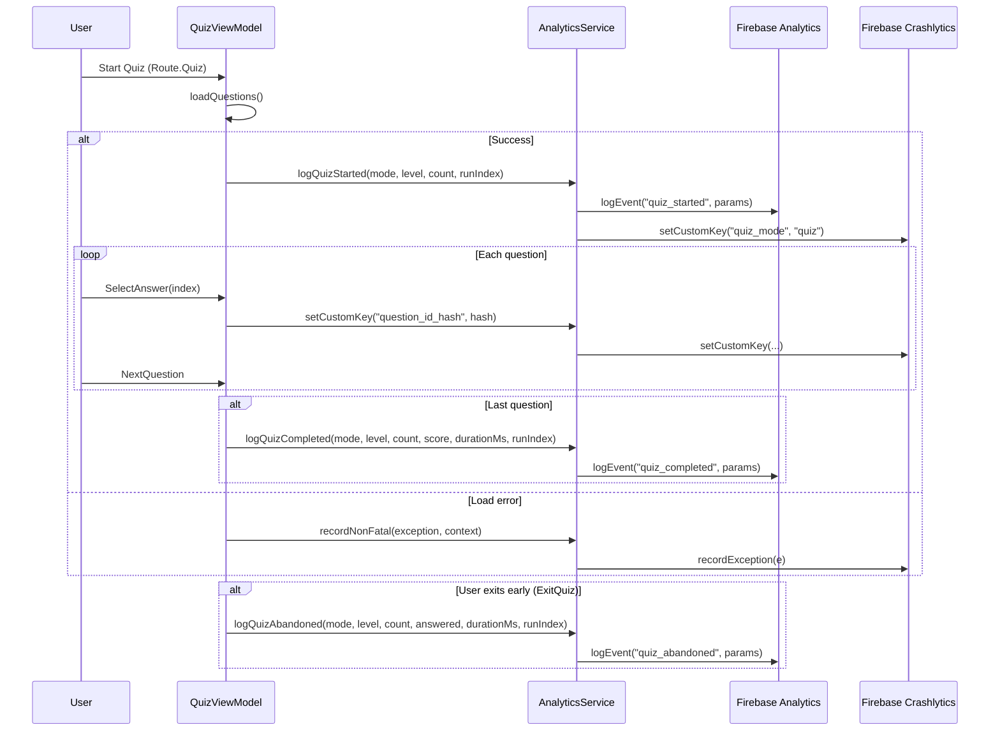
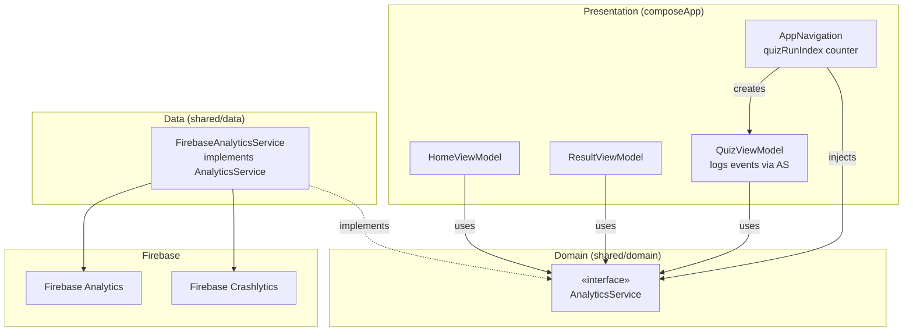

# Phase 7: Firebase Crashlytics + Analytics

> **Depends on:** Phase 2 (Firebase), Phase 6 (remote config — Firebase already initialized)  
> **ADR:** ADR-0010 (Crashlytics & Analytics in KMP)  
> **Goal:** Crash monitoring + basic quiz flow analytics (events, sessions, funnels).

---

## Summary

| What | How |
|---|---|
| Crashlytics SDK | GitLive `dev.gitlive:firebase-crashlytics:2.1.0` (commonMain) |
| Analytics SDK | GitLive `dev.gitlive:firebase-analytics:2.1.0` (commonMain) |
| Crash reporting | Automatic (fatal) + manual `recordException()` (non-fatal) |
| Custom keys | `mode`, `category`, `quizId_hash`, `level`, `uid` |
| Analytics events | 4 custom events (see table below) |
| Privacy | Żadnych treści pytań; `questionId` → SHA-256 prefix (8 znaków) |

---

## Event Catalog

### 1) `quiz_started`

| | |
|---|---|
| **Kiedy** | `QuizViewModel` — pytania załadowane pomyślnie (`LoadQuestions` intent) |
| **Cel** | Mierzyć ile razy quiz jest uruchamiany; w połączeniu z `quiz_completed`/`quiz_abandoned` daje funnel completion rate |

| Parametr | Typ | Opis | Przykład |
|---|---|---|---|
| `mode` | String | Tryb quizu (`quiz` — MVP; przyszłe: `learning`, `exam`) | `"quiz"` |
| `level` | String | Poziom trudności | `"easy"` |
| `question_count` | Int | Liczba pytań w sesji | `5` |
| `quiz_run_index` | Int | Który raz w tej sesji aplikacji użytkownik uruchamia quiz (1-based) | `2` |

### 2) `quiz_completed`

| | |
|---|---|
| **Kiedy** | `QuizViewModel` — ostatnie pytanie odpowiedziane, `NavigateToResult` emitted |
| **Cel** | Mierzyć ukończenie quizu, wynik, czas trwania |

| Parametr | Typ | Opis | Przykład |
|---|---|---|---|
| `mode` | String | Tryb quizu | `"quiz"` |
| `level` | String | Poziom trudności | `"easy"` |
| `question_count` | Int | Liczba pytań | `5` |
| `score` | Int | Zdobyte punkty | `4` |
| `duration_ms` | Long | Czas od `quiz_started` do ukończenia (ms) | `32400` |
| `quiz_run_index` | Int | Numer uruchomienia w sesji | `2` |

### 3) `quiz_abandoned`

| | |
|---|---|
| **Kiedy** | `QuizViewModel` — `ExitQuiz` intent (użytkownik wychodzi z quizu przed ukończeniem) |
| **Cel** | Mierzyć porzucenia; porównanie z `quiz_started` daje drop-off rate |

| Parametr | Typ | Opis | Przykład |
|---|---|---|---|
| `mode` | String | Tryb quizu | `"quiz"` |
| `level` | String | Poziom trudności | `"easy"` |
| `question_count` | Int | Łączna liczba pytań | `5` |
| `questions_answered` | Int | Ile pytań odpowiedziano przed wyjściem | `2` |
| `duration_ms` | Long | Czas od startu do porzucenia (ms) | `12500` |
| `quiz_run_index` | Int | Numer uruchomienia w sesji | `1` |

### 4) `terms_clicked`

| | |
|---|---|
| **Kiedy** | Użytkownik klika "Regulamin" (link/przycisk — do dodania w UI) |
| **Cel** | Mierzyć zainteresowanie regulaminem |

| Parametr | Typ | Opis | Przykład |
|---|---|---|---|
| `source_screen` | String | Ekran z którego kliknięto | `"home"`, `"settings"` |

---

## Zasady prywatności

| Reguła | Realizacja |
|---|---|
| Brak treści pytań w eventach | Żaden event nie zawiera `question.text`, `question.options`, `question.infotip` |
| `questionId` jako hash | W Crashlytics custom keys: `question_id_hash` = `SHA256(question.id).take(8)` — wystarczające do debug, bez możliwości reverse |
| Brak PII | `uid` (Firebase anonymous UID) nie jest PII. Nickname nie jest wysyłany do Analytics |
| Firebase consent | Na MVP: domyślnie enabled. Przyszłość: dodać consent dialog (GDPR) przed inicjalizacją Analytics |

---

## Architektura

### Warstwa abstrakcji

```
shared/domain/
└── service/
    └── AnalyticsService.kt          ← interface (czyste Kotlin, brak Firebase)

shared/data/
└── analytics/
    └── FirebaseAnalyticsService.kt  ← implementacja (GitLive firebase-analytics + firebase-crashlytics)
```

`AnalyticsService` jest wstrzykiwany do ViewModeli przez konstruktor.  
ViewModele logują eventy w odpowiednich momentach (reducer / side effects).

### Interface `AnalyticsService`

```kotlin
interface AnalyticsService {
    // Analytics events
    fun logQuizStarted(mode: String, level: String, questionCount: Int, quizRunIndex: Int)
    fun logQuizCompleted(mode: String, level: String, questionCount: Int, score: Int, durationMs: Long, quizRunIndex: Int)
    fun logQuizAbandoned(mode: String, level: String, questionCount: Int, questionsAnswered: Int, durationMs: Long, quizRunIndex: Int)
    fun logTermsClicked(sourceScreen: String)

    // Crashlytics
    fun recordNonFatal(exception: Throwable, context: Map<String, String> = emptyMap())
    fun setCustomKey(key: String, value: String)
    fun setUserId(uid: String)
}
```

### Crashlytics custom keys (ustawiane kontekstowo)

| Key | Kiedy ustawiany | Wartość |
|---|---|---|
| `quiz_mode` | `quiz_started` | `"quiz"` |
| `quiz_level` | `quiz_started` | `"easy"` |
| `quiz_id_hash` | `quiz_started` | SHA-256 prefix z concatenacji question IDs |
| `current_question_index` | Każde `NextQuestion` | `"2"` |
| `question_id_hash` | Każde `SelectAnswer` | `SHA256(question.id).take(8)` |

---

## Plan fazowy (2 commity)

### Commit 7A: Gradle + SDK + AnalyticsService

**Commit msg:** `build: add Firebase Crashlytics and Analytics dependencies + AnalyticsService`

#### 7A.1 — Version Catalog (`gradle/libs.versions.toml`)

```toml
[libraries]
firebase-analytics = { module = "dev.gitlive:firebase-analytics", version.ref = "firebase-gitlive" }
firebase-crashlytics = { module = "dev.gitlive:firebase-crashlytics", version.ref = "firebase-gitlive" }

[plugins]
firebaseCrashlytics = { id = "com.google.firebase.crashlytics", version = "3.0.3" }
```

#### 7A.2 — Root `build.gradle.kts`

Dodać plugin (apply false):
```kotlin
alias(libs.plugins.firebaseCrashlytics) apply false
```

#### 7A.3 — `:composeApp/build.gradle.kts`

Apply Crashlytics plugin:
```kotlin
alias(libs.plugins.firebaseCrashlytics)
```

#### 7A.4 — `:shared/build.gradle.kts`

Dodać dependencies:
```kotlin
commonMain.dependencies {
    implementation(libs.firebase.analytics)
    implementation(libs.firebase.crashlytics)
}
```

#### 7A.5 — iOS SPM

W Xcode dodać packages:
- `FirebaseAnalytics`
- `FirebaseCrashlytics`

(z tego samego `firebase-ios-sdk` repo co Auth/Firestore)

#### 7A.6 — `AnalyticsService` interface

Plik: `shared/src/commonMain/.../domain/service/AnalyticsService.kt`

```kotlin
package pl.quizpszczelarski.shared.domain.service

/**
 * Analytics + crash reporting abstraction.
 * No Firebase imports — pure Kotlin interface.
 */
interface AnalyticsService {
    fun logQuizStarted(mode: String, level: String, questionCount: Int, quizRunIndex: Int)
    fun logQuizCompleted(mode: String, level: String, questionCount: Int, score: Int, durationMs: Long, quizRunIndex: Int)
    fun logQuizAbandoned(mode: String, level: String, questionCount: Int, questionsAnswered: Int, durationMs: Long, quizRunIndex: Int)
    fun logTermsClicked(sourceScreen: String)
    fun recordNonFatal(exception: Throwable, context: Map<String, String> = emptyMap())
    fun setCustomKey(key: String, value: String)
    fun setUserId(uid: String)
}
```

#### 7A.7 — `FirebaseAnalyticsService` implementation

Plik: `shared/src/commonMain/.../data/analytics/FirebaseAnalyticsService.kt`

```kotlin
package pl.quizpszczelarski.shared.data.analytics

import dev.gitlive.firebase.Firebase
import dev.gitlive.firebase.analytics.analytics
import dev.gitlive.firebase.crashlytics.crashlytics
import pl.quizpszczelarski.shared.domain.service.AnalyticsService

class FirebaseAnalyticsService : AnalyticsService {

    private val analytics = Firebase.analytics
    private val crashlytics = Firebase.crashlytics

    override fun logQuizStarted(mode: String, level: String, questionCount: Int, quizRunIndex: Int) {
        analytics.logEvent("quiz_started") {
            param("mode", mode)
            param("level", level)
            param("question_count", questionCount.toLong())
            param("quiz_run_index", quizRunIndex.toLong())
        }
        crashlytics.setCustomKey("quiz_mode", mode)
        crashlytics.setCustomKey("quiz_level", level)
    }

    override fun logQuizCompleted(mode: String, level: String, questionCount: Int, score: Int, durationMs: Long, quizRunIndex: Int) {
        analytics.logEvent("quiz_completed") {
            param("mode", mode)
            param("level", level)
            param("question_count", questionCount.toLong())
            param("score", score.toLong())
            param("duration_ms", durationMs)
            param("quiz_run_index", quizRunIndex.toLong())
        }
    }

    override fun logQuizAbandoned(mode: String, level: String, questionCount: Int, questionsAnswered: Int, durationMs: Long, quizRunIndex: Int) {
        analytics.logEvent("quiz_abandoned") {
            param("mode", mode)
            param("level", level)
            param("question_count", questionCount.toLong())
            param("questions_answered", questionsAnswered.toLong())
            param("duration_ms", durationMs)
            param("quiz_run_index", quizRunIndex.toLong())
        }
    }

    override fun logTermsClicked(sourceScreen: String) {
        analytics.logEvent("terms_clicked") {
            param("source_screen", sourceScreen)
        }
    }

    override fun recordNonFatal(exception: Throwable, context: Map<String, String>) {
        context.forEach { (key, value) -> crashlytics.setCustomKey(key, value) }
        crashlytics.recordException(exception)
    }

    override fun setCustomKey(key: String, value: String) {
        crashlytics.setCustomKey(key, value)
    }

    override fun setUserId(uid: String) {
        crashlytics.setUserId(uid)
        analytics.setUserId(uid)
    }
}
```

#### Verification (7A)

- [ ] `:shared` kompiluje się z `firebase-analytics` + `firebase-crashlytics`
- [ ] `:composeApp:assembleDebug` — Crashlytics plugin działa (generuje mapping file)
- [ ] iOS build succeeds z dodatkowym SPM packages
- [ ] Brak importów Firebase w `domain/service/`

---

### Commit 7B: Wiring — QuizViewModel + AppNavigation + Crashlytics init

**Commit msg:** `feat: wire Crashlytics + Analytics into quiz flow and error handling`

#### 7B.1 — `AppNavigation.kt` — instancjacja + `quiz_run_index` counter

```kotlin
// W AppNavigation, obok istniejących remember {}:
val analyticsService = remember { FirebaseAnalyticsService() }
var quizRunIndex by remember { mutableIntStateOf(0) }

// Po bootstrapie użytkownika (splash):
currentUid?.let { analyticsService.setUserId(it) }
```

`quizRunIndex` jest incrementowany za każdym razem gdy tworzona jest `Route.Quiz`.

#### 7B.2 — `QuizViewModel` — tracking start/complete/abandon + duration

Nowe parametry konstruktora:
```kotlin
class QuizViewModel(
    private val getRandomQuestions: GetRandomQuestionsUseCase,
    private val syncService: QuestionSyncService,
    private val analyticsService: AnalyticsService,  // ← ADD
    private val level: String = "easy",
    private val questionCount: Int = 5,
    private val quizRunIndex: Int = 1,                // ← ADD
)
```

Nowe pola wewnętrzne:
```kotlin
private val mode = "quiz"  // MVP — jeden tryb; przyszłe: "learning", "exam"
private var quizStartTimeMs: Long = 0L
```

Logowanie:
- W `LoadQuestions` reducer: `analyticsService.logQuizStarted(...)`, `quizStartTimeMs = currentTimeMillis()`
- W `NavigateToResult` (isLastQuestion): `analyticsService.logQuizCompleted(..., durationMs = currentTimeMillis() - quizStartTimeMs)`
- W `ExitQuiz`: `analyticsService.logQuizAbandoned(..., questionsAnswered = currentQuestionIndex, durationMs = ...)`
- W `SelectAnswer`: `analyticsService.setCustomKey("question_id_hash", sha256prefix(question.id))`

#### 7B.3 — Non-fatal error logging

We wszystkich `catch` blokach w ViewModelach (QuizVM, ResultVM, LeaderboardVM, Splash):
```kotlin
catch (e: Exception) {
    analyticsService.recordNonFatal(e, mapOf(
        "context" to "load_questions",
        "level" to level,
    ))
    // existing error handling...
}
```

#### 7B.4 — Hash helper

Plik: `shared/src/commonMain/.../data/analytics/HashUtils.kt`
```kotlin
fun sha256prefix(input: String, length: Int = 8): String {
    // Use kotlinx or platform MessageDigest
    // For KMP: consider kotlinx-crypto or simple manual hash
    // Minimal approach: hashCode().toUInt().toString(16) — less secure but sufficient for analytics
    return input.hashCode().toUInt().toString(16).padStart(8, '0').take(length)
}
```

> **Trade-off:** Pełny SHA-256 w KMP wymaga dodatkowej biblioteki (`kotlinx-crypto` lub `okio`). Na MVP `hashCode()` w hex jest wystarczający — uniemożliwia odczytanie ID, a kolizje nie są krytyczne dla analytics debugging.

#### 7B.5 — `terms_clicked` — przygotowanie miejsca

Event `terms_clicked` będzie logowany w momencie dodania przycisku "Regulamin" do UI.
Placeholder w `HomeScreen` lub `SettingsScreen`:
```kotlin
// Gdy przycisk Regulamin zostanie dodany:
analyticsService.logTermsClicked(sourceScreen = "home")
```

Na tym etapie: `AnalyticsService.logTermsClicked()` jest gotowe, ale nie jest jeszcze wywoływane (brak UI elementu).

#### Verification (7B)

- [ ] Quiz start → `quiz_started` event w Firebase Console (DebugView)
- [ ] Quiz ukończony → `quiz_completed` z prawidłowym `duration_ms`
- [ ] Quiz porzucony (ExitQuiz) → `quiz_abandoned` z `questions_answered`
- [ ] Non-fatal exception → widoczny w Crashlytics Console
- [ ] Custom keys (`quiz_mode`, `quiz_level`) widoczne w crash details
- [ ] `quiz_run_index` rośnie przy kolejnych quizach w tej samej sesji
- [ ] Żadne treści pytań nie trafiają do eventów/crashów

---

## Crashlytics — integracja minimalna (checklist)

### Android
1. Plugin `com.google.firebase.crashlytics` applied to `:composeApp`
2. `google-services.json` już istnieje w `:composeApp`
3. Firebase auto-init obsługuje Crashlytics (żadna dodatkowa konfiguracja)
4. ProGuard/R8: Crashlytics plugin automatycznie uploaduje mapping file

### iOS
1. SPM: dodać `FirebaseCrashlytics` package
2. `FirebaseApp.configure()` w `iOSApp.swift` — **już istnieje** — Crashlytics init automatic
3. Build Phase: dodać `upload-symbols` script dla dSYM:
   ```
   "${BUILD_DIR%/Build/*}/SourcePackages/checkouts/firebase-ios-sdk/Crashlytics/run"
   ```
4. Input Files: `$(DWARF_DSYM_FOLDER_PATH)/$(DWARF_DSYM_FILE_NAME)`, `$(DWARF_DSYM_FOLDER_PATH)/$(DWARF_DSYM_FILE_NAME)/Contents/Info.plist`

---

## Risks & Mitigations

| Risk | Likelihood | Impact | Mitigation |
|---|---|---|---|
| GitLive nie ma `firebase-analytics` / `firebase-crashlytics` artefaktów | Low | High | Sprawdzić mavenCentral przed kodem. Fallback: expect/actual wrappery wokół natywnych SDK |
| iOS dSYM upload nie działa (symbole w Crashlytics) | Medium | Medium | Zweryfikować Build Phase script; alternatywnie użyć Fastlane `upload_symbols_to_crashlytics` |
| `hashCode()` kolizje dla question IDs | Low | Low | Wystarczające dla debug context; nie jest to klucz główny |
| Analytics DebugView nie pokazuje eventów | Medium | Low | Użyć `adb shell setprop debug.firebase.analytics.app pl.quizpszczelarski.app` |
| GDPR consent dialog brakuje | Medium | Medium | MVP — domyślnie enabled. Phase 8+: consent dialog z `firebase-analytics` `.setAnalyticsCollectionEnabled()` |

---

## Diagram: Flow analityczny w quizie



### Diagram: Warstwa analytics w architekturze



---

## Pliki — podsumowanie

### Nowe

| Plik | Opis |
|---|---|
| `shared/.../domain/service/AnalyticsService.kt` | Interface (pure Kotlin) |
| `shared/.../data/analytics/FirebaseAnalyticsService.kt` | Implementacja GitLive |
| `shared/.../data/analytics/HashUtils.kt` | `sha256prefix()` helper |
| `docs/adr/ADR-0010-crashlytics-analytics.md` | ADR |

### Zmodyfikowane

| Plik | Zmiana |
|---|---|
| `gradle/libs.versions.toml` | Dodać `firebase-analytics`, `firebase-crashlytics` libraries + `firebaseCrashlytics` plugin |
| `build.gradle.kts` (root) | Dodać `firebaseCrashlytics` plugin (apply false) |
| `composeApp/build.gradle.kts` | Apply `firebaseCrashlytics` plugin |
| `shared/build.gradle.kts` | Dodać `firebase-analytics`, `firebase-crashlytics` deps |
| `composeApp/.../navigation/AppNavigation.kt` | Dodać `analyticsService`, `quizRunIndex`, `setUserId()` |
| `composeApp/.../presentation/quiz/QuizViewModel.kt` | Dodać `analyticsService` param, logowanie start/complete/abandon, duration tracking, custom keys |
| `composeApp/.../presentation/quiz/QuizState.kt` | Opcjonalnie: dodać `startTimeMs` jeśli potrzebne |
| `iosApp/iosApp.xcodeproj/project.pbxproj` | Build Phase: dSYM upload script |

### iOS SPM

| Package | Purpose |
|---|---|
| `FirebaseAnalytics` | Event tracking |
| `FirebaseCrashlytics` | Crash + non-fatal reporting |
