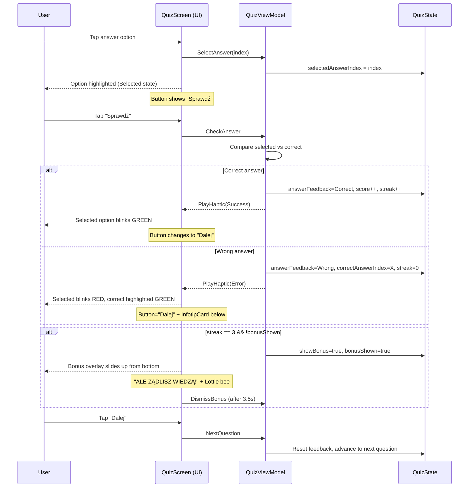
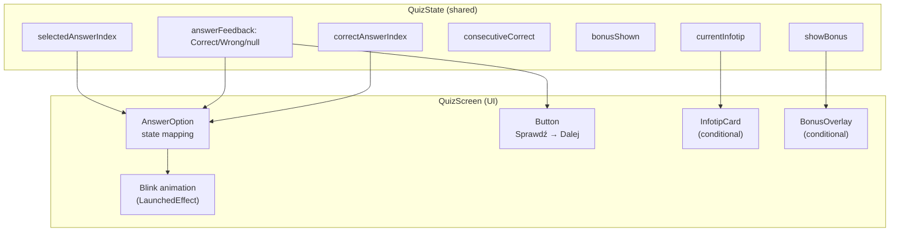
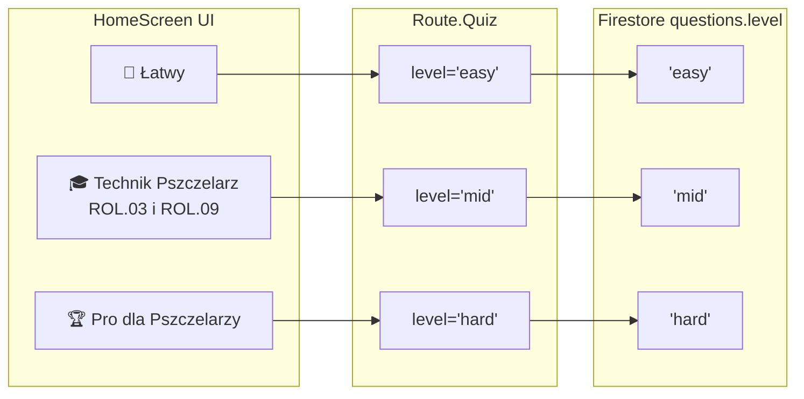

# Phase 8: Tryb "Zabawa" — Feedback, Bonus, Poziomy, Ikona, Infotip

> **Depends on:** Phase 7 (analytics wired), Phase 5 (UX — level selection), Phase 4 (animations, haptics)  
> **ADR:** ADR-0011 (answer feedback + bonus streak)  
> **Goal:** Natychmiastowa informacja zwrotna po odpowiedzi, bonus za streak 3, nowy poziom "Technik", poprawka ikony Android, przycisk "Sprawdź" + infotip.

---

## Podsumowanie wymagań

| # | Wymaganie | Warstwa | Scope |
|---|---|---|---|
| 1 | Natychmiastowy feedback po wyborze odpowiedzi (zielone/czerwone "mruganie") | shared (logika) + composeApp (UI) | QuizState, QuizIntent, QuizScreen, AnswerOption |
| 2 | Bonus "ALE ŻĄDLISZ WIEDZĄ!" po 3 poprawnych z rzędu (max 1× na sesję) — Lottie pszczoła + napis, animacja bottom-to-top | shared (streak logic) + composeApp (UI overlay) | QuizState, QuizScreen |
| 3 | Przycisk "Dalej" → "Sprawdź"; po złej odpowiedzi → infotip pod przyciskiem | composeApp (UI) + shared (state) | QuizState, QuizScreen |
| 4 | Nowy poziom "Technik Pszczelarz — kwalifikacje ROL.03 i ROL.09" (`mid`) | composeApp (HomeScreen) + shared (level mapping) | HomeScreen, level strings |
| 5 | Poprawka ikony Android launcher (brak adaptive icon XML) | composeApp/androidMain/res | mipmap-anydpi-v26 |

---

## Analiza stanu obecnego

### Obecny flow odpowiedzi (QuizScreen)
1. User wybiera odpowiedź → `SelectAnswer(index)` → `selectedAnswerIndex = index` (highlight Selected)
2. User klika "Dalej" (lub "Zakończ quiz") → `NextQuestion` → **reducer liczy wynik** i przechodzi do kolejnego pytania
3. **Brak informacji zwrotnej** — user nie wie, czy odpowiedział poprawnie, dopóki nie zobaczy wyniku na ResultScreen

### Obecne AnswerOption states
`enum AnswerOptionState { Default, Selected, Correct, Wrong, Disabled }`
→ `Correct` i `Wrong` już istnieją z pełną animacją kolorów, ale **nie są nigdy używane w QuizScreen** (render zawsze to `Selected` albo `Default`).

### Obecne poziomy
- HomeScreen: "🐝 Normalny" → `SelectLevel("easy")`, "🏆 Pro dla Pszczelarzy" → `SelectLevel("pro")`
- `Route.Quiz(level: String, ...)` → `QuizViewModel(level = ...)` → `GetRandomQuestionsUseCase(level = level)` → `QuestionRepository.getActiveQuestions(level = level)`
- W Firestore pytania mają pole `level`: wartości `"easy"`, `"mid"`, `"hard"` (lub inne)

### Android icon
- PNG-only w `mipmap-{m,h,xh,xxh,xxxh}dpi/ic_launcher.png` i `ic_launcher_round.png`
- **Brak** `mipmap-anydpi-v26/ic_launcher.xml` (adaptive icon XML)
- Nowoczesne launchery (Android 8+, API 26+) wymagają adaptive icon (`<adaptive-icon>`) — bez tego mogą pokazywać domyślny placeholder

### bonus.json
- Lottie animation (pszczoła): 2000×2000px, 25fps, 50 frames (2s), name: "ailes gauches/abeille"  
- Plik w repo root `/bonus.json` — **nie jest** jeszcze w compose resources

---

## Architektura zmian

### Warstwa Domain/Shared — nowe pola w QuizState + logika streaku

```
QuizState (data class) — nowe pola:
  + answerFeedback: AnswerFeedback?      // null = brak feedbacku, oczekiwanie na odpowiedź
  + correctAnswerIndex: Int?             // indeks poprawnej odpowiedzi (do wyróżnienia w UI)
  + consecutiveCorrect: Int              // bieżący streak poprawnych odpowiedzi
  + bonusShown: Boolean                  // czy bonus "ŻĄDLISZ WIEDZĄ" już był w tej sesji
  + showBonus: Boolean                   // czy właśnie teraz wyświetlamy bonus overlay
  + currentInfotip: String?              // infotip z pytania (wyświetlany po błędnej odpowiedzi)

AnswerFeedback (enum):
  Correct, Wrong

QuizState computed:
  + isAnswerChecked: Boolean             // answerFeedback != null
  + canProceed (zmiana): selectedAnswerIndex != null && answerFeedback != null
```

### Nowy flow odpowiedzi (2-fazowy)

```
1. User wybiera odpowiedź → SelectAnswer(index) → selectedAnswerIndex = index, answerFeedback = null
2. User klika "Sprawdź" → CheckAnswer → reducer oblicza:
   - poprawna? → answerFeedback = Correct, score++, consecutiveCorrect++
   - błędna?   → answerFeedback = Wrong, correctAnswerIndex = X, consecutiveCorrect = 0, currentInfotip = question.infotip
   - jeśli consecutiveCorrect == 3 && !bonusShown → showBonus = true, bonusShown = true
   - blokada klikania odpowiedzi (UI: enabled = !isAnswerChecked)
3. User klika "Dalej" → NextQuestion (jak dotąd, ale score już obliczony w CheckAnswer):
   - resetuje: answerFeedback = null, selectedAnswerIndex = null, correctAnswerIndex = null, currentInfotip = null, showBonus = false
   - przechodzi do następnego pytania (lub NavigateToResult)
```

### Nowy Intent

```kotlin
sealed interface QuizIntent {
    data class SelectAnswer(val index: Int) : QuizIntent
    data object CheckAnswer : QuizIntent       // ← NEW (zastępuje logikę scorowania z NextQuestion)
    data object NextQuestion : QuizIntent      // ← teraz tylko przechodzi dalej
    data object DismissBonus : QuizIntent      // ← NEW (zamykanie bonus overlay po animacji)
    data object RetryLoad : QuizIntent
    data object ExitQuiz : QuizIntent
}
```

### Nowy Effect

```kotlin
sealed interface QuizEffect {
    // ... istniejące ...
    data object PlayCorrectHaptic : QuizEffect     // ← NEW — success haptic
    data object PlayWrongHaptic : QuizEffect        // ← NEW — error haptic
}
```

---

## Plan fazowy (5 commitów)

### Commit 8A: Answer feedback — shared state + reducer logic

**Commit msg:** `feat(quiz): add answer feedback state (Correct/Wrong) + CheckAnswer intent`

#### 8A.1 — `AnswerFeedback` enum

Plik: `composeApp/src/commonMain/.../presentation/quiz/AnswerFeedback.kt`

```kotlin
package pl.quizpszczelarski.app.presentation.quiz

enum class AnswerFeedback { Correct, Wrong }
```

#### 8A.2 — `QuizState` — nowe pola

Dodać do istniejącego `QuizState.kt`:

```kotlin
data class QuizState(
    val questions: List<Question> = emptyList(),
    val currentQuestionIndex: Int = 0,
    val selectedAnswerIndex: Int? = null,
    val score: Int = 0,
    val isLoading: Boolean = true,
    val isRefreshing: Boolean = false,
    val isOffline: Boolean = false,
    val errorMessage: String? = null,
    // NEW — answer feedback
    val answerFeedback: AnswerFeedback? = null,
    val correctAnswerIndex: Int? = null,
    val consecutiveCorrect: Int = 0,
    val bonusShown: Boolean = false,
    val showBonus: Boolean = false,
    val currentInfotip: String? = null,
) {
    val currentQuestion: Question? get() = questions.getOrNull(currentQuestionIndex)
    val totalQuestions: Int get() = questions.size
    val progress: Float
        get() = if (totalQuestions == 0) 0f
        else (currentQuestionIndex + 1).toFloat() / totalQuestions
    val isLastQuestion: Boolean get() = currentQuestionIndex + 1 >= totalQuestions
    val isAnswerChecked: Boolean get() = answerFeedback != null
    // CHANGED — wymaga sprawdzenia odpowiedzi, nie tylko zaznaczenia
    val canProceed: Boolean get() = selectedAnswerIndex != null && answerFeedback != null
}
```

#### 8A.3 — `QuizIntent` — `CheckAnswer` + `DismissBonus`

Dodać do `QuizIntent.kt`:

```kotlin
sealed interface QuizIntent {
    data class SelectAnswer(val index: Int) : QuizIntent
    data object CheckAnswer : QuizIntent        // NEW
    data object NextQuestion : QuizIntent
    data object DismissBonus : QuizIntent       // NEW
    data object RetryLoad : QuizIntent
    data object ExitQuiz : QuizIntent
}
```

#### 8A.4 — `QuizEffect` — feedback haptics

Dodać do `QuizEffect.kt`:

```kotlin
sealed interface QuizEffect {
    data class NavigateToResult(val score: Int, val total: Int) : QuizEffect
    data class ShowSnackbar(val message: String) : QuizEffect
    data object NoQuestionsAvailable : QuizEffect
    data class PlayHaptic(val type: ImpactType) : QuizEffect
    data object NavigateToHome : QuizEffect
}
```

> Uwaga: istniejący `PlayHaptic(type)` jest wystarczający — nie trzeba osobnych effect'ów. W `CheckAnswer` emitujemy `PlayHaptic(ImpactType.Success)` lub `PlayHaptic(ImpactType.Error)`.

#### 8A.5 — `QuizViewModel.reduce()` — nowa logika

**`SelectAnswer`** — bez zmian (ustawia `selectedAnswerIndex`, emituje light haptic). Dodatkowo: zablokowany gdy `isAnswerChecked`:

```kotlin
is QuizIntent.SelectAnswer -> {
    if (state.isAnswerChecked) return state  // blocked after check
    emitEffect(QuizEffect.PlayHaptic(ImpactType.Light))
    // ... existing crashlytics key ...
    state.copy(selectedAnswerIndex = intent.index)
}
```

**`CheckAnswer`** (NEW) — przenosi logikę scorowania z `NextQuestion`:

```kotlin
is QuizIntent.CheckAnswer -> {
    val selectedIndex = state.selectedAnswerIndex ?: return state
    if (state.isAnswerChecked) return state  // already checked
    val currentQuestion = state.currentQuestion ?: return state

    val isCorrect = selectedIndex == currentQuestion.correctAnswerIndex

    val newScore = if (isCorrect) state.score + 1 else state.score
    val newStreak = if (isCorrect) state.consecutiveCorrect + 1 else 0
    val triggerBonus = newStreak >= 3 && !state.bonusShown

    if (isCorrect) {
        emitEffect(QuizEffect.PlayHaptic(ImpactType.Success))
    } else {
        emitEffect(QuizEffect.PlayHaptic(ImpactType.Error))
    }

    state.copy(
        score = newScore,
        answerFeedback = if (isCorrect) AnswerFeedback.Correct else AnswerFeedback.Wrong,
        correctAnswerIndex = if (!isCorrect) currentQuestion.correctAnswerIndex else null,
        consecutiveCorrect = newStreak,
        showBonus = triggerBonus,
        bonusShown = if (triggerBonus) true else state.bonusShown,
        currentInfotip = if (!isCorrect) currentQuestion.infotip.takeIf { it.isNotBlank() } else null,
    )
}
```

**`NextQuestion`** (CHANGED) — nie liczy już wyniku, tylko przechodzi dalej:

```kotlin
is QuizIntent.NextQuestion -> {
    if (!state.isAnswerChecked) return state  // must check first

    if (state.isLastQuestion) {
        // Analytics: quiz completed
        val durationMs = if (quizStartTimeMs > 0) currentTimeMillis() - quizStartTimeMs else 0L
        analyticsService.logQuizCompleted(...)
        emitEffect(QuizEffect.PlayHaptic(if (state.score > state.totalQuestions / 2) ImpactType.Success else ImpactType.Medium))
        emitEffect(QuizEffect.NavigateToResult(score = state.score, total = state.totalQuestions))
        state
    } else {
        analyticsService.setCustomKey("current_question_index", (state.currentQuestionIndex + 1).toString())
        emitEffect(QuizEffect.PlayHaptic(ImpactType.Light))
        state.copy(
            currentQuestionIndex = state.currentQuestionIndex + 1,
            selectedAnswerIndex = null,
            answerFeedback = null,
            correctAnswerIndex = null,
            currentInfotip = null,
            showBonus = false,
        )
    }
}
```

**`DismissBonus`** (NEW):

```kotlin
is QuizIntent.DismissBonus -> {
    state.copy(showBonus = false)
}
```

#### 8A.6 — Unit testy (shared-testable)

Plik: `composeApp/src/commonTest/.../presentation/quiz/QuizReducerTest.kt` (lub inline w `QuizViewModelTest.kt`)

Scenariusze:
- `selectAnswer_thenCheckAnswer_correct_incrementsScoreAndStreak`
- `selectAnswer_thenCheckAnswer_wrong_resetsStreakAndSetsInfotip`
- `threeCorrectInRow_triggersBonus`
- `bonusShownOnce_notTriggeredAgain`
- `selectAnswer_blockedAfterCheck`
- `nextQuestion_resetsAnswerFeedback`
- `checkAnswer_emitsCorrectHaptic`
- `checkAnswer_emitsWrongHaptic`

#### Verification (8A)

- [ ] `QuizState` kompiluje się z nowymi polami
- [ ] `reduce(CheckAnswer)` zwraca prawidłowy `answerFeedback`
- [ ] `consecutiveCorrect` rośnie przy poprawnych, resetuje przy błędnych
- [ ] `showBonus` = true dokładnie raz (przy streaku 3, pierwszym w sesji)
- [ ] `SelectAnswer` zablokowany gdy `isAnswerChecked == true`
- [ ] `NextQuestion` zablokowany gdy `isAnswerChecked == false`
- [ ] Unit testy pass

---

### Commit 8B: QuizScreen UI — feedback rendering + "Sprawdź" / "Dalej" + infotip

**Commit msg:** `feat(quiz-ui): answer feedback animation, "Sprawdź" button, infotip display`

#### 8B.1 — QuizScreen: AnswerOption state mapping (feedback)

Zmienić mapowanie `AnswerOptionState` w `QuizScreen.kt`:

```kotlin
currentQuestion.options.forEachIndexed { index, option ->
    val answerState = when {
        // Po sprawdzeniu odpowiedzi:
        state.isAnswerChecked && state.selectedAnswerIndex == index &&
            state.answerFeedback == AnswerFeedback.Correct -> AnswerOptionState.Correct
        state.isAnswerChecked && state.selectedAnswerIndex == index &&
            state.answerFeedback == AnswerFeedback.Wrong -> AnswerOptionState.Wrong
        state.isAnswerChecked && state.correctAnswerIndex == index -> AnswerOptionState.Correct
        state.isAnswerChecked -> AnswerOptionState.Disabled
        // Przed sprawdzeniem:
        state.selectedAnswerIndex == index -> AnswerOptionState.Selected
        else -> AnswerOptionState.Default
    }

    AnswerOption(
        text = option,
        state = answerState,
        onClick = { onIntent(QuizIntent.SelectAnswer(index)) },
        enabled = !state.isAnswerChecked,
    )
    // ...
}
```

#### 8B.2 — QuizScreen: Przycisk "Sprawdź" → "Dalej"

Dwu-fazowy przycisk:

```kotlin
// Przycisk — faza 1: "Sprawdź" (gdy nie sprawdzono), faza 2: "Dalej"/"Zakończ quiz"
if (!state.isAnswerChecked) {
    AppButton(
        text = "Sprawdź",
        onClick = { onIntent(QuizIntent.CheckAnswer) },
        enabled = state.selectedAnswerIndex != null,
        modifier = Modifier.padding(horizontal = spacing.lg, vertical = spacing.lg),
    )
} else {
    AppButton(
        text = if (state.isLastQuestion) "Zakończ quiz" else "Dalej",
        onClick = { onIntent(QuizIntent.NextQuestion) },
        enabled = true,
        modifier = Modifier.padding(horizontal = spacing.lg),
    )

    // Infotip — po błędnej odpowiedzi
    if (state.currentInfotip != null) {
        InfotipCard(
            text = state.currentInfotip,
            modifier = Modifier.padding(horizontal = spacing.lg, vertical = spacing.sm),
        )
    }

    Spacer(modifier = Modifier.height(spacing.lg))
}
```

#### 8B.3 — `InfotipCard` komponent

Plik: `composeApp/src/commonMain/.../ui/components/InfotipCard.kt`

```kotlin
@Composable
fun InfotipCard(
    text: String,
    modifier: Modifier = Modifier,
) {
    Card(
        modifier = modifier.fillMaxWidth(),
        shape = MaterialTheme.shapes.medium,
        colors = CardDefaults.cardColors(
            containerColor = MaterialTheme.colorScheme.secondaryContainer,
        ),
        border = BorderStroke(1.dp, MaterialTheme.colorScheme.secondary.copy(alpha = 0.3f)),
    ) {
        Row(
            modifier = Modifier.padding(AppTheme.spacing.lg),
            verticalAlignment = Alignment.Top,
        ) {
            Text(text = "💡", style = MaterialTheme.typography.bodyLarge)
            Spacer(modifier = Modifier.width(AppTheme.spacing.sm))
            Text(
                text = text,
                style = MaterialTheme.typography.bodyMedium,
                color = MaterialTheme.colorScheme.onSecondaryContainer,
            )
        }
    }
}
```

Design:
- Tło: `secondaryContainer` (jasny sage green) — harmonizuje z design systemem
- Ikona: 💡 (lampa — wskazówka edukacyjna)
- Border: subtelny `secondary` z alpha
- Zaokrąglenie: `shapes.medium` (12dp)
- Padding: `lg` (16dp)

#### 8B.4 — AnswerOption "mruganie" (blink animation)

Dodać do `AnswerOption.kt` efekt mrugania po przejściu w stan `Correct` lub `Wrong`:

```kotlin
// Blink effect: alpha oscillates 1.0 → 0.3 → 1.0 → 0.3 → 1.0 (3 blinks, ~600ms total)
val isBlinking = state == AnswerOptionState.Correct || state == AnswerOptionState.Wrong
var blinkAlpha by remember { mutableFloatStateOf(1f) }

LaunchedEffect(state) {
    if (isBlinking) {
        repeat(3) {
            blinkAlpha = 0.3f
            delay(100)
            blinkAlpha = 1f
            delay(100)
        }
    } else {
        blinkAlpha = 1f
    }
}
```

Zastosować `blinkAlpha` do `graphicsLayer { alpha = blinkAlpha }` na Card.

#### Verification (8B)

- [ ] Po kliknięciu odpowiedzi → "Sprawdź" przycisk aktywny
- [ ] Po kliknięciu "Sprawdź" z poprawną → zaznaczona mruga na zielono
- [ ] Po kliknięciu "Sprawdź" z błędną → zaznaczona mruga na czerwono, poprawna wyróżniona zielono
- [ ] Po sprawdzeniu → przycisk zmienia się na "Dalej"
- [ ] Infotip wyświetla się pod przyciskiem "Dalej" (tylko gdy wrong + infotip niepusty)
- [ ] Odpowiedzi zablokowane po sprawdzeniu
- [ ] "Zakończ quiz" na ostatnim pytaniu → ResultScreen

---

### Commit 8C: Bonus overlay — "ALE ŻĄDLISZ WIEDZĄ!" + Lottie bottom-to-top

**Commit msg:** `feat(quiz-ui): bonus streak overlay with Lottie bee animation`

#### 8C.1 — Przenieś `bonus.json` do compose resources

```
cp bonus.json composeApp/src/commonMain/composeResources/files/bonus.json
```

#### 8C.2 — Bonus overlay w QuizScreen

Dodać `Box` overlay na cały ekran QuizScreen, wyświetlany gdy `state.showBonus`:

```kotlin
// W głównym Box wrappującym QuizScreen content
Box(modifier = modifier.fillMaxSize()) {
    // ... istniejący Column z content ...

    // Bonus overlay
    AnimatedVisibility(
        visible = state.showBonus,
        enter = slideInVertically(
            initialOffsetY = { it },   // od dołu
            animationSpec = tween(800, easing = EaseOutCubic),
        ) + fadeIn(tween(400)),
        exit = fadeOut(tween(300)),
    ) {
        BonusOverlay(
            onAnimationEnd = { onIntent(QuizIntent.DismissBonus) },
        )
    }
}
```

#### 8C.3 — `BonusOverlay` composable

Plik: `composeApp/src/commonMain/.../ui/components/BonusOverlay.kt`

Layout: fullscreen semi-transparent overlay, centered content animating from bottom.

```kotlin
@Composable
fun BonusOverlay(
    onAnimationEnd: () -> Unit,
    modifier: Modifier = Modifier,
) {
    // Auto-dismiss after animation duration
    LaunchedEffect(Unit) {
        delay(3500)  // animation time
        onAnimationEnd()
    }

    val bonusComposition by rememberLottieComposition {
        val jsonBytes = Res.readBytes("files/bonus.json")
        LottieCompositionSpec.JsonString(jsonBytes.decodeToString())
    }

    Box(
        modifier = modifier
            .fillMaxSize()
            .background(Color.Black.copy(alpha = 0.4f)),
        contentAlignment = Alignment.Center,
    ) {
        Column(
            horizontalAlignment = Alignment.CenterHorizontally,
        ) {
            // Lottie pszczoła
            Image(
                painter = rememberLottiePainter(
                    composition = bonusComposition,
                    iterations = 2,
                ),
                contentDescription = "Bonus bee animation",
                modifier = Modifier.size(200.dp),
            )

            Spacer(modifier = Modifier.height(AppTheme.spacing.lg))

            // Napis
            Text(
                text = "ALE ŻĄDLISZ WIEDZĄ!",
                style = MaterialTheme.typography.headlineMedium,
                color = Color.White,
                textAlign = TextAlign.Center,
                modifier = Modifier.padding(horizontal = AppTheme.spacing.xl),
            )
        }
    }
}
```

Animacja:
- Cały overlay slide-in od dołu (800ms `EaseOutCubic`)
- Pszczoła (Lottie) animuje 2 iteracje (2 × 2s = 4s)
- Tekst "ALE ŻĄDLISZ WIEDZĄ!" pod pszczołą
- Po 3.5s → auto-dismiss via `DismissBonus` intent
- Overlay ma semi-transparent black background (focus na bonusie)

#### 8C.4 — Interaction blocking during bonus

Gdy `state.showBonus == true`:
- AnswerOptions: `enabled = false`
- "Dalej" button: `enabled = false`
- Exit button: wciąż dostępny (user może wyjść)

#### Verification (8C)

- [ ] `bonus.json` jest w `composeResources/files/`
- [ ] Po 3 poprawnych z rzędu → overlay pojawia się (slide bottom-to-top)
- [ ] Lottie animacja pszczoły gra
- [ ] Tekst "ALE ŻĄDLISZ WIEDZĄ!" pod pszczołą
- [ ] Overlay auto-dismiss po ~3.5s
- [ ] Bonus pojawia się **max 1×** na sesję quizu
- [ ] Odpowiedzi zablokowane podczas bonusu
- [ ] Gra toczy się dalej po dismiss

---

### Commit 8D: Nowy poziom "Technik Pszczelarz" + remapping level labels

**Commit msg:** `feat(home): add "Technik Pszczelarz" level + remap Easy/Mid/Hard`

#### 8D.1 — HomeScreen: LevelSelectContent — 3 przyciski

Zmienić `LevelSelectContent` w `HomeScreen.kt`:

**Było:**
```kotlin
AppButton(text = "🐝  Normalny", onClick = { onIntent(HomeIntent.SelectLevel("easy")) }, ...)
AppButton(text = "🏆  Pro dla Pszczelarzy", onClick = { onIntent(HomeIntent.SelectLevel("pro")) }, ...)
```

**Ma być:**
```kotlin
AppButton(
    text = "🐝  Łatwy",
    onClick = { onIntent(HomeIntent.SelectLevel("easy")) },
    variant = AppButtonVariant.Secondary,
)

Spacer(modifier = Modifier.height(spacing.lg))

AppButton(
    text = "🎓  Technik Pszczelarz\nROL.03 i ROL.09",
    onClick = { onIntent(HomeIntent.SelectLevel("mid")) },
    variant = AppButtonVariant.Secondary,
)

Spacer(modifier = Modifier.height(spacing.lg))

AppButton(
    text = "🏆  Pro dla Pszczelarzy",
    onClick = { onIntent(HomeIntent.SelectLevel("hard")) },
    variant = AppButtonVariant.Secondary,
)
```

#### 8D.2 — Level mapping wyjaśnienie

| UI label | `SelectLevel` value | Firestore `level` field | Opis |
|---|---|---|---|
| Łatwy | `"easy"` | `"easy"` | Był "Normalny" — pytania poziomu podstawowego |
| Technik Pszczelarz ROL.03 i ROL.09 | `"mid"` | `"mid"` | **NOWY** — pytania egzaminu technika |
| Pro dla Pszczelarzy | `"hard"` | `"hard"` | Był "Pro" → teraz query'uje `hard` zamiast `pro` |

> **WAŻNE:** Stare `"pro"` w Firestore trzeba zastąpić `"hard"` (migracja danych) **LUB** dodać mapowanie w `CachingQuestionsRepository` / `GetRandomQuestionsUseCase`. Rekomendacja: zmiana na poziomie Firestore danych (jednorazowa migracja admin-side), bo `GetRandomQuestionsUseCase` przekazuje level string wprost do query.

#### 8D.3 — Route.Quiz — bez zmian

`Route.Quiz(level: String, questionCount: Int)` — generyczny, przyjmuje każdy string. Nie wymaga zmian.

#### 8D.4 — Firestore data migration (admin-side, poza scope'em kodu)

Zmienić w Firestore `questions` collection:
- Dokumenty z `level: "pro"` → `level: "hard"`
- Dodać nowe dokumenty z `level: "mid"` (pytania technika ROL.03/ROL.09)

> To jest zadanie administracyjne (Cloud Function lub ręczna zmiana), nie kodu aplikacji.

#### 8D.5 — SQLDelight cache — bez zmian

Schemat `QuestionEntity` ma `level TEXT` — generyczny. Cache pobierze nowe wartości przy sync.

#### Verification (8D)

- [ ] HomeScreen wyświetla 3 przyciski: Łatwy, Technik Pszczelarz, Pro
- [ ] "Łatwy" → `Route.Quiz(level = "easy", ...)`
- [ ] "Technik Pszczelarz" → `Route.Quiz(level = "mid", ...)`
- [ ] "Pro" → `Route.Quiz(level = "hard", ...)`
- [ ] Quiz ładuje pytania z odpowiednim filtrem level
- [ ] Kompiluje się na Android i iOS

---

### Commit 8E: Android adaptive icon fix

**Commit msg:** `fix(android): add adaptive icon XML for Android 8+ launchers`

#### 8E.1 — Utwórz `mipmap-anydpi-v26/ic_launcher.xml`

Plik: `composeApp/src/androidMain/res/mipmap-anydpi-v26/ic_launcher.xml`

```xml
<?xml version="1.0" encoding="utf-8"?>
<adaptive-icon xmlns:android="http://schemas.android.com/apk/res/android">
    <background android:drawable="@color/ic_launcher_background"/>
    <foreground android:drawable="@mipmap/ic_launcher_foreground"/>
</adaptive-icon>
```

#### 8E.2 — Utwórz `mipmap-anydpi-v26/ic_launcher_round.xml`

Plik: `composeApp/src/androidMain/res/mipmap-anydpi-v26/ic_launcher_round.xml`

```xml
<?xml version="1.0" encoding="utf-8"?>
<adaptive-icon xmlns:android="http://schemas.android.com/apk/res/android">
    <background android:drawable="@color/ic_launcher_background"/>
    <foreground android:drawable="@mipmap/ic_launcher_foreground"/>
</adaptive-icon>
```

#### 8E.3 — Utwórz `values/ic_launcher_background.xml`

Plik: `composeApp/src/androidMain/res/values/ic_launcher_background.xml`

```xml
<?xml version="1.0" encoding="utf-8"?>
<resources>
    <color name="ic_launcher_background">#FFF9ED</color>
</resources>
```

> Kolor `#FFF9ED` = warm cream z design systemu (AppColors background).

#### 8E.4 — Foreground icon

Przedgenerować `ic_launcher_foreground.png` w odpowiednich rozmiarach (bazując na istniejącym ic_launcher, zostawiając padding 33% safe zone):

| Density | Foreground size |
|---|---|
| mdpi | 108×108 |
| hdpi | 162×162 |
| xhdpi | 216×216 |
| xxhdpi | 324×324 |
| xxxhdpi | 432×432 |

> Rekomendacja: Użyć Android Studio Image Asset Studio do wygenerowania z istniejącego PNG (zachowując pszczołę/logo w safe zone 66%).

#### Alternatywa (prostsza)

Jeśli istniejące PNG ic_launcher mają odpowiednią ikonę bez tła, można użyć ich bezpośrednio jako foreground (z niewielkim ryzykiem przycięcia na maskach adaptywnych).

#### Verification (8E)

- [ ] `mipmap-anydpi-v26/ic_launcher.xml` istnieje
- [ ] `mipmap-anydpi-v26/ic_launcher_round.xml` istnieje
- [ ] `values/ic_launcher_background.xml` z kolorem `#FFF9ED`
- [ ] Foreground PNG we wszystkich density
- [ ] App instaluje się na Android 8+ i ikona widoczna w launcherze
- [ ] Ikona w ustawieniach bez zmian

---

## Risks & Mitigations

| Risk | Likelihood | Impact | Mitigation |
|---|---|---|---|
| Zmiana "pro" → "hard" w Firestore może złamać starsze wersje app | Medium | High | Opcja 1: migracja danych + nowa wersja app jednocześnie. Opcja 2: dodać pytania z `level: "hard"` OBOK starych `"pro"`, a w nowej wersji query'ować `"hard"`. Stare app dalej query'ują `"pro"`. |
| Blink animation za szybka/za wolna na różnych urządzeniach | Low | Low | Tuning: 3×100ms blink jest relatywnie bezpieczny. Test na emulatorze + fizycznym urządzeniu |
| bonus.json może być za duży (Lottie 2000×2000) | Low | Medium | Skala do 200dp w Compose — rendering OK. Jeśli performance issue: przeskalować JSON offline |
| Adaptive icon foreground przycięty przez mashki | Medium | Low | Użyć safe zone 66%. Przetestować na Pixel + Samsung launcher |
| Infotip pusty dla niektórych pytań | Medium | Low | `currentInfotip = question.infotip.takeIf { it.isNotBlank() }` — InfotipCard nie renderuje się gdy null |
| Brak pytań `level: "mid"` w Firestore | High (nowy level) | High | Musi być załadowane przed release. Alternatywa: ukryć przycisk "Technik" dopóki Remote Config nie potwierdzi dostępności |

---

## Diagram: Nowy flow odpowiedzi



## Diagram: Component + state flow



## Diagram: Level mapping



---

## Pliki — podsumowanie

### Nowe

| Plik | Opis |
|---|---|
| `composeApp/.../presentation/quiz/AnswerFeedback.kt` | Enum: Correct, Wrong |
| `composeApp/.../ui/components/InfotipCard.kt` | Komponent infotip pod przyciskiem |
| `composeApp/.../ui/components/BonusOverlay.kt` | Bonus overlay (Lottie + tekst) |
| `composeApp/src/commonMain/composeResources/files/bonus.json` | Lottie animation (kopia z repo root) |
| `composeApp/src/androidMain/res/mipmap-anydpi-v26/ic_launcher.xml` | Adaptive icon |
| `composeApp/src/androidMain/res/mipmap-anydpi-v26/ic_launcher_round.xml` | Adaptive icon round |
| `composeApp/src/androidMain/res/values/ic_launcher_background.xml` | Kolor tła adaptive icon |
| `composeApp/src/androidMain/res/mipmap-*/ic_launcher_foreground.png` | Foreground layer (5 density) |
| `docs/adr/ADR-0011-answer-feedback-bonus-streak.md` | ADR |

### Zmodyfikowane

| Plik | Zmiana |
|---|---|
| `composeApp/.../presentation/quiz/QuizState.kt` | +6 pól (answerFeedback, correctAnswerIndex, consecutiveCorrect, bonusShown, showBonus, currentInfotip), zmiana `canProceed`, +`isAnswerChecked` |
| `composeApp/.../presentation/quiz/QuizIntent.kt` | +`CheckAnswer`, +`DismissBonus` |
| `composeApp/.../presentation/quiz/QuizViewModel.kt` | Nowa logika `CheckAnswer`, refactor `NextQuestion` (nie liczy score), `DismissBonus`, `SelectAnswer` guard |
| `composeApp/.../ui/screens/QuizScreen.kt` | AnswerOption state mapping, 2-fazowy przycisk, InfotipCard, BonusOverlay, Box wrapper |
| `composeApp/.../ui/components/AnswerOption.kt` | Blink animation (LaunchedEffect) |
| `composeApp/.../ui/screens/HomeScreen.kt` | 3 poziomy zamiast 2, nowe labele, level strings |

### Dane (poza kodem app)

| Zadanie | Kto |
|---|---|
| Firestore: zmiana `level: "pro"` → `"hard"` | Admin / Cloud Function |
| Firestore: dodanie pytań z `level: "mid"` | Admin / content team |

---

## DoR checklist

- [x] User goal: natychmiastowy feedback po odpowiedzi w trybie "zabawa"
- [x] Non-goals: tryb egzaminowy (ten ma inny flow), multiplayer
- [x] Platforms: Android + iOS (shared logic + Compose Multiplatform)
- [x] UX references: brak Figma — implementacja wg opisu (mruganie, overlay, infotip)
- [x] Data sources: `bonus.json` (Lottie), `question.infotip` (Firestore), level field
- [x] Acceptance criteria: j.w. (per commit verification)
- [x] Edge cases: pusty infotip, brak pytań mid, bonus max 1×, ostatnie pytanie
- [x] Offline behavior: feedback działa offline (logika w shared state)
- [x] Telemetry: istniejące eventy `quiz_started`/`quiz_completed` wystarczają
- [x] Test strategy: unit testy reducera (streak, feedback, bonus guard)
